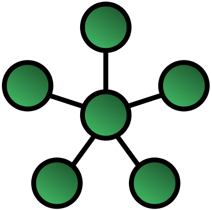
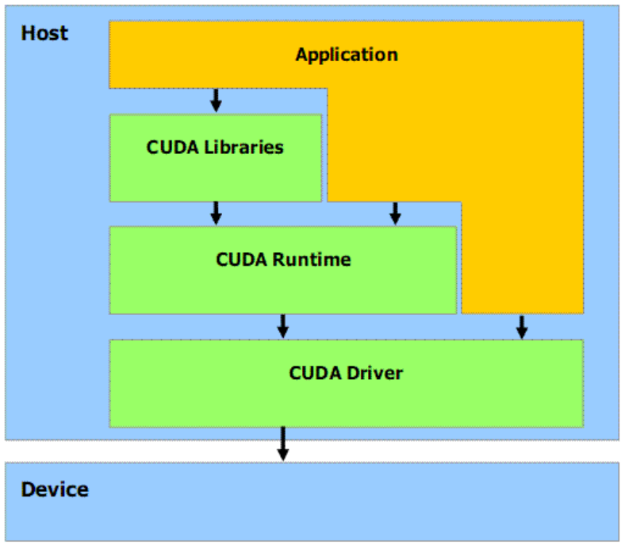
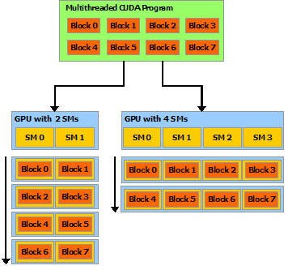
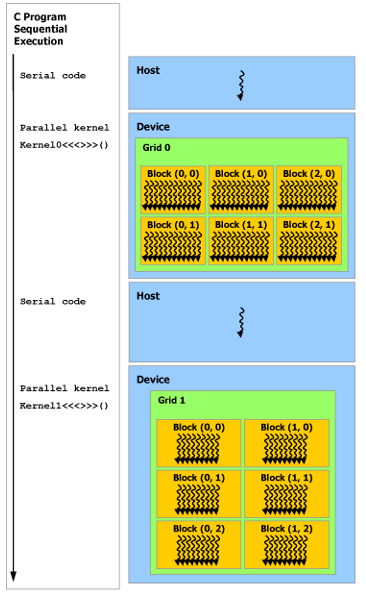
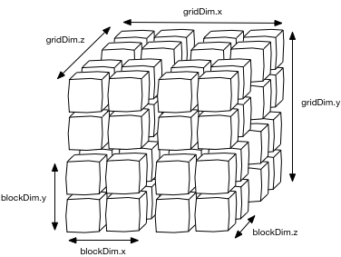
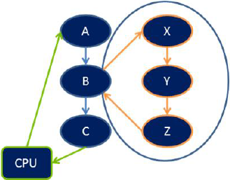
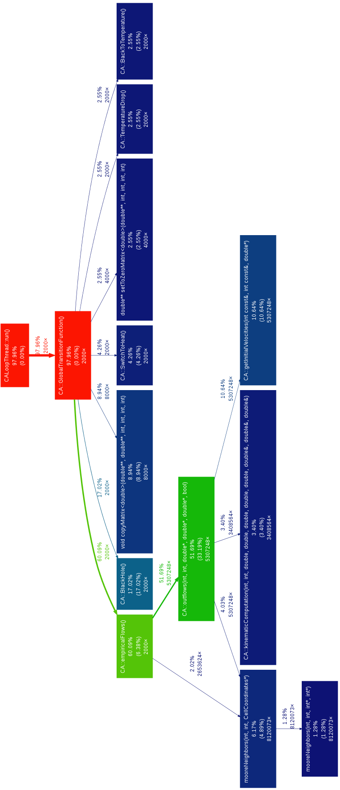

-   [Acknowledgments](#acknowledgments)
-   [Parallel computing architectures](#chap:parallelArchitectures)
    -   [Introduction](#introduction)
    -   [Architectures](#architectures)
        -   [Classical classification - Flynn’s
            taxonomy](#classical-classification---flynns-taxonomy)
        -   [Memory classification](#memory-classification)
    -   [Network Topologies](#network-topologies)
        -   [Bus-based networks](#bus-based)
        -   [Completely connected
            networks](#completely-connected-networks)
        -   [Star-Connected Networks](#star-connected-networks)
        -   [K-Meshes](#k-meshes)
        -   [Three based](#three-based)
-   [GPGPU - History And Motivation](#gpgpu---history-and-motivation)
    -   [Introduction](#introduction-1)
    -   [Why GPU computing?](#why-gpu-computing)
    -   [From Graphics to General Purpose
        Computing](#from-graphics-to-general-purpose-computing)
        -   [Traditional Graphics Pipeline](#graphicPipeline)
-   [Compute Unified Device Architecture - CUDA ](#chap:CUDA)
    -   [Introduction](#introduction-2)
    -   [CUDA Hardware model](#cuda-hardware-model)
        -   [Compute Capability](#computeCapability)
        -   [Kepler Architecture](#sect:keplerArch)
    -   [CUDA Programming model](#cudaProgrammingModel)
        -   [Host and Device](#host-and-device)
        -   [Kernels Functions And Thread Hierarchy](#kernels)
        -   [Memory model](#memoryModel)
        -   [Dynamic Parallelism](#DynamicParallelism)
        -   [Performance Guidelines](#sect:cudaPerfGuideline)
        -   [Nvidia Visual Profiler](#nvidia-visual-profiler)
-   [Alternatives to CUDA](#alternatives-to-cuda)
    -   [Introduction](#introduction-3)
    -   [OpenCL](#opencl)
        -   [Model Architecture](#model-architecture)
    -   [OpenACC](#openacc)
        -   [Wait Directive](#wait-directive)
        -   [Kernel Directive](#kernel-directive)
        -   [Data Construct](#data-construct)
    -   [C++ Accelerated Massive Parallelism
        (C++ AMP)](#c-accelerated-massive-parallelism-c-amp)
-   [Cellular Automata](#cellular-automata)
    -   [Introduction](#cellularAutomataIntroduction)
    -   [Informal Definition](#informal-definition)
        -   [Cellular space dimension and
            geometry](#cellular-space-dimension-and-geometry)
        -   [Neighborhood](#neighborhood)
        -   [Transition Function](#transition-function)
    -   [Formal Definition](#formal-definition)
        -   [Finite State Automaton](#DFA)
    -   [Homogeneous Cellular Automata](#homogeneousCellularAutomata)
    -   [Theories and studies](#theories-and-studies)
        -   [Elementary cellular
            automata](#elementary-cellular-automata)
        -   [Wolfram’s classification](#wolframs-classification)
        -   [At the edge of Chaos](#at-the-edge-of-chaos)
        -   [Game of life](#sect:GOL)
    -   [Extension of the Cellular automata
        model](#extension-of-the-cellular-automata-model)
        -   [Probabilistic CA](#probabilistic-ca)
-   [Complex cellular automata](#complex-cellular-automata)
    -   [Introduction](#introduction-4)
    -   [Complex phenomena modellation with cellular
        automata](#complex-phenomena-modellation-with-cellular-automata)
    -   [Complex Cellular
        automata (CCA)](#complex-cellular-automata-cca)
        -   [Parameters](#parameters)
        -   [Substates](#substates)
        -   [Elementary processes](#elementaryProcesses)
    -   [CCA - a formal definition](#mcaFormal)
-   [SCIARA-fv3 - Model Formalization](#sect:SCIARA_MODEL)
    -   [Model Overview](#model-overview)
    -   [Elementary process](#sect:ElementaryProcesses)
        -   [Elementary process *τ*1: lava flows
            computation](#elementary-process-tau_1-lava-flows-computation)
        -   [Elementary process *τ*2: updating of mass and
            momentum](#sect:sciaraModelTau2)
        -   [Elementary process *τ*3: temperature variation
            and lava solidification](#sect:temperatureDrop)
-   [Parallel GPU/CUDA Implementation of the lava flow model
    SCIARA-fv3](#parallel-gpucuda-implementation-of-the-lava-flow-model-sciara-fv3)
    -   [Introduction](#introduction-5)
    -   [The Assess, Parallelize, Optimize, Deploy (APOD) design
        cycle](#sect:APOD)
        -   [Assess](#assess)
        -   [Parallelize](#parallelize)
        -   [Optimize](#optimize)
        -   [Deploy](#deploy)
    -   [Analysis of the serial code](#analysysserialCode)
        -   [Serial code overview](#serial-code-overview)
        -   [Profiling - Gprof](#sect:profiling)
        -   [SCIARA-fv3 profiling](#sciara-fv3-profiling)
    -   [Top level and strategies overview](#sect:topLevelStrategies)
        -   [Migration from 2D matrices to linear arrays](#1Dto2Dmemory)
    -   [Naïve implementation](#sect:naiveImplementation)
        -   [Blocks organization](#blocks-organization)
        -   [Race Condition avoiding](#sect:raceCondAvoiding)
    -   [Device occupancy considerations](#sect:idleThreadsDevOccupancy)
    -   [Rectangular Bounding Box - RBB](#sect:RBBOptimization)
    -   [Atomic Functions implementation](#sect:atomicImplementation)
    -   [List of active cells implementation](#sect:linearCellAtomic)
    -   [Shared memory optimizations](#sect:sharedMemoryOptimization)
    -   [If divergences mitigation](#if-divergences-mitigation)
    -   [Test, validation and performances
        results](#test-validation-and-performances-results)
        -   [Kepler vs Fermi performance](#kepler-vs-fermi-performance)
        -   [Float-Double precision
            considerations](#sect:precisionConsid)
        -   [Approximation and numerical
            errors](#approximation-and-numerical-errors)
-   [Conclusions](#conclusions)
    -   [Summary](#summary)
    -   [Work in progress](#work-in-progress)
        -   [Multiple Rectangular Bounding
            Boxes](#multiple-rectangular-bounding-boxes)
        -   [General CCA CUDA-GPGPU
            library (CuCCAl)](#general-cca-cuda-gpgpu-library-cuccal)
        -   [Publications](#publications)
-   [Code Listings](#code-listings)

*Alla mia famiglia.*

*A Maria.*

  
***English***  
  
In this thesis, a parallel version of the model
SCIARA-fv3\[@Spataro2010\] was designed and implemented using
General-Purpose Computation with Graphics Processing Units (GPGPU) and
specifically, by adopting the NVIDIA Compute Unified Device Architecture
(CUDA)\[@NvidiaprogGuide\] framework in order to improve the overall
execution time. It involves the design and the application of strategies
that allow to avoid incorrect computation results due to race conditions
of any type and at the same time to achieve the best performance and
occupancy of the underlying available hardware. Carried out experiments
show that significant performance improvement in terms of speedup are
achieved also thanks to some original optimizations strategies adopted,
confirming the validity of graphics hardware as an alternative to much
more expensive solutions for the simulation of cellular automata
models.  

(1,0)350  

  
  
***Italian***  
  
In questo lavoro di tesi ho progettato ed implementato una versione
parallela del modello numero SCIARA-fv3\[@Spataro2010\] utilizzando le
schede grafiche per il calcolo general-purpose (General Purpose
Computation with Graphics Processing Units - GPGPU), adottando il
Compute Unified Device Architecture (CUDA)\[@NvidiaprogGuide\] framework
di NVIDIA con lo scopo di migliorare i tempi di esecuzione complessivi.
Questo ha comportato il design prima, e l’applicazione vera e propria
poi, di strategie che permettessero sia di evitare errori dovuti a
race-conditions di qualsiasi tipo che di raggiungere gli speedups
migliori con l’hardware a disposizione. Gli esperimenti effettuati
mostrano significativi miglioramenti nelle performance in termini di
speedup grazie anche all’utilizzo di alcune stragie d’ottimizzazione
nuove, confermando la validità dell’uso di processori grafici come
alternativa a soluzioni hardware per la parallelizzazione di modelli ad
automi cellulari molto più costose.

Acknowledgments
===============

This thesis would not have been possible without the help, support and
patience of my principal supervisors, Prof. *William Spataro* and
*Donato D’Ambrosio*.

The good advices and support of Dr. *Giuseppe Filippone* have been
invaluable on both academic and personal level, for which I am extremely
grateful.

I would like to acknowledge the technical and academic support of the
Prof. *Davide Marocco* from *Plymouth University*, particularly for
providing all the necessary hardware for this research and for enabling
me to take part to this great experience in United Kingdom.

The *Università della Calabria* for sponsoring me with a Erasmus
Placement studentship.

All the researcher in the *School of Computing and Mathematics of the
Plymouth University*, particularly those who work in the *Centre for
Robotics and Neural Systems (CRNS)* for promoting a stimulating and
welcoming academic and social environment will stand as an example to
those that succeed them.

I must also acknowledge Dr. *Valerio Biscione* from *University of
Plymouth* for his suggestions, motivation and encouragement.

Parallel computing architectures
================================

Introduction
------------

Parallel computing has a tremendous impact on various areas, raging from
scientific computation or simulation, commercial and industrial
application and data mining. Lot of effort has put during these years in
order to try to mitigate and overcome the limits regarding the
sequential computer architecture. In particular sequential architecture
consist of three main components:

1.  Processor

2.  Memory

3.  Communication system (datapaths, usually buses)

All three components present bottlenecks that limit the overall
computing rate of a system. Caches, low-latency high bandwidth and small
capacity storage, for example can hide latency of DRAM chips storing the
fetched data and serving subsequent requests of the same memory
location[1]. But one of the most important innovation that addresses
these bottlenecks is multiplicity (in processor, memories and dataphats)
that allows to extend the class of tractable problems with larger
instances and more cases that can be handled. It is so popular that even
smartphones are multicore; Iphone 4S is 2-core, and nexus 4 is 4-core.
This multiplicity has been organized in several manners during the years
giving birth to a variety of architectures. Here a brief classification
of the most important ones.

Architectures
-------------

Classifying a parallel system is not a trivial task. Lots of definitions
and classifications have been proposed in years, mostly based on their
hardware configuration or logical approach in handling and implementing
the parallelism.

### Classical classification - Flynn’s taxonomy

The classification is based on the notion of *stream of information*.
Two types of information flow into the processor: instructions and data.
Conceptually they can be separated into two independent streams. A
coarse classification can be made taking in account only the number of
instructions and data streams that a parallel machine can manage (see
figure \[fig:parallelClassification1\]). That’s how Flynn’s
taxonomy\[@Flynn1972\] classifies machines: according to whether they
have one or more streams of each type.

SISD:  
***Single*** instruction ***Single*** data.  
No parallelism in either instruction or data streams. Each arithmetic
instruction initiates an operation on a data item taken from a single
stream of data elements (e.g. mainframes)

SIMD:  
***Single*** instruction ***Multiple*** data.  
Data parallelism. The same instruction is executed on a batch of
different data. The control unit is responsible for fetching and
interpreting instructions. When it encounters an arithmetic or other
data processing instruction, it broadcasts the instruction to all
processing elements (PE), which then all perform the same operation. For
example, the instruction might be *add R3,R0.*. Each PE would add the
contents of its own internal register R3 to its own R0. (e.g. stream
processors[2].)

MISD:  
***Multiple*** instruction ***Single*** data.  
Multiple instruction operating on the same data stream. It is a class of
system very unusual, mostly for fault-tolerance reasons.

MIMD:  
***Multiple*** instruction ***Multiple*** data.  
Multiple instruction operating independently on multiple data
streams. (e.g. most modern computers)

### Memory classification

Architectures can be further organized by memory architecture and
software models. A first rough categorization can be obtained analyzing
the memory layout:

  
All the processors have in common the ability to access all memory
locations as global space, usually sharing them via buses. Changes in
memory effected by one processor are visible to all the others.
Historically can be divided in :

-   UMA (Uniform Memory Access) : Identical processors with equal access
    time to memory (see figure \[fig:UMA\_NUMA\]), sometimes called
    CC-UMA acronym for Cache Coherent UMA, because the hardware ensures
    that all the processor can see a memory modification performed by
    one of them.

-   NUMA (Non Uniform Memory Access): Usually different groups of
    processors (SMP, Symmetric multiprocessors[3]) are connected, and
    processors belonging to different SMP can access memory spaces of
    each others. As NUMA if is present a cache coherence mechanism this
    architecture is called CC-NUMA.

This memory architecture provides a user friendly perspective to memory
and data sharing across processors, is fast due to the proximity of
memory to CPUs, but it is not scalable because adding more CPUs can
geometrically increase the traffic on the bus and for cache management.
Is up to the programmer to ensure the correct accesses to global memory
in order to avoid race-conditions.

Coupled with this architecture many software solution can be used to
program shared memory machines. The most used are:

-   Threads. Lightweight processes but with same PID (e.g. pthreads)

-   A standard language with preprocessor directives to the compiler
    that is capable of converting the serial program in a parallel
    program without any (or very few) intervention by the
    programmer (e.g. OpenMP[4], see example code \[code:OpenMPFOR\] and
    \[code:OpenMPREDUCTION\] at page for complete examples ).

Different systems, and hence, different processors connected via some
kind of network (see figure \[fig:distribuiteMemory\]) (usually high
speed networks) and the memory space in one processor do not map to
another processor. Each of them operate independently on its memory
space, so changes are not reflected on memory spaces of the others.
Explicit communication is required between processors and is like
synchronization programmer’s responsibility. This architecture is very
scalable and there’s not any overhead in maintaining cache coherency but
all the communication work rely on the programmer.

The most used paradigm for programming distributed memory machines is
the message passing[5] for further informations.

As the name suggest is a mix of the two architectures seen before. Only
a limited number of processors, say N, have access to a common pool of
shared memory. These N processor are connected to the others via network
and each processor can consist of many cores. A common example of a
programming model for hybrid system is the combination of the message
passing model (MPI) with the threads model (OpenMP) in which

\[*a)\]*

threads perform computationally intensive task, using local **on-node**
memory space and

communications between processes on different nodes occurs over network
using MPI (see figure\[fig:hybridMemory\]).

Network Topologies
------------------

An important role is played, as seen before, by the interconnection
network because provide mechanisms for data transfer between processing
nodes. Typically they consist of *n* inputs and *m* outputs and are
built in by switches and links (set of wires or fibers capable of
carrying information[6]).

\[fig:starMesh\]

A first classification can be done considering only if the nodes are
connected directly to each others or not. In the first case the entire
network consist of point-to-point links and they are called ***static***
or ***direct*** networks. On the other hand when the nodes are connected
to each others using switches we talk about ***indirect*** networks.
Because communication is an important task in parallel computing, the
way the nodes are connected to each other is important and can influence
the overall performance of the system that is determined by the
capabilities of the network access devices, the level of control or
fault tolerance desired, and the cost associated with cabling or
telecommunications circuits. Networks topologies try to trade off cost
and scalability with performance

### Bus-based networks

The most simple family of topologies that give birth to the bus-based
networks. Each node is connected to a single shared medium that is
common to all the nodes. The most important advantage of bus is that the
distance of two nodes is constant *O*(1) and the cost scale linearly as
the number of nodes *p*[7]. A message from the source is broadcasted to
all machines connected to the bus and every machine ignore the message
except for the intended address for the message that accept the data.
The low cost of implementing this topology if tradeoff by the
difficulties in managing it and plus, because of the bounded bandwidth
of buses, typical bus-based machine are limited to dozen of nodes.

### Completely connected networks

In a completely-connected network, each node has a direct communication
link to every other node in the network. This kind of networks don’t
need any switching or broadcasting mechanism because a node can send a
message to another in a single step, and interferences during the
communication are completely prevented. But completely connected network
are not suitable for practical uses because of the cost related to their
implementation. The number of connection grows quadratically
*O*(*p*2) with the number of the nodes (see figure
\[fig:completelyConnected\]).
$$c=\\frac{n(n-1)}{2}$$

### Star-Connected Networks

Star topology (see figure \[fig:starMesh\]) every node is connected to a
central node that acts as the central processor (as server if we
consider the analogy with the LAN) . It is similar to the bus-based (see
section \[bus-based\]) network, because communication between any pair
of nodes is routed through the central processor (and the latter is the
shared medium the all the other nodes share) and because the central
processor is the bottleneck in this topology and also the single point
of failure (if this node goes down the entire network stops to work).

### K-Meshes

r0.4 

\[fig:ring\]

Due to the large number of links in fully connected networks, sparser
networks are typically used to build parallel computers. A family of
such networks spans the space of linear arrays and hypercubes. Linear
array or ring are static network in which each node is connected with
other two (called neighbors, see figure \[fig:ring\]).

The 2-D version of the ring topology is the 2-D torus (see figure
\[fig:torus\]). It consist of $\\sqrt{p}$ processor per each dimension,
and each processor is connected to four neighbors (ones whose indices
differ in any dimension by one). 2-D or 3-D meshes are very often used
to build parallel machines because they are attractive from a wiring
standpoint (2-D mesh laid out in 2-D space) and because it naturally
maps a variety of computation ( matrices, 3-D weather modeling,
structural modeling, etc.).

### Three based

This type of network topology is based on a hierarchy of nodes. The
highest level of any tree network consists of a single node, the
“*root*” that connects nodes (a fixed number referred to as the
“branching factor”[8] of the tree) in the level below by point-to-point
links. These lower level nodes are also connected to nodes in the next
level down. Tree networks are not constrained to any number of levels,
but as tree networks are a variant of the bus network topology, they are
prone to crippling network failures should a connection in a higher
level of nodes fail/suffer damage. This topology exhibits good
scalability and thanks to the different levels makes fault
identification and isolation easier but the maintenance may be an issue
when the network spans a great area.

GPGPU - History And Motivation
==============================

Introduction
------------

GPGPU, acronym for General-purpose computing on graphics processing
units, is a recent phenomenon wich consist in the utilization of a
graphics processing unit (GPU[9]), which typically handles computation
only for computer graphics and was optimized for a small set of graphic
operation, to perform computation in applications traditionally handled
by the central processing unit (CPU). Those operations (generation of 3D
images) are intrinsically parallel, so, is not surprising if the
underlying hardware has evolved into a highly parallel, multithreaded,
and many-core processor. The GPU excels at fine grained, data-parallel
workloads consisting of thousands of independent threads executing
vertex, geometry, and pixel-shader program threads concurrently.
Nowadays, the GPUs are not limited to its use as a graphics engine;
there is a rapidly growing interest in using these units as parallel
computing architecture due to the tremendous performance available in
them. Currently, GPUs outperform CPUs on floating point performance and
memory bandwidth, both by a factor of roughly 100\[@NvidiaprogGuide\],
easily reaching computational powers in the order of teraFLOPS. GPU
works alongside the CPU providing an heterogeneous computation, simply
offloading compute-data-intensive portion of program on GPU using it as
co-processor highly specialized in parallel tasks. Plus since 2006, date
when Nvidia has introduced CUDA, is extremely simple to program these
kind of devices for general purpose tasks, although before that date
this goal was achieved dealing directly with the graphic API using
shaders with all the related constraints such as lack of integers or bit
operations.

Why GPU computing?
------------------

Traditionally performance improvements in computer architecture have
come from cramming ever more functional units onto silicon, increasing
clock speeds and transistors number. Moores law\[@mooreLaw1965\] states
that the number of transistors that can be placed inexpensively on an
integrated circuit will double approximately every two years.

Coupled with increasing clock speeds CPU performance has until recently
scaled likewise. But this trend cannot be sustained indefinitely or
forever. Increased clock speed and transistor number require more power
and generate more heat. Although the trend for transistor densities has
continued to steadily increase, clock speeds began slowing circa 2003 at
3 GHz. If we apply Moore’s law type thinking to clock-speed performance,
we should be able to buy at least 10 GHz CPUs. However, the fastest CPU
available today is 3.80 GHz At same point the performance increase fails
to increase proportionally with the added effort in terms of transistors
or clock speed because efficient heat dissipation and increasing
transistor resolution on a wafer becomes more important and challenging
(there will be still the physical limit of dimension for each
transistor, the atom). The heat emitted from the modern processor,
measured in power density

()

rivals the heat of a nuclear reactor core\[@Gelsinger2004\].

But the power demand did not stop in these year, here the necessity of
switching on parallel architectures, so today the dominating trend in
commodity CPU architectures is multiple processing cores mounted on a
single die operating at reduced clock speeds and sharing some resources.
Today is normal to use the so-called multi-core (2,4,8,12) CPUs on a
desktop PC at home.

From Graphics to General Purpose Computing
------------------------------------------

The concept of many processor working together in concert in not new in
the graphic field of the computer science. Since the demand generated by
entertainment started to growth multi-core hardware emerged in order to
take advantage of the high parallel task of generating 3D image. In
computer graphics, the process of generating a 3D images consist of
refreshing pixels at rate of sixty or more Hz. Each pixel to be
processed goes through a number of stages, and this process is commonly
referred to as the graphic processing pipeline. The peculiarity of this
task is that the computation each pixel is independent of the other’s so
this work is perfectly suitable for distribution over parallel
processing elements. To support extremely fast processing of large
graphics data sets (vertices and fragments), modern GPUs employ a stream
processing model with parallelism. The game industry boosted the
development of the GPU, that offer now greater performance than CPUs and
are improving faster too (see Figure \[CPU-VS-GPU\_GFLOP\] and
\[CPU-VS-GPU\_MEMORY\]). The reason behind the discrepancy in
floating-point capability between CPU and GPU is that GPU is designed
such that more transistors are devoted to data processing rather than
caching and flow control.

The today’s Top 500 Supercomputers[10] ranking is dominated by massively
parallel computer, built on top of superfast networks and millions of
sequential CPUs working in concert but as the industry is developing
even more powerful, programmable and capable GPUs in term of GFlops we
see that they begin to offer advantages over traditional cluster of
computers in terms of economicity and scalability.

### Traditional Graphics Pipeline

A graphics task such as rendering a 3D scene on the GPU involves a
sequence of processing stages (i.e. shaders) that run in parallel and in
a prefixed order, known as the graphics hardware pipeline[11] (see
Figure \[graphicPipeline\]).

The first stage of the pipeline is the vertex processing. The input to
this stage is a 3D polygonal mesh. The 3D world coordinates of each
vertex of the mesh are transformed to a 2D screen position. Color and
texture coordinates associated with each vertex are also evaluated. In
the second stage, the transformed vertices are grouped into rendering
primitives, such as triangles. Each primitive is scan-converted,
generating a set of fragments in screen space. Each fragment stores the
state information needed to update a pixel. In the third stage, called
the fragment processing, the texture coordinates of each fragment are
used to fetch colors of the appropriate texels (texture pixels) from one
or more textures. Mathematical operations may also be performed to
determine the ultimate color for the fragment. Finally, various tests
(e.g., depth and alpha) are conducted to determine whether the fragment
should be used to update a pixel in the frame buffer. Each shader in the
pipeline performs a basic but specialised operation on the vertices as
it passes. In a shader based architecture the individual shader
processors exhibit very limited capabilities beyond their specific
purpose. Before the advent of CUDA in 2006 most of the techniques for
non-graphics computation on the GPU took advantages of the programmable
fragment processing stage. The steps involved in mapping a computation
on the GPU are as follows:

1.  The data are laid out as texel colors in textures;

2.  Each computation step is implemented with a user-defined
    fragment program. The results are encoded as pixel colors and
    rendered into a pixel-buffer[12];

3.  Results that are to be used in subsequent calculations are copied to
    textures for temporary storage.

The year 2006 marked a significant turning point in GPU architecture.
The G80 was the first NVidia GPU to have a unified architecture whereby
the different shader processors were combined into unified stream
processors. The resulting stream processors had to be more complex so as
to provide all of the functionality of the shader processors they
replaced. Although research had been carried out into general purpose
programming for GPUs previously, this architectural change opened the
door to a far wider range of applications and practitioners. More in
detail GPU are well-suited for problems highly data-parallel in wich the
same code is executed on many data elements at the same time (SIMD
paradigm[13] or more generally as a CRCW PRAM machine[14]).

Compute Unified Device Architecture - CUDA 
===========================================

Introduction
------------

I0.45

In November 2006 Nvidia released CUDA a platform (both hardware and
software) that allow the developers to use an high-level programming
language (e.g. C with slightly additions) to exploit the parallel power
of the hardware in order to solve complex computational problems in a
more efficient way than on a CPU. CUDA is attractive because is a
complete system(software and hardware model map well onto each other
aiding the developer comprehension), from silicon to high-level
libraries and a growing experience exists providing a valuable resource
to developers. It is for these reason CUDA was selected as development
platform for this work rather than other platforms[15]. CUDA expose
three level of components to an application (See figure
\[CUDA\_SOFT\_ARCH\]):

1.  ***Cuda Driver***:

    -   Distinct from graphics driver. The only purpose of this
        component is to provide the access to the GPU’s general
        purpose functionalities.

2.  ***CUDA Runtime***:

    -   Built on top of the CUDA Driver, provide an higher level of
        abstraction making the code less cumbersome especially as far as
        the complexity of host code for kernel launches is concerned.

3.  ***CUDA Libraries***:

    -   Built on top of the CUDA Runtime, Is a collection of
        Libraries(CUBLAS, CUSP, CUFFT, Thrust etc.)[16] providing
        full-suitable state of the art implementation of algorithms for
        a wide range of applications.

CUDA Hardware model
-------------------

There are various kind of CUDA capable device on the market. From a
mid-level laptop graphic card to a numerical computation dedicated
card.[17] The Nvidia GPU hardware architecture is built around a
scalable array of multithreaded *Streaming Multiprocessors (SMs)*. The
*Streaming Multiprocessors* is designed to execute hundreds of threads
concurrently and contains a number of Streaming Processors (SP)[18].

### Compute Capability

Each device comes with a revision number which defines the *compute
capability* of the device, and it determines the set of features that
can be used for programming and the configuration in processors and
memory. The compute capability of a device is defined by a major
revision number and a minor revision number. Devices with the same major
revision number are of the same core architecture. The major revision
number is 3 for devices based on the Kepler architecture, 2 for devices
based on the Fermi architecture, and 1 for devices based on the Tesla
architecture. The minor revision number corresponds to an incremental
improvement to the core architecture, possibly including new
features[19]. Furthermore, properties and features support can be
queried using the runtime API. Accelerators with capability 3.5, for
example, were enhanced by dynamic parallelism(See section
\[DynamicParallelism\]).

For this work we used as hardware test the Nvidia GeForce GTX 780 a
GeForce GTX 680 respectively with compute capability 3.0 and 3.5 Kepler
architecture and a GeForce GTX 480 and GeForce GTX 580 both compute
capability 2.0, Fermi architecture. For brevity purpose we are going to
see in detail just the new Kepler architecture.

### Kepler Architecture

NVIDIA Kepler architecture builds on the foundation first established in
2010 with NVIDIA’s Fermi GPU architecture. The first GPU based on this
new Kepler architecture, code-named “GK104” is fabricated on a 28nm
process, and every internal unit was designed for the best perf/watt
possible. The first product being introduced based on GK104 is the
GeForce GTX 680. Like Fermi, Kepler GPUs are composed of different
configurations of Graphics Processing Clusters (GPCs), Streaming
Multiprocessors (SMs), and memory controllers. The GeForce GTX 680 GPU
consists of four GPCs, eight next-generation Streaming Multiprocessors
(SMX), and four memory controllers. In GeForce GTX 680, each GPC has a
dedicated raster engine and two SMX units. With a total of eight SMX
units, the GeForce GTX 680 implementation has 1536 CUDA Cores (See
figure \[gtxArch\] and table \[tab:cudaGtxspec\]).

Tied to each memory controller are 128KB L2. With four memory
controllers, a full GeForce GTX 680 GPU has 512KB L2 cache.

<table>
<caption>High-level comparison of Kepler vs. Fermi GPUs</caption>
<thead>
<tr class="header">
<th align="left"><strong><em>GPU</em></strong></th>
<th align="left"><strong><em>GTX 680</em></strong></th>
<th align="left"><strong><em>GF110(Fermi)</em></strong></th>
</tr>
</thead>
<tbody>
<tr class="odd">
<td align="left"><strong><em>Transistor</em></strong></td>
<td align="left">3.54 billion</td>
<td align="left">3.0 billion</td>
</tr>
<tr class="even">
<td align="left"><strong><em>CUDA Cores</em></strong></td>
<td align="left">1536</td>
<td align="left">512</td>
</tr>
<tr class="odd">
<td align="left"><strong><em>Graphic Core Clock</em></strong></td>
<td align="left">772 MHz</td>
<td align="left">1006 MHz</td>
</tr>
<tr class="even">
<td align="left"><strong><em>GFLOPs</em></strong></td>
<td align="left">3090</td>
<td align="left">1581</td>
</tr>
<tr class="odd">
<td align="left"><strong><em>Memory Clock</em></strong></td>
<td align="left">6008 MHz</td>
<td align="left">4008 MHz</td>
</tr>
<tr class="even">
<td align="left"><strong><em>Memory Bandwidth</em></strong></td>
<td align="left">192.26 GB/sec</td>
<td align="left">192.4 GB/sec</td>
</tr>
<tr class="odd">
<td align="left"><strong><em>TDP</em></strong></td>
<td align="left">195 W</td>
<td align="left">244 W</td>
</tr>
</tbody>
</table>

#### Streaming MultiProcessor-SMX

The SM is the heart of NVIDIA unified GPU architecture. Most of the key
hardware units for graphics processing reside in the SM. The SM CUDA
cores perform pixel/vertex/geometry shading and physics/compute
calculations. Texture units perform texture filtering and load/store
units fetch and save data to memory. Special Function Units (SFUs)
handle transcendental and graphics interpolation instructions. There are
eight SMX in GeForce GTX 680 instead of sixteen as in the GTX580).

r0.45 

To feed the execution resources of SMX, each unit contains four warp
schedulers, and each warp scheduler is capable of dispatching two
instructions per warp every clock. More importantly, the scheduling
functions have been redesigned with a focus on power efficiency. For
example: Both Kepler and Fermi schedulers contain similar hardware units
to handle scheduling functions, including, (a) register score boarding
for long latency operations (texture and load), (b) inter- warp
scheduling decisions (e.g., pick the best warp to go next among eligible
candidates), and (c) thread block level scheduling (e.g., the GigaThread
engine); The SMX schedules threads in groups of 32 parallel threads
called warps. Each SMX features four warp schedulers and eight
instruction dispatch units, allowing four warps to be issued and
executed concurrently. Kepler’s quad warp scheduler selects four warps,
and two independent instructions per warp can be dispatched each cycle.
All cores in a multiprocessor have on-chip shared resources, including
255 local 32- bit registers per thread and one on-chip fast memory of
size 64Kbyte, which enable threads cooperation and transparent
caching[20]. Threads variables typically reside in live registers. The
on-chip shared memory has very low access latency and high bandwidth
similar to an L1 cache; it holds CUDA variables for the active thread
blocks. The shared memory allows the parallel threads run on the cores
in a MP to share data without sending it over the system memory bus.

CUDA Programming model
----------------------

CUDA programming model is designed to fully expose parallel capabilities
of NVIDIA GPUs. Even though the language is devoted to general purpose
computing, it still requires the programmer to follow a set of paradigms
arising from the GPU architecture. CUDA provides a few easily understood
abstractions that allow the programmer to focus on algorithmic
efficiency and develop scalable parallel applications by expressing the
parallelism explicitly. It provides three key abstractions as hierarchy
of thread groups, shared memories, and synchronization barrier that
provide a clear parallel structure to conventional C code for one thread
of the hierarchy.

l0.55

The abstractions guide the programmer to partition the problem into
coarse sub-problems that can be solved independently in parallel, and
then into finer pieces that can be solved cooperatively in parallel. The
programming model scales transparently to large numbers of processor
cores: a compiled CUDA program executes on any number of processors, and
only the runtime system needs to know the physical processor count (See
figure \[automatic-scalability\]).

### Host and Device

CUDA paradigm is heterogeneous computation: serial portions of
applications are run on the CPU, and parallel portions are off loaded to
the GPU. The CPU and GPU are treated as separate devices that both host
and device are equipped with their own memory spaces(referring to them,
respectively as to the host memory and device memory). This
configuration also allows simultaneous and overlapped

### Kernels Functions And Thread Hierarchy

l0.540

Host code schedules kernels to be executed on the GPU, which also
specifies starting configuration of the kernel. Kernel code is compiled
by nvcc the Nvidia CUDA compiler and sequential code by the host’s
normal C[21] compiler which is then linked to create a single binary
executable. A kernel can be “launched” using thousands or even millions
of “lightweight� threads that are to be run on the device.
computation on both the CPU and GPU without contention for memory
resources (See figure \[heterogeneous-programming\]). The programmer is
encouraged to “think big� and schedule threads liberally and as
needed. Cuda threads are thought as lightweighted for these because
there is not any creation overhead and can be created quickly,
scheduling of blocks and threads is handled directly on hardware
avoiding any software overhead. More threads can hide latency caused by
data fetching, leading to performance gains. A kernel is an extension to
the standard C function that are executed N times by different N
threads(as opposed to only one like regular C function). kernel is
defined specifying the **\_\_global\_\_** keyword and the *execution
configuration* &lt;&lt;&lt;…&gt;&gt;&gt;. Each thread is given a unique
*threadID* that is accessible through the built-in variable(a
3-component C-structure) threadIdx. (See listing
\[code:kernelInvocation\] at page ).

The threads are organized by the programmer by defining a grid and
making a division of the grid in thread blocks or just blocks, (see
figure \[threadHierarchy\] and \[kernelGrid\]). The index of the blocks
and threads in x, y and z direction can be retrieved ,within a kernel,
via statements like: by = blockIdx.y, and tz = threadIdx.z (as well as
the grid dimension via dimGrid.(x,y,z)). We can assign a unique (for the
grid) global ID to each thread by combining both thread and block index,
e.g. for a 2D grid and 2D block
*t**h**r**e**a**d**I**D**x* = *b**l**o**c**k**D**i**m*.*x* × *b**l**o**c**k**I**d**x*.*x* + *t**h**r**e**a**d**I**d**x*.*x*
and
*t**h**r**e**a**d**I**D**y* = *b**l**o**c**k**D**i**m*.*y* × *b**l**o**c**k**I**d**x*.*y* + *t**h**r**e**a**d**I**d**x*.*y*.
It is useful when we want to assign a portion of work to each thread and
divide the work among them[22]

Each block consists of a batch of threads, and can be a 1D, 2D or 3D
object. This provide a natural and intuitive way to compute on data
structure like array(1D), matrix(2D) or volume(3D).

r0.62

The maximal number of threads per block and the maximum dimensionality
of the grid and the block which is allowed depends on the compute
capability (section \[computeCapability\])and that limit exist because
all threads of a block reside on the same multiprocessor and they share
its resources as shared/registers memory or cores. On GTX 680 the
maximum number of thread per block is 1024 and the maximum sizes of each
dimension of a block is

1024 1024 64

.

It means that, the dimensionally of a block launched on a GTX 680 must
satisfy:
$$\\begin{cases} 

			xBlockDim \\times yBlockDim \\times zBlockDim=1024 \\\\
			 1\\le xBlockDim \\le 1024 \\\\
			  1\\le yBlockDim \\le 1024 \\\\
			  1\\le zBlockDim \\le 64\\\\  
\\end{cases}$$
 Plus a kernel can be launched and executed only by equally shaped
kernel so the total number of threads is the number of threads per block
times the number of blocks[23]. The blocks are divided amongst the
physical processors of the GPU, and threads inside a block are grouped
in warps. A warp consist typically of 32 threads with consecutive
indices that are in principle having their instructions executed
simultaneously on the multiprocessor[24](SIMD). If one or several
threads executes conditional code that differ in code path from other
threads in the warp (SIMT), these different execution paths are
effectively serialized, as the threads need to wait for each other. This
phenomenon is referred to as *thread divergence*\[threadDivergence\]
[25], a situation that should be avoided as much as possible. Threads
inside a block can cooperate by communicating and sharing (see section
\[shareMemory\]) data through shared memory or by synchronizing their
execution via the **\_\_syncthreads()** intrinsic function that acts as
barrier at block level.

### Memory model

Different kind of memories can be accessed by threads during their
execution, and can be classified regarding their degree of privacy and
their speed (See table \[tab:memoryHierarchyScope\]). All threads have
free access to *global memory* or also called *device memory*. Threads
within the same block have access to so called *shared memory* that can
be used for cooperation between thread of the same block and, at the
end, each thread has his own local and private *registers*. There are
other two memory spaces that can be addressed by all threads: constant
and texture memories each specialized for different usage, but the
shared characteristic is that they are persistent across kernels
launch[26].

#### Device Memory

r0.5

The most prominent feature of device memory is its high capacity, up to
6GB (Tesla C2070), but is also slow (400 - 600 cycles latency)[27]
prohibiting an extensive usage, when high performance is requested.
Parts of the DRAM are dedicated to constant memory and texture memory.

#### Global Memory

The most general space allowing both, reading and writing of data, is
the global memory. It is allocated and is allocated and managed by the
host. Due to DRAM bandwidth optimizations and the GPU architecture, and,
as each multiprocessor works independently, unordered reads and writes
are possible because all threads are able to read from all memory spaces
at any time without any mutual exclusivity mechanism. Is up to the
programmer to avoid race-conditions and incoherences.

An important concept related to the global memory that has to be kept in
mind when writing CUDA C code due to its performance consequence, it’s
the memory coalescence.

  
  

\[l\]|l|l|l|l|l|l| **Memory** & **Location**& **Chached**&
**Access** & **Scope** & **LifeTime**  

*Register* & On-Chip & N\\A & R\\W & One Thread & Thread  
*Local* & Off-Chip & NO & R\\W & One Thread & Thread  
*Shared* & On-Chip & N\\A & R\\W & All Threads in a block & Block  
*Global* & Off-Chip & NO & R\\W & All Threads + Host & Application  
*Constant* & Off-Chip & YES & R & All Threads + Host & Application  
*Texture* & Off-Chip & YES & R & All Threads + Host & Application  

#### Coalescence

Coalescence is the capability of the device of grouping global memory
accesses of threads whithin a warp. Global memory loads and stores by
threads of a warp [28] are coalesced by the device into as few as one
transaction when certain access requirements are met. Remanding that
c.c. 3.5 global memory is only L2 cached, while for devices with c.c.
2.x the concurrent accesses of the threads of a warp will coalesce into
a number of transactions equal to the number of cache lines necessary to
service all of the threads of the warp. By default, all accesses are
cached through L1, which has 128-byte lines. For scattered access
patterns, to reduce overfetch, it can sometimes be useful to cache only
in L2, which caches shorter 32-byte segments

In order to achieve coalescence there should be some coherence[29] in
memory access by adjacent threads running on the device. Certain memory
access patterns enable the hardware to coalesce groups of reads or
writes of multiple data items into one operation. Data that cannot be
laid out so as to enable coalescing (in general case) and, application
that do not exploit this feature will tend to see lesser speedups when
used in computations on CUDA. Assuming compute capability 2.x the very
first pattern that enable coalescence is when the *k* − *t**h* accesses
the *k* − *t**h* word in a cache line[30] (not all threads need to
partecipate). Morever if the same scenario of sequential access happens,
but on misaligned with the cache line, two 128B loads are required in
order to fill the L1 cache or even more if L2 is used (see figure
\[fig:misaligedCoalescence\], in red loaded memory portions).

#### Texture Memory

As its name suggests, texture memory is used for storing textures.
Although this memory was designed for the classical openGL and DirectX
graphic pipeline (see section \[graphicPipeline\]) it can be used
successfully in some scenario to accelerate the application especially
when the memory access pattern exhibit 2D-spatial [31] locality it will
give higher memory bandwidth by reducing requests to the off-chip DRAM.
Threads of the same warp that read texture addresses that are close
together, will achieve better performance using the texture
cache\[@NvidiaprogGuide\].

#### Constant Memory

Specific part of device memory is the constant memory, which allows to
store limited amount (64KB) of constant symbols. Similarly to the
texture memory, the accesses are cached but only reading is allowed.
Constant memory should be used for small variables that are shared among
all threads and do no require interpolation. It is declared by the host
using the keyword **\_\_constant\_\_**, and its size is to be known at
compile time. There are two main reason why reading from constant memory
can save bandwidth:

-   A single read can be broadcasted to all thread of the same *warp*.

-   Constant memory is cached, so consecutive reads of the same address
    will not incur any additional traffic on off-chip DRAM.

#### Shared Memory

Present on each SM. On the Fermi architecture card, there is 64KB of
level 1 cache made up of SRAM. SRAM, or static random-access memory, is
an expensive type of RAM, that is much faster than DRAM. This cache is
divided into two parts: a normal cache and a user managed cache called
the shared memory\[@NvidiaprogGuide\]. Depending on the program, the L1
cache can be set to either be 16 or 48 KB, where the size of shared
memory is the remainder. As programmer the keyword **\_\_constant\_\_**
make a variable resident into shared memory. Cuda will create a copy of
each variable for each block. Each thread within a block share the
*shared memory*, and so, can modify or read whichever address, but it
cannot access to any other block’s copy. This provide an excellent
mechanism by which threads can communicate and cooperate on
computations. It is a on-chip SRAM[32] and is very fast compared to the
*global memory* (30-50 cycles latency) but it is only alive during the
kernel call. More in detail, shared memory is divided into multiple
banks[33] (similar to banks in DRAM modules). Each bank can service only
one request at a time[34]. Shared memory banks are organized such that
successive 32-bit words are assigned to successive banks and each bank
has a bandwidth of 32 bits per clock cycle. Therefore, any memory load
or store of n addresses that spans n distinct memory banks can be
serviced simultaneously, yielding an effective bandwidth that is n times
as high as the bandwidth of a single bank but if multiple addresses of a
memory request map to the same memory bank, the accesses are
serialized[35].

#### Registers

r0.45

The registers on the GPU are general purpose. Each SM has a number of
registers to share between its cores. If too much register space is used
by a kernel, the number of cores per SM that can be utilized is lowered
or local memory[36] can be utilized. The Geforce GTX 480 has 32.768,
32-bit registers on each of the 15 SMs[37] and that memory is 8x
faster[38] even than the already very fast shared memory.

### Dynamic Parallelism

Cuda 5.0 introduces a new feature,*Dynamic
Parallelism*\[@dynamicParallelism\][39] that enable CUDA kernel to
create new work, using the API to launch new kernel, perform device
memory management, or library call (CUBLAS for instance) all without CPU
involvement (see example code \[code:dynamicParallelism\] at page ).
This effectively eliminates the superfluous back and forth communication
between the GPU and CPU through nested kernel computations. The
launching kernel is called the “parent”, and the new grid it launches
the “child”. Child kernels may themselves launch work, creating a nested
execution hierarchy[40] and giving the possibility to easily exploit and
port parallel nested algorithms or other constructs that do not fit a
flat, single-level of parallelism. To be considered complete, a parent
kernel all child grids created by its threads(whichever it is within the
kernel) have completed, even if the programmer does not explicitly
synchronize the threads the runtime guarantee synchronization between
parent and all the childs ( see figure \[dynamicparallelismParentChild\]
and \[dynamicParallelismSynch\]). In the example in figure
\[dynamicParallelismSynch\] the kernel C will not be able to begin
execution until kernel Z has completed, because from the point of view
of C, kernels X,Y,Z are seen as part of B.

The same kind of coordination and synchronization holds between X,Y,Z,
hence Y can’t begin the execution until X has returned. This allow the
program flow can be handled “on GPU” within one single kernel without
any memory exchange between GPU and CPU, and also allow hierarchical
call to be written where data from a parent kernel is used to decide how
to partition the next lower level of the hierarchy (see figure
\[dynamicparallelismParentChild\]) .

Consistency of global memory access is not guarantees between child and
parent, because as usual launches are asynchronous and it means that
when a child grid is invoked it return immediately the control to the
parent kernel, and the parent does not know when child is really
executed. So it can not rely on any assumption about the concurrent
execution of the child. There are just two point in the execution of a
child grid when the memory is fully consistent with the parent:

-   when a child is invoked.

-   when the launching thread reaches a synchronization point.

Moreover childs and parent grid share the same global and constant
memory, but as kernels, have different and private local registers and
shared memory. It’s illegal to use a pointer to local or shared memory
as an argument to a kernel launch.

### Performance Guidelines

In this section we discuss some basic, frequently used technique to
fully exploit the computational power of the CUDA platform, but
basically they revolve around these concepts:

-   Maximize parallel execution to achieve maximum utilization;

-   Optimize memory usage to achieve maximum memory throughput;

-   Optimize instruction usage to achieve maximum
    instruction throughput.

#### Maximize Utilization

At application level the programmer should maximize the device
utilization by using asynchronous function calls and
streams[41].Different operations in different streams can run
concurrently giving (even if the device support these kind of operation)
better overall performance. At an high level of abstraction we can think
t streams as independent task that could, in theory, run in parallel
without any consequence on each other. At a lower level, the application
should maximize the occupancy. Nvidia provide with its SDK a spreadsheet
that enable the programmer to calculate those metrics[42] However,
maximize the occupancy is not a trivial task, because it can be
influenced by lot of factors and such kernel launch configuration
settings, number of registers utilized by threads or amount of shared
memory utilized per block and compute capability. Another important
issue can be represented by the lower utilization of the functional
units. At every instruction issue time, a warp scheduler selects a warp
that is ready to execute its next instruction, if any, and issues the
instruction to the active threads of the warp. The number of clock
cycles it takes for a warp to be ready to execute its next instruction
is called the latency, and full utilization is achieved when all warp
schedulers always have some instruction to issue for some warp at every
clock cycle during that latency period, or in other words, when latency
is completely “hidden”. The most common reason a warp is not ready to
execute its next instruction is that the instruction’s input operands
are not available yet. For instance if some input operand resides in
off-chip memory, the latency is :400 to 800 clock cycles for devices of
compute capability 1.x and 2.x and about 200 to 400 clock cycles for
devices of compute capability 3.x, that is much higher than registers’s
latency which is caused by register dependencies, i.e. some of them are
waiting for some previous instructions to be completed. Synchronization
is another source of latency, because warps waiting at some
synchronizing fence cannot be scheduled. However is not possible to
predeterminate the performance given only a execution configuration.
Experimentation is recommended to find out the best configuration for
the application. Obviously the number of threads per block should be
chosen of multiple of the warps size (i.e. 32) otherwise CUDA
automatically pad the resulting of blocks subdivision warps with *fake*
threads, wasting resources.

#### Memory throughput Utilization

Memory transfer should be avoided, but some of them are unavoidable
especially if they are performed in low bandwidth. For instance host
to/from device bandwidth is much lower than device to device one. One
way to minimize data transfer between the host and the device is to move
more code from the host to the device, even if that means running
kernels with low parallelism computations and try to batch many small
transfers into a single large one, that always perform better.

#### Memory throughput Utilization

Shared memory and caches (i.e., L1/L2 caches available on devices
compute capability 2.x and higher) should be used to minimized memory
transfers and global memory accesses. The typical patter of a program
that use shared memory is :

-   Load data in shared memory. Usually each thread in a block load
    its address.

-   Synchronize with the other threads so the memory is coherent after
    its population.

-   Process data in shared memory as much as possible.

-   Write back to device memory.

As explained in section \[memoryModel\] accesses pattern is important
even in shared memory, so a second phase of optimization is often
necessary to organize accesses in order to enable coalesced access in
case of global memory[43] or avoid bank conflict in shared memory.

#### Optimize instruction throughput

Use as much as possible intrinsic[44] function, avoiding function with
low throughput and prefer single precision instead of double
precision[45]. Moreover programmer should be try to minimize thread
divergence (see section \[threadDivergence\]) in order to not increase
the total number of instruction scheduled for a warp. There are many
other option that can permit a fine-tuning of the application regarding
integer and floating point arithmetics. But those techniques are not
crucial for the performance of the application unless they can give back
a good improvement in some scenarios.[46]

#### Library usage

Cuda provide a large yes implemented state of the art functions that
span from linear algebra to AI algorithms[47]. Using them instead of
writing own kernels one can accelerate the application development and
taking advantage of the performance gain given by the new version of the
library due to redesigning of the algorithms or the exploitation of the
latest GPU features. For this work for instance we used Thrust that is a
library of parallel algorithms(sort, scan, transform, reduction etc.)
and data structure (see example code \[code:Thrust\] at page ).

### Nvidia Visual Profiler

The NVIDIA Visual Profiler is a cross-platform performance profiling
tool that delivers developers feedback for optimizing CUDA C/C++
applications, identify potential performance bottleneck issues and plus
it provides optimization suggestions. These informations are organized
in tables that show activity occurring on both CPU and GPU in a unified
time line, including CUDA API calls, memory transfers and CUDA kernel
launches and each information is coupled with many other statistics and
metrics, like timing or occupancy. This tools has access to the low
level metric collected directly from the hardware and low-level software
instrumentation, like power, thermal or clock situation of the devices.
See figure \[profiler\] for an example of the kind of suggestions given
by this tools.

Alternatives to CUDA
====================

Introduction
------------

The purpose of this section is to give an overall descriptions and
introduction of the alternative to CUDA. For this work we investigated
more in detail OpenCL and OpenACC. For a full description of all the
platform described here refers to the official documentation.

OpenCL
------

Released on December 2008 by the Kronos Group[48] OpenCL is an open
standard for programming heterogeneous computers built from CPUs, GPUs
and other processors that includes a framework to define the platform in
terms of a host, one or more compute devices, and a C-based programming
language for writing programs for the compute devices (see figure
\[openCL\]). One of the first advantages of OpenCL is that it is not
restricted to the use of GPUs but it take each resource in the system as
computational peer unit, easing the programmer by interfacing with them.
Another big advantage is that it is open and free standard and it permit
cross-vendor portability[49].

### Model Architecture

The model architecture follows that one already studied for CUDA (see
section \[cudaProgrammingModel\]) but with different names.

Work-items:  
  
are equivalent to the CUDA threads and are the smallest execution entity
of the hierarchy. Every time a Kernel is launched, lots of work-items (a
number specified by the programmer) are launched, each one executing the
same code. Each work-item has an ID, which is accessible from the
kernel, and which is used to distinguish the data to be processed by
each work-item.

Work-group:  
  
equivalents to CUDA blocks, and their purpose is to permit communication
between groups of work-items and reflect how the work is organized
(usually organized as N-dimensional grid of work-groups with

N {1,2,3}

). As work-items, they are provided by a unique ID within a kernel. Also
the memory model is similar to the CUDA’s one. The host has to
orchestrate the memory copy to/from the device and explicit;y call
the kernel.

A big difference is in how a kernel is queued to execution on the
accelerator. Kernels are usually listed in separate files the OpenCL
runtime take that source code to create kernel object that can be first
decorated with the parameters on which it is going to be executed and
then effectively enqueued for execution onto device. Here a brief
description of the typical flow of an OpenCL application.

1.  Contexts creation: The first step in every OpenCL application is to
    create a context and associate to it a number of devices, an
    available OpenCL platform (there might be present more than one
    implementation), and then each operation (memory management, kernel
    compiling and running) is performed within *this* context. In the
    example \[code:openCLContext\] a context associated with the CPU
    device and the first finded platform is created.  

2.  Memory buffers creation: OpenCL buffer Object are created. Those
    buffer are used to hold data to be computed onto devices.  

3.  Load and build program: we need to load and build the compute
    program (the program we intend to run on devices). The purpose of
    this phase is to create an object ***cl::Program*** that is
    associable with a context and then proceed building for a particular
    subset of context’s devices. We first query the runtime for the
    available devices and then load directly source code as string in a
    ***cl::Program:Source*** OpenCL object (see listing1
    \[code:loadBuildProgramCL\]).  

4.  In order a kernel to be executed a *kernel object* must be created.
    For a given *Program* there would exists more than one entry point
    (identified by the keyword *\_\_kernel* [50]). We choose one of them
    for execution specifying in the kernel object constructor  

5.  We effectively execute the kernel putting it into a
    *cl::CommandQueue*. Given a cl::CommandQueue queue, kernels can be
    queued using *queue.enqueuNDRangeKernel* that queues a kernel on the
    associated device. Launching a kernel need some parameters (similar
    to launch configuration in CUDA, see section \[kernels\]) to specify
    the work distribution among work-groups and their dimensionality and
    size of each dimension (see listing \[code:openCLQueuCommand\]). We
    can test the status of the execution by querying the associated
    *event*.  

<!-- -->

    	cl_int err;
    	cl::vector< cl::Platform > platformList;
    	cl::Platform::get(&platformList);
    	checkErr(platformList.size()!=0 ?  \\
    			CL_SUCCESS:-1,"cl::Platform::get");
    	cl_context_properties cprops[3] =
    	{CL_CONTEXT_PLATFORM, (cl_context_properties)(platformList[0])(), 0};
    	cl::Context context(CL_DEVICE_TYPE_CPU,cprops,NULL,NULL,&err);
    	checkErr(err, "Conext::Context()"); 

    	cl::Buffer outCL(context,CL_MEM_WRITE_ONLY |
                              		CL_MEM_USE_HOST_PTR,hw.length()+1,outH,&err);
        checkErr(err, "Buffer::Buffer()");

    	std::ifstream file("pathToSourceCode.cl");
    	checkErr(file.is_open() ? CL_SUCCESS:-1, "pathToSourceCode.cl");std::string
    	prog( std::istreambuf_iterator<char>(file),
    	(std::istreambuf_iterator<char>()));
    	cl::Program::Sources source(1,std::make_pair(prog.c_str(), prog.length()+1));
    	cl::Program program(context, source);
    	err = program.build(devices,"");
    	checkErr(err, "Program::build()");

    	cl::CommandQueue queue(context, devices[0], 0, &err);
    	checkErr(err, "CommandQueue::CommandQueue()");cl::Event event;
    	err = queue.enqueueNDRangeKernel(kernel,cl::NullRange,
    	cl::NDRange(hw.length()+1),	cl::NDRange(1, 1),NULL,&event);
    	checkErr(err, "ComamndQueue::enqueueNDRangeKernel()");

OpenACC
-------

OpenACC is a new[51] open parallel programming standard designed to
enable to easily to utilize massively parallel coprocessors. It consist
of a series of *pragma*[52] pre-compiler annotation that identifies the
succeeding block of code or structured loop as a good candidate for
parallelization exactly like OpenMP [53] developed by a consortium of
companies[54]. The biggest advantage offered by openACC is that the
programmer does not need to learn a new language as CUDA or OpenCL
require and does not require a complete transformation of existing code.
Pragmas and high-level APIs are designed to provide software
functionality. They hide many details of the underlying implementation
to free a programmer’s attention for other tasks. The compiler is free
to ignore any pragma for any reason including: it does not support the
pragma, syntax errors, code complexity etc. and at the same time it has
to provide profiling tool and information about the parallelization(even
if it is possible). OpenACC is available both for C/C++ and Fortran. In
this document we will concentrate only on C/C++ version. An OpenACC
pragma can be identified from the string “\#pragma acc” just like an
OpenMP pragma can be identified from “\#pragma omp”. The base concept
behind openACC is the *offloading* on the accelerator device. Like CUDA
or openCL the execution model is host-directed where the bulk of the
application execute on CPU and just the compute intensive region are
effectively offloaded on accelerator[55]. The *parallel regions* or
*kernel regions*, which typically contains work sharing work such as
loops are executed as kernel (concept described in section \[kernels\]
at page ). The typical flow of an openACC application is orchestrated by
the host that in sequence has to:

-   Allocate memory on device.

-   Initiate transfer.

-   Passing arguments and start kernel execution(a sequence of kernels
    can be queued).

-   Waiting for completion.

-   Transfer the result back to the host.

-   Deallocate memory.

For each of the action above there is one or more directive that
actually implements the directives and a complete set of option permit
to tune the parallelization across different kind of accelerators. For
instance the *parallel* directive starts a parallel execution of the
code above it on the accelerator, constricting *gangs* of workers (once
started the execution the number of gangs and workers inside the gangs
remain constant for the duration of the *parallel* execution.) The
analogy between the CUDA blocks and between workers and cuda threads is
clear and permit to easily understand how the work is effectively
executed and organized. It has a number of options that permits to for
example copy an array on gpu to work on and to copy back the result on
the host side.

The syntax of a OpanACC directive is :

-   C/C++ : \#pragma acc directive-name \[clause \[\[,\]
    clause\]…\] new-line.

-   Fortran : !$acc directive-name \[clause \[\[,\] clause\]…\]

Each clause can be coupled with a number of clauses that modify the
behavior of the directive. For example:

-   copy( list )Allocates the data in list on the accelerator and copies
    the data from the host to the accelerator when entering the region,
    and copies the data from the accelerator to the host when exiting
    the region.

-   copyin( list ) Allocates the data in list on the accelerator and
    copies the data from the host to the accelerator when entering
    the region.

-   copyout( list ) Allocates the data in list on the accelerator and
    copies the data from the accelerator to the host when exiting
    the region.

-   create( list ) Allocates the data in list on the accelerator, but
    does not copy data between the host and device.

-   present( list ) The data in list must be already present on the
    accelerator, from some containing data region; that accelerator copy
    is found and used.

### Wait Directive

The wait directive causes the host program to wait for completion of
asynchronous accelerator activities. With no expression, it will wait
for all outstanding asynchronous activities.

-   C/C++ : \#pragma acc wait \[( expression )\] new-line

-   Fortran : !$acc wait \[(expression)\]

### Kernel Directive

This construct defines a region of the program that is to be compiled
into a sequence of kernels for execution on the accelerator device.

C/C++:  
  
\#pragma kernels \[clause \[\[,\] clause\]…\] new-line { structured
block }

Fortran:  
  
!$acc kernels \[clause \[\[,\] clause\]…\]  
structured block  
!$acc end kernels

### Data Construct

An accelerator data construct defines a region of the program within
which data is accessible by the accelerator. It’s very useful in order
to avoid multiple transfers from host to accelerator or viceversa. If
the same pointers are used by multiple directives, a good practice is to
declare and allocate those pointers in a *data* construct and use them
in parallel or kernel construct with the clause *present*\[@Rengan1\].

Description of the clause are taken from the official documentation[56].

A complete OpenACC parallel implementation and description of the game
of life\[@Conway1970\] is given in the section \[code:openACC\_GOL\]) at
page . With just few lines it achieved 10x speedup on a laptop GPU[57].

C++ Accelerated Massive Parallelism (C++ AMP)
---------------------------------------------

**C++ AMP**[58] is a family of tools developed by Microsoft, first
announced in 2011. It is aiming to significantly lower the barrier to
entry parallel programming by providing a mainstream C++ option that we
are calling “*C++ Accelerated Massive Parallelism*” or “*C++ AMP*” for
short.

C++ AMP introduces a key new language feature to C++ and a minimal
STL-like library that enables you to very easily work with large
multidimensional arrays to express your data parallel algorithms in a
manner that exposes massive parallelism on an accelerator, such as the
GPU. It is part of *Visual C++* compiler and of Visual Studio tool.

Microsoft’s implementation targets Windows by building on top of the
ubiquitous and reliable Direct3D platform, and that means that in
addition to the performance and productivity advantages of C++ AMP, you
will benefit from hardware portability across all major hardware
vendors. The core API surface area is general and Direct3D-neutral, such
that one could think of Direct3D as an implementation detail; in future
releases, we could offer additional implementations targeting other
kinds of hardware and topologies (e.g., cloud).

Once you build your C++ AMP code, it will be able to execute on any
DirectX 11 device or newer, from any major hardware vendor, and fallback
to the CPU if necessary. For example this is how the vector addition
example looks in C++ AMP:

    #include <vector>
    	  #include <amp.h>
    	  void example_amp(const std::vector<int>& v1, const std::vector<int>& v2, std::vector<int>& v3)
    	  {
    	    concurrency::array_view<const int> av1(v1.size(), v1);
    	    concurrency::array_view<const int> av2(v2.size(), v2);  
    	    concurrency::array_view<int> av3(v3.size(), v3);  
    	
    	    // add pairs of elements in v1 and v2 into v3 in parallel 
    	    concurrency::parallel_for_each(av3.grid, [=] (concurrency::index<1> idx)  restrict(direct3d)
    	   {
    	     av3[idx] = av1[idx] + av2[idx]; 
    	   });
    	
    	   av3.synchronize();
    	 }

Lines 5 through 7 (`concurrency::array_view`) create array views on top
of the std::vectors which were passed into the function. GPUs typically
have their own memory and wrapping your CPU-side arrays or STD vectors
in an array view is required in order to make the data accessible on the
GPU. Then, C++ AMP copies data as necessary between the CPU and the GPU,
in a mostly automatic fashion. Like an `std::vector` or an `std::array`,
class `concurrency::array_view` is a template on the element type. Lines
9 through 13 contain an invocation of `parallel_for_each`. This newly
added overload of `parallel_for_each` is the method using which C++ AMP
injects parallelism into your program (well, not the only one). This
instruction take some parameters like how many logical threads have to
be allocated in launching the parallel code and what their numerical
thread ID’s are going to be. The body of the lambda function is just a
single line that actually performs the sum addition, and it is here that
the “parallel” code is specified.

Microsoft is offering C++ AMP in order to ease the entry into the
massive parallelism world by hiding current and future hardware
differences and by making it a first class feature of Visual C++, and by
working with industry partners to make it an open specification.

Cellular Automata
=================

Introduction
------------

Nowadays most of the basic natural phenomena are well described and
known, thanks to the effort of lots of scientist that studied the basic
physic’s laws for centuries; for example, the freezing of water or the
conduction that are well know and qualitative analyzed. Natural system
are usually composed by many parts that interact in a complex net of
causes/consequences that is at least very difficult but most of the
times impossible to track and so to describe. Even if the single
component are each very simple, extremely complex behavior emerge
naturally due to the cooperative effect of many components. Much has
been discovered about the nature of the components in natural systems,
but little is known about the interactions that these components have in
order to give the overall complexity observed. Classical theoretical
investigations of physical system have been based on mathematical
models, like differential equations, that use calculus as tool to solve
them, which are able to describe and allow to understand the phenomena,
in particular for those that can be described by which are linear
differential equation[59] that are easy solvable with calculus. Problems
arise when non-linear differential equations come out from the
modellation of the phenomena, like fluid turbulence[60]. Classical
approach usually fails to handle these kind of equations due to the too
high number of components, that make the problem intractable even for a
computer based numerical approach. Another approach to describe such
systems is to distill only the fundamental and essential mathematical
mechanism that yield to the complex behavior and at the same time
capture the essence of each component process. Cellular automata are a

r0.40 

candidate class of such systems and are well suitable for the
modellation and simulation of a wide class of systems, in particular
those ones constructed from **many identical** components, each
(ideally) simple, but together capable of complex
behaviour\[@Toffoli1984\]\[@toffoli1987\]. In literature there are lots
applications of cellular automata in a wide rage of class problems from
gas\[@Frisch1986\] and fluid turbulence\[@Succi1991\] simulation to
macroscopic phenomena\[@Gregorio1999\] like epidemic
spread\[@Sirakoulis2000\], snowflakes and lava
flow\[@Crisci2004\]\[@Spataro2010\]. CA were first investigated by S.
Ulam working on growth of crystals using lattice network and at the same
time by Von Neumann in order to study self-reproduction\[@Neumann1966\];
it was not very popular until the 1970 and the famous Conway’s game of
life\[@Conway1970\], then was widely studied on the theoretical
viewpoint, computational universality were proved[61]\[@Thatcher1970\]
and then mainly utilised, after 1980’s, as parallel model due to its
intrinsically parallel nature implemented on parallel
computers\[@Margolus1986\].

Informal Definition
-------------------

Informally a *cellular automata* (CA) is a mathematical model that
consists of a discrete lattice of sites and a value, the state, that is
updated in a sequence of discrete timestamps (steps) according to some
logical rules that depend on a neighbor sites of the cell. Hence CA
describe systems whose the overall behavior and evolution of the system
may be exclusively described on the basis of local
interactions\[@wolfram1984\], property also called centrism. The most
stringent and typical characteristic of the CA-model is the restriction
that the local function does not depend on the time t or the place i: a
cellular automaton has homogeneous space/time behavior. It is for this
reason that ca are sometimes referred to as *shift-dynamical* or
*translation invariant* systems. From another point of view we can say
that in each lattice site resides a finite state automaton[62] that take
as input only the states of the cells in its neighborhood (see figure
\[amod3Automata\]).

### Cellular space dimension and geometry

The cellular space is a *discrete* d-dimensional lattice of sites (see
figure \[spazioCellulare\]). For 1-D automaton the only way to
discretize the space is in a one-dimensional grid. For automaton with
dimensionality higher than 1 the shape of each cell can be different
than squared. In 2D tessellation for example each cell can be hexagonal
or triangular instead of squared. Each tessellation present advantages
and disadvantages. For instance the squared one does not give any
graphical representation problem[63], but present problems of anisotropy
for some kind of simulations[64]\[@Frisch1986\]. An Hexagonal
tessellation can solve the anisotropy problem\[@wolfram1986\] but
presents obvious graphical issues. Often, to avoid complications due to
a boundary, periodic boundary conditions are used, so that a
two-dimensional grid is the surface of a torus (see picture \[torus\]).

### Neighborhood

The evolution of a cell’s state is function of the states of the
neighborhood’s cells. The geometry and the number of cells that are part
of the neighborhood depends on the tessellation type, but it has to have
three fundamental properties:

1.  **Locality**. It should involve only a ’limited’ number of cells.

2.  **Invariance**. It should not be changed during the evolution.

3.  **Homogeneity**. It has to be the same for each cell of
    the automaton.

Typically neighborhood “surrounds” the central cell. For 1-D cellular
automata its borders are identified with a number *r* called
*radius*\[@wolfram1983\]. A *r* = 2 identify *n* = 2*r* + 1 cells in a
1D lattice: the central cell plus the right and left cells. Typical 2D
cellular space neighborhood are the those of Moore and von Neumann
neighborhood. The number of cells in the Moore neighborhood of range r
is the odd squares (2*r* + 1)2, the first few of which are 1,
9, 25, 49, 81, and so on as r is increased. Von Neumann’s one consist of
the central cell plus the cell at north, south, east, and west of the
central cell itself. Moore’s (*r* = 1) one add the farther cells at
north-east, south-east, south-west and north-west (see figure
\[mooreNeigh\]).

### Transition Function

The evolution of the cell’s state is decided by the transition function
that is applied at the same time and on each cell. Usually that
transition function is deterministic and defined by a *look-up* table
only when the total number of state for each cell is small[65] otherwise
is defined by an algorithmic procedure. It may be probabilistic, in the
case of stochastic cellular automata.

Formal Definition
-----------------

Cellular automata are dynamic models that are discrete in time, space
and state. A simple cellular automaton A is defined by a lattice of
cells each containing a finite state automaton so we briefly give its
definition.

### Finite State Automaton

Also known as deterministic finite automata (DFAs) or as deterministic
finite state machines, are ones of the most studied and simple
computational model known. It is a theoretical model of computation[66]
that can be in a finite number of states, only one at a time, the
current state. Its state can change in response of inputs taken by a
transition function that describe the state change given the current
state and

r6.0cm

the received input of the automata. Its a much more restrictive in its
capabilities than a Turing machines,[67] but they are still capable to
solve simpler problems, and hence to recognize simpler languages, like
well parenthesized string; More in general they are capable to recognize
the so called *Regular languages*[68], but they fail for example in
parsing *context-free* languages. More formally a DFA is a 5-tuple:
*M* = &lt;*Q*, *Σ*, *δ*, *q*0, *F*&gt;

-   *Q* is a finite, nonempty, set of states.

-   *Σ* is the alphabet

-   *δ* : *Q* × *Σ* ↦ *Q* is the transition function (also called
    next-state function, may be represented in tabular form (see
    table \[tab:tabularTransitionFunction\])

-   *q*0 is the initial (or starting) state :
    *q*0 ∈ *Q*

-   *F* is the set, possibly empty, of final states : *F* ⊆ *Q*

A run of DFA on a input string
*u* = *a*0, *a*1, …, *a**n* is a
sequence of states  
*q*0, *q*1, …, *q**n* s.t.
$q\_i  \\overset{a\_i}{\\longmapsto} q\_{i+1} $, 0 ≤ *i* ≤ *n*. It means
that for each couple of state and input the transition function
deterministically return the next DFA’s state  
*q**i* = *δ*(*q**i* − 1, *a**i*). For a
given word *w* ∈ *Σ*\* the DFA has a unique run (it is
deterministic), and we say that it **accepts** w if the last state
*q**n* ∈ *F*. A DFA recognizes the language L(M) consisting
of all accepted strings.

Figure \[amod3Automata\] is an example of DFA[69]. It accepts the
language made up of strings with a number N s.t *N* *m**o**d* 3 = 0

-   *Σ* = {*a*, *b*}

-   *Q* = {*t*0, *t*1, *t*2}

-   *q*0 = *t*0

-   *F* = {*t*0}

If we execute the DFA on an input string S={aaabba} we can see that at
time t=0 the DFA is in the initial state *t*0 and the first
symbol of S is read. The transition function is applied once per each
symbol is S (i.e. |*S*|). The only rule that match the current state and
input is *δ* = (*t*0, *a*)=*t*1 hence the new
state is *t*1. The DFA accept the string only if there is not
any input left and the current state is the final state
*q**f*[70]. S is not accepted by the DFA defined in the
example \[amod3Automata\] because at the end of the computation the
reached state is *t*1 that is not a final state.
$$t\_0\\overset{\\delta(t\_0,a)}
 {\\longmapsto}t\_{1}\\overset{\\delta(t\_1,a)}
 {\\longmapsto}t\_{2}\\overset{\\delta(t\_2,a)}
 {\\longmapsto} t\_{0}\\overset{\\delta(t\_0,b)}
 {\\longmapsto}t\_{0}\\overset{\\delta(t\_0,b)}
 {\\longmapsto}t\_{0}\\overset{\\delta(t\_0,a)}
 {\\longmapsto} t\_{1}$$
 On the input *S*1 = {*a**b**a**b**a**b**b*} the DFA accept:
$$t\_0\\overset{\\delta(t\_0,a)}
 {\\longmapsto}t\_{1}\\overset{\\delta(t\_1,b)}
 {\\longmapsto}t\_{1}\\overset{\\delta(t\_1,a)}
 {\\longmapsto} t\_{2}\\overset{\\delta(t\_2,b)}
 {\\longmapsto}t\_{2}\\overset{\\delta(t\_2,a)}
 {\\longmapsto}t\_{0}\\overset{\\delta(t\_0,b)}
 {\\longmapsto}t\_{0}\\overset{\\delta(t\_0,b)}
 {\\longmapsto}\\mathbf{t\_{0}}$$

Homogeneous Cellular Automata
-----------------------------

Formally a CA *A* is a quadruple
*A* = &lt;*Z**d*, *X*, *Q*, *σ*&gt; where:

-   ℤ*d* = {*i* = (*i*1, *i*1, …, *i**d*)∣*i**k* ∈ ℤ, ∀*k* = 1, 2, …, *d*}
    is the set of cells of the d-dimensional Euclidean space.

-   *X* is the neighborhood, or neighborhood template; a set of m
    d-dimensional vectors (one for each neighbor)
    *ξ**j* = {*ξ**j*1, *ξ**j*2, …, *ξ**j**d*} ,  1 ≤ *j* ≤ *m*
     that defines the set of the neighbors cells of a generic cell
    *i* = (*i*1, *i*1, …, *i**d*)
    *N*(*X*, *i*)={*i* + *ξ*0, *i* + *ξ*2, …, *i* + *ξ**d*}
     where *ξ*0 is the null vector. It means that the cell
    *i* is always in its neighborhood and we refer to it cell as
    *central cell* (see example below).

-   Q is the finite set of states of the elementary automaton EA.

-   *σ* = *Q**m* → *Q* is the transition function of the EA.
    *σ* must specify *q**k* ∈ *Q* as successor state of the
    central cell. If there are *m* cells in the neighborhood of the
    central cell including itself, then there are |*Q*|*m*
    possible neighborhood’s state configuration. It means that there are
    |*Q*||*Q*|*m* possible transition functions.
    Plus we can see that the tabular definition of the next-state
    function is unsuitable for practical purpose. It should have
    |*σ*| = |*Q*|*m* entries, an exceedingly large number.

-   *τ* = *C* → *C* ↦ *σ*(*c*(*N*(*X*, *i*))) where
    $C=\\Set\*{c}{c \\colon Z^d
      \\rightarrow Q}$ is called the set of the possible configuration
    and *C*(*N*(*X*, *i*))) is the set of states of the neighborhood of
    *i*.

For example consider a 2D cellular automata with Moore neighborhood and
a generic cell c=(10,10) and |*Q*| = 5 possible state for each cell .
*X* = {*ξ*0, *ξ*1, *ξ*2, *ξ*3, *ξ*4, *ξ*5, *ξ*6, *ξ*7, *ξ*8}=
={(0, 0),(−1, 0),(0, −1),(1, 0),(0, 1),(−1, −1),(1, −1),(1, 1),(−1, 1)}
 Hence the set of the cells belonging to the neighborhood(defined by X)
of c=(10,10) is:
*V*(*X*, *c*)={(0, 0)+*c*, ( − 1, 0)+*c*, (0, −1)+*c*, (1, 0)+*c*, (0, 1)+*c*, ( − 1, −1)+*c*, (1, −1)+*c*, (1, 1)+*c*, ( − 1, 1)+*c*}
={(10, 10),(9, 10),(10, 9),(11, 10),(10, 11),(9, 9),(11, 9),(11, 11),(9, 11)}
 and the total number of entries for the tabular definition of the
transition-function is |*Q*||*X*| = 59 = 1953125
and the total number of possible transition functions is
|*Q*||*Q*||*X*| = 559 = 51953125.

Theories and studies
--------------------

### Elementary cellular automata

The most simple AC we can imagine are the elementary cellular
automata\[@wolfram1983\]. They are one-dimensional periodic N cells
array {*C**i* ∣ 1 ≤ *i* ≤ *N*, *C**i* ∈ {0, 1}}
each with 2 possible state (0,1), and rules that depend only on nearest
neighbor value hence a radius r=1 neighborhood with a total number of
involved cell 2*r* + 1 = 2 × 1 + 1 = 3 (central, right and left cells).
Since there are only
2 × 2 × 2 × =22*r* + 1 = 23 = 8 possible states
for the neighborhood of a given cell there are a total of
223 = 28 = 256 possible elementary
automata (each of which may be identified with a 8-bit binary
number\[@wolfram2002\]).

#### Wolfram’s code

The transition function is
*F*(*C**i* − 1, *C**i*, *C**i* + 1) is
defined by a look-up table of the form stated in table
\[wolframcodeGeneral\], and an example of an instance of a function is
given (rule 110, an important rule on which \[@cook2004\] proved
universal computational power, as Wolfram had conjectured in 1985, and
is arguably the simplest Turing complete system\[@wolfram2002\]) in
table \[wolframcodeGeneral\].

l \[wolframcodeGeneral\]

  
*F*(1, 1, 1)={0, 1}  
*F*(1, 1, 0)={0, 1}  
*F*(1, 0, 1)={0, 1}  
*F*(1, 0, 0)={0, 1}  
*F*(0, 1, 1)={0, 1}  
*F*(0, 1, 0)={0, 1}  
*F*(0, 0, 1)={0, 1}  
*F*(0, 0, 0)={0, 1}  

$\\overset{instance}{\\longrightarrow}$

<table>
<caption>Encoding of a transition function for a generic elementary CA. On the right the instance 110.</caption>
<thead>
<tr class="header">
<th align="left">[wolframcoderule]</th>
</tr>
</thead>
<tbody>
<tr class="odd">
<td align="left"><em>F</em>(1, 1, 1)=0</td>
</tr>
<tr class="even">
<td align="left"><em>F</em>(1, 1, 0)=1</td>
</tr>
<tr class="odd">
<td align="left"><em>F</em>(1, 0, 1)=1</td>
</tr>
<tr class="even">
<td align="left"><em>F</em>(1, 0, 0)=0</td>
</tr>
<tr class="odd">
<td align="left"><em>F</em>(0, 1, 1)=1</td>
</tr>
<tr class="even">
<td align="left"><em>F</em>(0, 1, 0)=1</td>
</tr>
<tr class="odd">
<td align="left"><em>F</em>(0, 0, 1)=1</td>
</tr>
<tr class="even">
<td align="left"><em>F</em>(0, 0, 0)=0</td>
</tr>
</tbody>
</table>

More generally Wolfram’s code\[@wolfram1983; @wolfram2002\] can be
calculated Conventionally neighborhoods are sorted in non-decreasing
order ,(111=7),(110=6),(101=5) etc., and the may be interpreted as a
8-digit number
01101110 = 20 × 0 + 21 × 1 + 22 × 1 + 2×1 + 24 × 0 + 25 × 1 + 26 × 1 + 27 × 0 = 110

1.  List and sort in decreasing numerical (if interpreted as number)
    order all the possible configuration of the neighborhood of a
    given cell.

2.  For each configuration, list the state which the given cell will
    have, according to this rule, on the next iteration.

3.  Interprets the resulting list as binary number and convert it
    to decimal. That is the Wolfram’s code.

Note that is not possible to understand from that code which is the size
or the shape of the neighborhood. Is tacit to suppose that those
information are already known.

### Wolfram’s classification

Mathematical analysis of CA may be not so straightforward despite their
simple definition. A first attempt to classify CA was attempted by
Wolfram\[@wolfram2002\]. He proposed a set of four classes for CA
classification that are the most popular method of CA classification,
but they suffer from a degree of subjectivity. Classification is based
only on visual valuations, that are obviously subjective. A more
rigorous definition of these classes is given in [71]\[@culik1998\].
Here the four Wolfram’s classes.

1.  these CA have the simplest behavior; almost all initial conditions
    result in the same uniform initial state (homogeneous state).

2.  different initial conditions yield different final patterns, but
    these different patterns consist of an arrangement of a certain set
    of structures, which stays the same forever or repeats itself within
    a few steps(periodic structures).

3.  behavior is more complicated and appears random, but some repeated
    patterns are usually present (often in the form of
    triangles)(chaotic pattern).

4.  in some respects these are the most complicated class; these behave
    in a manner somewhere in between Class II and III, exhibiting
    sections both of predictable patterns and of randomness in their
    pattern formation(complex structures).

He observed that the behavior of a meaningful class of Cellular Automata
by performing computer simulations of the evolution of the automata
starting from random configurations. Wolfram suggested that the
different behavior of automata in his classes seems to be related to the
presence of different types of attractors.

In figures \[class12\] and \[class34\] some elementary automata divided
in their classes.[72]

  

We can well see from these examples that automata from class 1 have all
cells ending up very quickly with the same value, in a homogeneous state
and automata from class 2 with a simple final periodic patterns. Class 3
appear to be chaotic and non-periodic and automata from class 4 have a
mixed behaviour, complex-chaotic structures are locally propagated.

### At the edge of Chaos

Class 4 automata are at *the edge of chaos* and give a good metaphor for
the idea that the *interesting* complexity (like the one exhibit by
biological entities and their interactions or analogous to the phase
transition between solid and fluid state of the matter, is in
equilibrium between stability and chaos\[@Langton1990\].

> *Perhaps the most exciting implication (of CA representation of
> biological phenomena) is the possibility that life had its origin in
> the vicinity of a phase transition and that evolution reflects the
> process by which life has gained local control over a successively
> greater number of environmental parameters affecting its ability to
> maintain itself at a critical balance point between order and chaos.  
> (***Chris Langton** - Computation at the edge of chaos. Phase
> transition and emergent computation - pag.13*).*

  

Langton in his famous paper, *Computation at the edge of chaos: phase
transition and emergent computation*\[@Langton1990\],was able to
identify, simply parametrizing the rule space, the various AC classes,
the relation between them and to “couple” them with the classical
complexity classes. He introduced the parameter
*λ*\[@LangtonThesis1990\]that, informally, is simply the fraction of the
entries in the transition rule table that are mapped the not-quiescent
state.
$$\\lambda=\\frac{K^N-n\_q}{K^N}$$
 where:

-   K is the number of the cell states

-   N the arity of the neighborhood

-   *n**q* the number of rules mapped to the quiescent state
    *q**q*

Langton’s major finding was that a simple measure such as it correlates
with the system behavior: as it goes from 0 to
$ 1-\\frac{1}{K}$(respectively the most homogeneous and the most
heterogeneous rules table scenario), the average behavior of the system
goes from freezing to periodic patterns to chaos and functions with an
average value of *λ* (see \[@Langton1990\] for a more general
discussion) are being on *on the edge*(see figure
\[lambdaWolframClass\]).

He studied a entire family of totalistic CA with *k* = 4 and *N* = 5
with *λ* varying in \[0, 0.75\]. He was able to determine that values of
*λ* ≈ 0.45 raise up to class 4 cellular automata. Computational system
must to provide fundamental properties if it is to support computation.
Only CA *on the edge* show these properties on manipulating and store
information data. Here the properties that a computational system as to
provide:

Storage  
  
Storage is the ability of the system of preserving information for
arbitrarily long times

Transmission  
  
Transmission is the propagation of the information in the form of
signals over arbitrarily long distance

Modification  
  
Stored and transmitted information is the mutual possible modification
of two signals.

Storage is coupled with less entropy of the system, but transmission and
modification are not. Few entropy is associated with CA of Class 1 and 2
and high entropy with class 3. Class 4 is something in between, the
cells cooperate and are correlate each other, but not too much otherwise
they would be overly dependent with one mimicking the other supporting
computation in all its aspects and requirements. Moreover class 4 CA are
very dependent from the initial configuration opening to the possibility
to encode programs in it.

### Game of life

CA are suitable for representing many physical, biological, social and
other human phenomena. But they are a good tool to study under which
condition a physical system supports the basic operation constituting
the capacity to support computation. Game of life is a famous 2D
cellular automaton of ’70s early studied (and perhaps proved) for its
universal computation capacity.

#### Game of life - brief definition

Game of Life (see figure \[gameoflife\]) (GOL)\[@Conway1970\] is a
totalistic CA[73] defined by :

-   a 2-D lattice of square cells in an orthogonal grid, ideally
    infinite

-   *Q* = {0, 1} 2 states, and we can picture 1 as meaning alive and 0
    dead (those interpretation come from the behaviour of the
    next-state function).

-   *X* is the Moore neighborhood template.

-   *σ* is the transition function and can be summarized :

    -   *Birth*: If the cell is in the state ***dead*** and the number
        of alive neighbors is ***3***, then the cell state becomes
        alive (1).

    -   *Survival*: If the cell is in the state ***alive*** and the
        number of alive neighbors is ***2 or 3***, then the cell state
        is still alive (1).

    -   *Dead*: If the cell is in the state ***alive*** and the number
        of alive neighbors is ***less than 2 or higher than 3***, then
        the cell state becomes dead (0).

GOL is a class 4 Wolfram’s taxonomy, rich complex structures, stable
blocks and moving patterns come into existence even starting from a
completely random configuration.

A famous block for example is the *glider* ( see picture \[fig:glider\])
that is a 5-step-period pattern that is capable of moving into the
cellular space.

#### Game of life as Turing machine

Every CA con be considered a device capable of supporting computation
and the initial configuration can encode an input string (a program for
example). At some point the current configuration can be interpreted as
the result of the computation and decoded in a output string. But as we
stated before in section \[DFA\] not all the computational device have
the same computational power. So which is the one of the game of life?
Life was proved can compute everything a universal Turing machine can,
and under Turing-Church’s thesis, everything can be computed by a
computer\[@berlekamp1982\].

This raises a computational issue; given the *Halting Theorem*[74] the
evolution of *Life* is unpredictable (as all the universal computational
systems) so it means that is not possible to use any algorithmically
shortcuts to anticipate the resulting configuration given an initial
input. The most efficient way is to let the system run.

> *Life, like all computationally universal systems, defines the most
> efficient simulation of its own behavior\[@Ilachinski2001\]*

Extension of the Cellular automata model
----------------------------------------

It is possible to relax some of the assumptions in the general
characterization of CA provided in the ordinary CA definitions and get
interesting results. Asynchronous updating of the cell, non homogenous
lattice with different neighborhood or transition functions.

### Probabilistic CA

Probabilist CA is are an extension of the common CA paradigm. They share
all the basic concept of an ordinary homogeneous CA with an important
difference in the transition function. *σ* is a stochastic-function that
choose the next-state according to some probability distributions. They
are used in a wide class of problems like in modelling ferromagnetism,
statistical mechanics \[@Vichniac1984\] or the cellular Potts model[75]

#### Cellular automata as Markov process

Another approach in studying CA, even if it is probably not a practical
way to study the CA is to see CA as a Markov process[76]. A Markov
process, is a stochastic process that exhibits memorylessness [77] and
it means that the future state is conditionally independent[78] of the
past. This property of the process means that future probabilities of an
event may be determined from the probabilities of events at the current
time. More formally if a process has this property following equation
holds:
$$\\begin{aligned}
P(X(t\_n)&= x \\,| X\\,(t\_1) = x\_1,X(t\_2) = x\_2, \\ldots,X(t\_{n-1})=x\_{n-1}) \\\\
&= P(X(t\_n)=x | X(t\_{n-1}=x\_{n-1})\\end{aligned}$$

In PCA analysis we are more interested in Markov chain because each cell
has a discrete set of possible value for the status variable. In terms
of chain a CA is a process that starts in one of these states and moves
successively from one state to another. If the chain is currently in
state *s**i*, than it evolve to state *s**j* at
the next step with probability *p**i**j*.The changes of state
of the system are called transitions, and the probabilities associated
with various state changes are called transition probabilities usually
represented in the Markov chain transition matrix :
$$M =
\\left( {\\begin{array}{cccc}
p\_{11} & p\_{12} & p\_{13} &\\cdots \\\\
p\_{21} & p\_{12} & p\_{23} &\\cdots \\\\
p\_{31} & p\_{32} & p\_{33} &\\cdots \\\\
\\vdots & \\vdots  &\\vdots& \\ddots\\\\
\\end{array} } \\right)$$

This could seems to be a good way to analyze the probabilistic CA but, a
small grid 10 × 10 (common models model use grid 100 × 100 or larger)
identify 210 × 10possible states and the resulting matrix
dimension of 210 × 10 × 210 × 10 that is a very
large number!

Complex cellular automata
=========================

Introduction
------------

As stated in the section \[cellularAutomataIntroduction\] cellular
automata are a very powerful tool for modelling complex-systems and they
were adopted as modelling and simulation paradigm in a wide range of
applications like fluid-dynamical phenomena, gas models \[@Frisch1986\],
or lattice Boltzmann model \[@Chopard1999\]. The behavior of those
physical systems is well described by the basic laws of continuum
mechanics (Navier-Stokes for example for fluid-dynamics), but in some
cases, when they cannot be applied directly without adding
phenomenological assumptions or when the set of differential equation
describing the problem is not amenable to any analytical solution
(except for relaxed or particular instances) numerical solution are
required.

Hence, general cases require approximated numerical methods commonly
based on space-time discretization and permitted to enlarge the set of
cases which can be carefully simulated. But many others problems are
still intractable and for those problems is necessary to adopt new
solutions. Numerical methods have became more popular, as computational
power raised up in years, and approaches in order to overcome the
problems regarding differential equations\[@Toffoli1984\] were studied,
but at the same time new methods that exploited principles of parallel
computing were adopted either for reasons of absolute performance or
reasons of cost/performance.

Complex phenomena modellation with cellular automata
----------------------------------------------------

Complex phenomena are different from models like Boltzmann lattice model
because of the lager scale of the space that they take into account,
like lava flow simulation models that evolve on a topographical mountain
region map[79]. CA, as defined in the previous chapter are already
suitable for this kind of modeling but, an extension was introduced by
\[@Gregorio1999\] to better fit the problem of complex phenomena
modellation.

Complex Cellular automata (CCA)
-------------------------------

While classical CA are based upon elementary automata, with few states
and a simple transition function, in order to deal with Complex
phenomena it is often necessary to allow a large number of different
states a more complicated transition. The notion of substate is
introduced in the Complex case for decomposing the state of the cell.
The values associated to substates can change in time either due to
interactions among substates inside the cell (internal transformations)
or to local interactions among neighbouring cells. When considering
Complex phenomena, each cell usually maps and correspond to a portion of
space and hence a parameter that define the *size* of the space that
each cell represent is needed and it’s natural assume that the cellular
space is never higher than 3 (*d* ≤ 3).

### Parameters

As said before a spatial mapping between cell size[80] and portion of
space in which the automaton evolves is needed and it is also reasonable
to define a *clock* parameter in order to map each CA step to an
effective amount of time. The choice of *cell size* and *clock* are
related to a particular space-time scale in which the CA model simulate
the phenomena and for this reason it has deeply consequence on the form
of the model. They are called parameters because they are predetermined
and constant during the evolution even if in some case a precise
estimation mat be given only *a posteriori*. Moreover the “best” value
for a parameter can depends on the value of the other parameters and
modification in one of them can have deep consequences on the behavior
of the entire model and may require the repetition of a parameters set
rearranging and recalibration phase.

### Substates

The state of the cell has in some ways to reflect all the
characteristics that are relevant for the system’s evolution. Each
characteristic is mapped to a substate which admitted values are a
finite set[81]. The set of possible state of the cell is given by the
cartesian product of the sets of substates, so,
*Q* = *Q*1 × *Q*2 × *Q*3 × … × *Q**n*
 When attempting in modelling complex phenomena with many relevant
character- ics could useful to create an higher hierarchy of substates
and so further dividing substates in sub-substates and taking in mind
that the values of the substates are constants within the space occupied
by a cell.

### Elementary processes

The transition function has to take into account all the possible
processes that can happen in Complex phenomena, as physics, chemical
etc. So as the state set was decomposed in substates also the transition
function is divided in so called elementary processes that when applied
in concert make up transition function that describe the entire process.
Moreover the elementary processes can be divided in :

Internal transformations  
  
Internal transformation
*T*1, *T*2, …, *T**l* define the
changes in the values of the substates only due to interactions among
them (e.g., temperature drop in SCIARA-fv3, see section
\[sect:temperatureDrop\], is function of the substate lava thickness)
inside the cell or due simply to the elapsing of the time (e.g., water
loss by evaporation). All cell processes evolution that are not due to
interaction with other cells can be “labeled” as *internal
transformation*. That is, internal transformation are those which would
take place if all the cells were independent of each other.

For each internal transformation :
*T**i* ≡ *σ**t**i*: *S**T**i*1 → *S**T**i*2 ,  1 ≤ *i* ≤ *l*
 where
*S**T**i*1, *S**T**i*2 ∈ 𝒫(*Q*)(power
set of Q)

Local/neighborhood interaction  
  
Local interaction *I*1, *I*2, …, *I**k*
describe transformation due to local interaction with the neighborhood
cells and are often described in terms of flows of some quantities
across them.
*I**j* ≡ *σ**I**j*: *S**I**j*1*m* → *S**I**j*2 ,  1 ≤ *j* ≤ *k*
 where
*S**I**j*1, *S**I**j*2 ∈ 𝒫(*Q*)(power
set of Q) and *m* is the number of the neighborhood cells.

The whole phenomenon can be so described by sequentially calculating
internal and local interaction functions. The execution order may be
particularly for the model evolution and for the results\[@Ruxton1996\].

#### External influences

In some scenario could it be necessary to introduce some extern
influence from the “outside" of the automaton point of view. Those kind
of influences cannot be described in terms of local rules and typically
require dedicated functions or procedures to be defined. An example of
these kind of influences could be the lava emission from a vent of a
volcano (see section \[mcaFormal\] for a formal definition).

CCA - a formal definition
-------------------------

Formally a Complex cellular automata CCA A is :
*A* = &lt;ℤ*d*, *Q*, *P*, *X*, *σ*, *E*, *γ*&gt;
 where:

-   ℤ*d* = {*i* = (*i*1, *i*1, …, *i**d*)∣*i**k* ∈ ℤ, ∀*k* = 1, 2, …, *d*}
    is the set of cells of the d-dimensional Euclidean space.

-   *Q* = *Q*1 × *Q*2 × … × *Q**n* is
    the finite set of the finite state automaton and is the cartesian
    product of all the substates
    *Q*1, *Q*2, …, *Q**n*.

-   *P* = *p*1, *p*2, …, *p**l* is the
    finite set of the parameters

-   *X* is the neighborhood, or neighborhood template; a set of m
    *d*-dimensional
    *ξ**j* = {*ξ**j*1, *ξ**j*2, …, *ξ**j**d*} ,  1 ≤ *j* ≤ *m*
     that defines the set of the neighbors cells of a generic cell
    *i* = (*i*1, *i*1, …, *i**d*)
    *N*(*X*, *i*)={*i* + *ξ*0, *i* + *ξ*2, …, *i* + *ξ**d*}
     where *ξ*0 is the null vector.

-   *σ* = *Q**m* → *Q* is the transition function of the
    cells’s finite state automaton . It is divided as specified before
    (see section \[elementaryProcesses\]) in internal
    transformation,*σ**T*1, *σ**T*1, …, *σ**T**p*,
    and local interactions,
    *σ**I*1, *σ**I*1, …, *σ**I**o*.
    For each local interaction is possible to adopt a particular
    neighborhood template
    *X**I**k* ,  1 ≤ *k* ≤ *o* and the general
    neighborhood template would be :
    $$D=\\bigcup\_{i=1}^{o}\\{X\_{I\_k}\\}$$

-   $E=\\bigcup\_{i=1}^{s}\\{E\_i\\} $ is the set of the cells affected
    by external influences.

-   *γ* = {*γ*1, *γ*2, …, *γ**w*} is
    the set of the functions that define external influences.
    *γ**i* = ℕ × *E**i* × *Q* → *Q* ,  1 ≤ *i* ≤ *w*
     where ℕ is the set of natural number, representing the current step
    of the CCA.

SCIARA-fv3 - Model Formalization
================================

Model Overview
--------------

Sciara-fv3 is the latest release of the Sciara family of Complex
Cellular Automata Models for simulating basaltic lava flows. As its
predecessor, Sciara-fv2, it is based on a Bingham-like rheology.
However, unlike fv2, it explicitly computes the flow momentum and the
time corresponding to the computational step (CA clock). In formal
terms, it is defined as:
*S**C**I**A**R**A* − *f**v*3 = &lt;*R*, *X*, *Q*, *P*, *τ*, *L*, *γ*&gt;

where:

1.  R is the cellular space, the set of square cells that define the
    bi-dimensional finite region where the phenomenon evolves.

2.  X is the pattern of cells belonging to the Moore neighborhood that
    influence the cell state change (see fig. \[fig:mooreNeighModel\])

3.  $Q= Q\_z \\times Q\_h  \\times Q\_T  \\times  Q\_{\\overrightarrow{p}}  \\times
      Q\_f^9 \\times  Q\_{\\overrightarrow{vf}}^9  $ is the finite set
    of states, considered as Cartesian product of substates. Their
    meanings are: cell altitude a.s.l., cell lava thickness, cell lava
    temperature, momentum (both x and y components), lava thickness
    outflows (from the central cell toward the adjacent cells) and flows
    velocities (both x and y components), respec- tively;

4.  *P* = *w*, *t*0, *P**T*, *P**d*, *P**h**c*, *δ*, *ρ*, *ϵ*, *σ*, *c**v*
    is the finite set of parameters (invariant in time and space), whose
    meaning is illustrated in Tab. \[tab:parameters\]; note that
    *P**T*, *P**d* , and *P**h**c* are
    set of parameters;

5.  *τ* : *Q*9 ↦ *Q* is the cell deterministic transition
    function; it is splitted in *“elementary processes”* which, are
    described in section \[sect:ElementaryProcesses\];

6.  *L* ⊆ *R* specifies the emitted lava thickness from the source
    cells (i.e. craters);

7.  *γ* : *Q**h* × ℕ ↦ *Q**h* specifies the
    emitted lava thickness from the source cells at each step *k* ∈ ℕ

<table>
<caption>List of parameters of SCIARA-fv3 with values considered for the simulation of the 2006 Etnean lava flow.</caption>
<thead>
<tr class="header">
<th align="left">Parameter</th>
<th align="left">Meaning</th>
<th align="left">Unit</th>
<th align="left">Best value</th>
</tr>
</thead>
<tbody>
<tr class="odd">
<td align="left"><em>w</em></td>
<td align="left">Cell side</td>
<td align="left">[m]</td>
<td align="left">10</td>
</tr>
<tr class="even">
<td align="left"><em>t</em>0</td>
<td align="left">Initial CA clock</td>
<td align="left">[s]</td>
<td align="left">1</td>
</tr>
<tr class="odd">
<td align="left"><em>t</em>max</td>
<td align="left">Upper value for the CA clock</td>
<td align="left">[s]</td>
<td align="left">120</td>
</tr>
<tr class="even">
<td align="left"><em>P</em><em>T</em></td>
<td align="left"></td>
<td align="left"></td>
<td align="left"></td>
</tr>
<tr class="odd">
<td align="left">   <em>T</em><em>s</em><em>o</em><em>l</em></td>
<td align="left">Temperature of solidification</td>
<td align="left">[K]</td>
<td align="left">1143</td>
</tr>
<tr class="even">
<td align="left">   <em>T</em><em>v</em><em>e</em><em>n</em><em>t</em></td>
<td align="left">Temperature of extrusion</td>
<td align="left">[K]</td>
<td align="left">1360</td>
</tr>
<tr class="odd">
<td align="left"><em>P</em><em>d</em></td>
<td align="left"></td>
<td align="left"></td>
<td align="left"></td>
</tr>
<tr class="even">
<td align="left">   <em>d</em><em>P</em><em>T</em><em>s</em><em>o</em><em>l</em></td>
<td align="left">Dissipation factor at solidification</td>
<td align="left">-</td>
<td align="left">0.5</td>
</tr>
<tr class="odd">
<td align="left">   <em>d</em><em>P</em><em>T</em><em>v</em><em>e</em><em>n</em><em>t</em></td>
<td align="left">Dissipation at extrusion</td>
<td align="left">-</td>
<td align="left">0.315</td>
</tr>
<tr class="even">
<td align="left"><em>P</em><em>h</em><em>c</em></td>
<td align="left"></td>
<td align="left"></td>
<td align="left"></td>
</tr>
<tr class="odd">
<td align="left">   <em>h</em><em>c</em><em>T</em><em>s</em><em>o</em><em>l</em></td>
<td align="left">Critical height at solidification</td>
<td align="left">[m]</td>
<td align="left">23.066</td>
</tr>
<tr class="even">
<td align="left">   <em>h</em><em>c</em><em>T</em><em>v</em><em>e</em><em>n</em><em>t</em></td>
<td align="left">Critical height at extrusion</td>
<td align="left">[m]</td>
<td align="left">1.014</td>
</tr>
<tr class="odd">
<td align="left"><em>r</em></td>
<td align="left">Relaxation rate</td>
<td align="left">-</td>
<td align="left">0.5</td>
</tr>
<tr class="even">
<td align="left"><em>δ</em></td>
<td align="left">Cooling parameter</td>
<td align="left">-</td>
<td align="left">1.5070</td>
</tr>
<tr class="odd">
<td align="left"><em>ρ</em></td>
<td align="left">Lava density</td>
<td align="left">[Kg m<em></em>−3]</td>
<td align="left">2600</td>
</tr>
<tr class="even">
<td align="left"><em>ϵ</em></td>
<td align="left">Lava emissivity</td>
<td align="left">-</td>
<td align="left">0.9</td>
</tr>
<tr class="odd">
<td align="left"><em>c</em><em>v</em></td>
<td align="left">Specific heat</td>
<td align="left">[J kg<em></em>−1 K<em></em>−1]</td>
<td align="left">1150</td>
</tr>
</tbody>
</table>

Elementary process
------------------

### Elementary process *τ*1: lava flows computation

The elementary process *τ*1 computes lava outflows and their
velocities. It is formally defined as:
$$\\tau\_1: Q\_z^9 \\times Q\_h^9 \\times Q\_{\\overrightarrow{p}} \\to Q\_f^9 \\times Q\_{\\overrightarrow{v\_f}}^9$$

Lava flows are computed by a two-step process: the first computes the CA
clock, *t*, i.e. the physical time corresponding to a CA computational
step, while the second the effective lava outflows,
*h*(0, *i*), their velocities
*v**f*(0, *i*) and displacements
*s*(0, *i*) (*i* = 0, 1, ..., 8). The elementary process
*τ*1 is thus executed two times, the first one in “time
evaluation mode”, the second in “flow computing mode”. Both modes
compute the so called “minimizing outflows”, *ϕ*(0, *i*),
i.e. those which minimize the unbalance conditions within the
neighborhood, besides their final velocities and displacements. In “time
evaluation mode”, *t* is preliminary set to a large value,
*t*max, and the computed displacement,
*s*(0, *i*), is compared with the maximum allowed value,
*d*(0, *i*), which is set to the distance between the central
cell and the neighbor that receives the flow. In case of
over-displacement, the time *t* must be opportunely reduced in order to
avoid the overflow condition. In case no over-displacement are obtained,
*t* remains unchanged. Eventually, in “flow computing mode”, effective
lava outflows, *h*(0, *i*), are computed by adopting the CA
clock obtained in “time evaluation mode”, by guarantying no overflow
condition.

#### Computation of the minimizing outflows *ϕ*(0, *i*)

As in \[@xxx; @xxx\], the initial velocity of the lava inside the cell,
$\\overrightarrow{v\_{0}}\_{\_{(0)}}$, is obtained from the momentum
components. In turn, it is decomposed in two components laying over the
two directions of the CA cellular space which are the nearest with
respect to $\\overrightarrow{v\_{0}}\_{\_{(0)}}$ itself. These latter
directions, which will be indicated by $e^\\circlearrowleft$ and
$e^\\circlearrowright$, can be found by moving in counterclockwise and
clockwise directions starting from the direction of
$\\overrightarrow{v\_{0}}\_{\_{(0)}}$, respectively, as shown in Fig.
\[fig:mooreNeighModel\]. Thus, if *i* denotes the *i*-th direction of
the cellular space, $v\_{0\_{(0)}}^\\circlearrowleft$ and
$v\_{0\_{(0)}}^\\circlearrowright$ the modules of the components of
$\\overrightarrow{v\_{0}}\_{\_{(0)}}$ along the directions
$e^\\circlearrowleft$ and $e^\\circlearrowright$, respectively, then the
modules of the components of $\\overrightarrow{v\_{0}}\_{\_{(0)}}$ along
the directions of the cellular space can be expressed as:
$$v\_{0\_{(0,i)}}=
	\\begin{cases}
		v\_{0\_{(0)}}^\\circlearrowleft, & \\mbox{if }i = e^\\circlearrowleft \\\\
		v\_{0\_{(0)}}^\\circlearrowright, & \\mbox{if }i = e	^\\circlearrowright \\\\
		0, & \\mbox{otherwise}
	\\end{cases}$$
 Moreover, let
*h**k*(0, *i*) = *v*0(0, *i*)2/2*g*
denote the kinetic head associated to the *i*-th component of velocity.

Viscosity effects are modeled in terms of velocity dissipation
mechanism, by means of the function *d**P*. It depends on temperature
and vary according to a power law of the type log*d**P* = *a* + *b**T*,
where *T* ∈ *Q**T* is the lava temperature and *a* and *b*
are coefficients determined by solving the system (cf. Tab.
\[tab:parameters\]):
$$\\begin{cases}
	\\log dP\_{T\_{sol}} = a+bT\_{sol}\\\\
	\\log dP\_{T\_{vent}} = a+bT\_{vent}\\\\
\\end{cases}$$
 Similarly, the relation between critical height and lava temperature
can be described by a power law of the kind log*h**c* = *c* + *d**T*
whose coefficients are obtained by solving the system (cf. Tab.
\[tab:parameters\]):
$$\\begin{cases}
	\\log hc\_{T\_{sol}} = c+dT\_{sol}\\\\
	\\log hc\_{T\_{vent}} = c+dT\_{vent}\\\\
\\end{cases}$$

Before applying the minimization algorithm of the differences for
computing the minimizing outflows, a preliminary control was performed
to eliminating cells that cannot receive lava due to their energy
conditions. As in \[@Spataro2010\], a topographic correction is
considered for flow symmetry reason. In addition, in Sciara-fv3 the
concepts of effective height, *h**e*(0, *i*), and
apparent height, *h**a*(0, *i*), was introduced.
The first is the part of *h*(0) that can really flow out of
the cell toward its *i*-th neighborhood, while the second one is the
part which is constrained inside the cell due to energy conditions.
There are three cases (see Fig. \[fig:cases\]):

1.  if
    *z*(0) + *h**k*(0, *i*) + *h*(0) ≤ *z*(*i*) + *h*(*i*),
    then  
    $\\begin{cases}
    	h\_{e\_{(0,i)}} = 0\\\\
    	h\_{a\_{(0,i)}} = h\_{(0)}\\\\
    \\end{cases}$

2.  if
    *z*(0) + *h**k*(0, *i*) &lt; *z*(*i*) + *h*(*i*) &lt; *z*(0) + *h**k*(0, *i*) + *h*(0),
    then  
    $\\begin{cases}
    	h\_{e\_{(0,i)}} = (z\_{(0)} + h\_{k\_{(0,i)}} + h\_{(0)}) - (z\_{(i)} + h\_{(i)})\\\\
    	h\_{a\_{(0,i)}} = h\_{(0)} - h\_{e\_{(0,i)}}\\\\
    \\end{cases}$

3.  if
    *z*(*i*) + *h*(*i*) ≤ *z*(0) + *h**k*(0, *i*),
    then  
    $\\begin{cases}
    	h\_{e\_{(0,i)}} = h\_{(0)}\\\\
    	h\_{a\_{(0,i)}} = 0\\\\
    \\end{cases}$

Thus, if denoting with
*θ*(0, *i*) = arctan((*z*(0) + *h**a*(0, *i*) + *h**e*(0, *i*)/2)−(*z*(*i*) + *h*(*i*)))
the slope angle between the central cell and its *i*-th neighbor (see
Fig. \[fig:cases\]), according to the concept of critical height, the
cells for which
*h**e*(0, *i*) ≤ *h**c*cos*θ**i*
 are eliminated and cannot receive flow.

The minimization algorithm of the differences is therefore applied to
the following quantities, in order to compute the minimizing outflows:

<table>
<tbody>
<tr class="odd">
<td align="left"><em>u</em>(0) = <em>z</em>(0)</td>
</tr>
<tr class="even">
<td align="left"><em>m</em> = <em>h</em>(0)</td>
</tr>
<tr class="odd">
<td align="left"><em>u</em>(<em>i</em>) = <em>z</em>(<em>i</em>) + <em>h</em>(<em>i</em>)</td>
</tr>
</tbody>
</table>

The application of the algorithm determines the computation of the
minimizing flows, *ϕ*(0, *i*), from the central cell to the
*i*-th neighbor, where *ϕ*(0, 0) represents the residual flow
which does not leave the cell. Eventually, final velocities and
displacements are computed. As a first step, final velocities are
computed for each outflow *ϕ*(0, *i*) (*i* = 1, 2, …, 8), by
taking into account dissipation:
*v**f*(0, *i*) = (*v*0(0, *i*) + *a**t*)(1 − *d**P*)
 Here, *a* = *g*sin*θ* is the acceleration of gravity, and does not take
into account dissipation, which is modeled by the function *d**P*.
Instead, the final velocity of *ϕ*(0, 0) is computed as:
*v**f*(0, 0) = *v*0(0)(1 − *d**P*)
 In order to compute the displacement, a mean acceleration is computed,
which also takes into account dissipation effects:
$\\overline{a} = (v\_{f\_{(0,i)}} - v\_{0\_{(0,i)}})/t$. Therefore, the
displacements *s*(0, *i*) (*i* = 1, 2, …, 9) are computed as:
$$s\_{(0,i)} = v\_{0\_{(0,i)}} t + \\frac{1}{2} \\overline{a} t^2$$
 while, a null displacement is assigned to *ϕ*(0, 0):
*s*(0, 0) = 0
 since, even if in the real case a movement can occur, inside the
discrete context of the cellular space, it is always located at the
center of the cell. This is a model simplification which is much more
correct as the smaller the size of the cell is.

![Cases in which the generic neighbor (*cell* *i*) is eliminated or not
eliminated by the minimization algorithm of the difference. If the
neighbor is eliminated (*Case* 1), the overall amount of debris inside
the central cell is considered as apparent (*h* = *h**a*),
and can not generate an outflow. If the neighbor is not eliminated
(*Case* 2 and 3), a part (*Case* 2) or the entire amount of debris
(*Case* 3) on the central cell is considered effective
(*h* ≥ *h**e*) and can generate outflows. Note that the slope
angle *θ*, considered in the critical height computation, is also
shown.](./images/fig2PDP.png)

#### Time evaluation

Once the minimizing outflows are computed, the CA clock can be
determined. As stated above, when *τ*1 is executed in “time
evaluation mode”, *t* is preliminary set to a large value,
*t*max. As a consequence, the computed displacements,
*s*(0, *i*), can overcome the maximum allowed distance, *w*,
i.e. the distance between the central cell and the neighbor that receive
the flow. In case of over-displacement, i.e.
*s*(0, *i*) &gt; *w*, the time *t* must be opportunely
reduced in order to avoid the overflow. The new value of *t* is
determined as follows:

-   for each minimizing flow, *ϕ*(0, *i*), a new time,
    *t*(0, *i*), is computed by imposing
    *s*(0, *i*) = *w* and by solving the equation with
    respect to *t*:
    $$t\_{(0,i)} = t = \\frac{ - v\_{0\_{(0,i)}} + \\sqrt{v\_{0\_{(0,i)}}^2 + 2 \\overline{a} w} }{\\overline{a}}$$
     so that overflow is avoided between the central cell and its *i*-th
    neighbor;

-   a new time, *t**j*, is computed in order to avoid
    overflow conditions along all the neighborhood as:
    *t**c* = min*i* = 1, 2, …, 8*t*(0, *i*)
     so that overflow is avoided in all the neighborhood;

-   a new minimal time, *t**o**p**t*, is computed as:
    *t**o**p**t* = min*c* ∈ *R**t**c*
     in order to avoid overflow conditions over all the cellular space
    *R*;

-   *t**o**p**t* is multiplied by a relaxation rate factor,
    0 &lt; *r* ≤ 1, for smoothing the phenomenon, and the new CA clock,
    $\\overline{t}$, is obtained:
    $$\\overline{t} = t\_{opt} r$$

#### Outflows computation

In “flow computing mode”, minimizing outflows, *ϕ*(0, *i*),
are re-computed by considering the new CA clock $\\overline{t}$.
Subsequently, lava outflows, *h*(0, *i*), are computed
proportionally to the displacement, by simply multiplying the minimizing
outflow by the ratio between the actual displacement and the maximum
allowed:
$$h\_{(0,i)} = \\phi\_{(0,i)} \\frac{ s\_{(0,i)} }{ w }$$
 Final velocity and displacement are computed as in Section
\[sec:min-ouflows\].

### Elementary process *τ*2: updating of mass and momentum

The elementary process updates lava thickness and momentum. It is
formally defined as:
$$\\tau\_2: Q\_f^9 \\times Q\_{\\overrightarrow{v\_f}}^9 \\to Q\_h \\times Q\_{\\overrightarrow{p}}$$
 Once the outflows *h*(0, *i*) are known for each cell
*c* ∈ *R*, the new lava thickness inside the cell can be obtained by
considering the mass balance between inflows and outflows:
$$h\_{(0)} = \\sum\_{i=0}^9 (h\_{(i,0)} - h\_{(0,i)})$$

Moreover, also the new value for the momentum can be updated by
accumulating the contributions given by the inflows:
$$\\overrightarrow{p}\_{(0)} = \\sum\_{i=0}^9 h\_{(i,0)} \\overrightarrow{v\_f}\_{\_{(i,0)}}$$

### Elementary process *τ*3: temperature variation and lava solidification

*τ*3 : *Q**f*9 × *Q**T*9 → *Q**T* × *Q**h*

As in the elementary process *τ*1, a two step process
determines the new cell lava temperature. In the first one, the
temperature is obtained as weighted average of residual lava inside the
cell and lava inflows from neighboring ones:
$$\\overline{T} = \\frac{ \\sum\_{i=0}^8 h\_{(i,0)} T\_i } { \\sum\_{i=0}^8 h\_{(i,0)} }$$
 A further step updates the calculated temperature by considering
thermal energy loss due to lava surface radiation \[@Park1984\]:
$$T = \\frac{\\overline{T}}  { \\sqrt\[3\]{1 + \\frac{3\\overline{T}^3 \\epsilon \\sigma
\\overline{t} \\delta}{\\rho c\_v w^2 h}} }$$
 where *ϵ*, *σ*, $\\overline{t}$, *δ*, *ρ*, *c**v*, *w* and
*h* are the lava emissivity, the Stephan-Boltzmann constant, the CA
clock, the cooling parameter, the lava density, the specific heat, the
cell side and the debris thickness, respectively (see Tab.
\[tab:parameters\]). When the lava temperature drops below the threshold
*T**s**o**l*, lava solidifies. Consequently, the cell
altitude increases by an amount equal to lava thickness and new lava
thickness is set to zero.

Lava flows are computed by a two-step process: the first computes the CA
clock, *t*, i.e. the physical time corresponding to a CA computational
step, while the second the effective lava outflows,
*h*(0, *i*), their velocities
*v**f*(0, *i*) and displacements
*s*(0, *i*) (*i* = 0, 1, ..., 8). The elementary process
*τ*1 is thus executed two times, the first one in “time
evaluation mode”, the second in “flow computing mode”. Both modes
compute the so called “minimizing outflows”, *ϕ*(0, *i*),
i.e. those which minimize the unbalance conditions within the
neighborhood, besides their final velocities and displacements. In “time
evaluation mode”, *t* is preliminary set to a large value,
*t*max, and the computed displacement,
*s*(0, *i*), is compared with the maximum allowed value,
*d*(0, *i*), which is set to the distance between the central
cell and the neighbor that receives the flow. In case of
over-displacement, the time *t* must be opportunely reduced in order to
avoid the overflow condition. In case no over-displacement are obtained,
*t* remains unchanged. Eventually, in “flow computing mode”, effective
lava outflows, *h*(0, *i*), are computed by adopting the CA
clock obtained in “time evaluation mode”, by guarantying no overflow
condition.

Parallel GPU/CUDA Implementation of the lava flow model SCIARA-fv3
==================================================================

Introduction
------------

Parallel computing is a cost-effective method for efficient resolution
of problems and was used as tool for modeling real complex phenomena
like a lava flow, or snowflakes. Many techniques were developed in order
to exploit the power of parallelization differing from each other
primarily for the underlying parallel architecture they are designed for
(see chapter \[chap:parallelArchitectures\]). In this work we adopted
GPUs to accelerate the SCIARA-fv3 lava flow (see section
\[sect:SCIARA\_MODEL\])cellular automata model[82] following the APOD
parallelizing methodology (see section \[sect:APOD\]) and hence,
different parallel versions of the model were produced, incrementally
adopting new features and strategies in order to achieve better
performances.

The versions produced have been:

***Naïve implementation :***  
  
A basic and simple porting consisting in mapping each cell of the
cellular space to a CUDA thread. Most part of the scaffolding code was
produced here because all the algorithms and data structures, used in
the serial code, that have prevented the parallelism have been
identified and handled (see section \[sect:topLevelStrategies\]
and \[sect:naiveImplementation\]) .

***Rectangular Bounding Box - RBB:***  
  
A first important optimization strategy was adopted here in order to
mitigate the problem of IDLE allocated threads (see section
\[sect:idleThreadsDevOccupancy\]), that limits the occupancy of the
device. The computation is limited only within the boundaries of a
rectangle that has the property of containing all the active cells (see
sections \[sect:serialoptimization\] and \[sect:RBBOptimization\] )

***Shared memory utilization:***  
  
A deep analysis on memory accesses was performed to select buffers and
variables more often accessed in kernel code in order to take advantage
of the shared memory (see sections \[shareMemory\]
and \[sect:sharedMemoryOptimization\])

***Atomic function implementation:***  
  
A family of two versions exploiting CUDA *atomic functions* was
developed as solution to the problem of race-conditions while
distributing flows among cells (see algorithm \[alg:distribution\])

1.  ***RBB-atomic*** : A porting of the RBB version introduced before
    without utilizing the flow’s substates (see
    section \[sect:raceCondAvoiding\]) for lava flow distribution.

2.  ***List active cells and atomic functions*** : IDLE cells and
    related IDLE threads have been found to be the most prominent
    limiting factor in exploiting GPU power. This version implements a
    mechanism that tries to avoid almost completely this issue, showing
    very good improvements in performances (see
    section \[sect:linearCellAtomic\]).

The Assess, Parallelize, Optimize, Deploy (APOD) design cycle
-------------------------------------------------------------

The Assess, Parallelize, Optimize, Deploy (APOD) is a cyclical process
strategy in parallelizing code. It allows initial speedups to be
achieved, with only minimal initial investment of time (is common that a
naïve porting of the application appears to be very easy). The
application can be tested, and deployed at which point the cycle can
begin again by identifying further optimization opportunities, seeing
additional speedups, and then deploying the even faster versions of the
application(see figure \[fig:APOD\]).

### Assess

In this phase, for an existing project the first step is to locate parts
of the code that are responsible for the bulk of execution time, trying
to evaluate bottlenecks and less adapt GPU parallelization parts (see
section \[analysysserialCode\]). This way of thinking is a direct
consequences of the Amdahl’s and Gustafson’s laws (see section
\[sect:profiling\]), and moreover thanks to them the developer can
determine an **upper bound** of performance improvement from
acceleration of the identified hotspots.

### Parallelize

Once hotspots have been identified the developer has to start to
parallelize the code. Depending on the application this goal can be
achieved just calling accelerated libraries (in GPUGPU CUDA environment
e.g. cuBLAS or Thrust) or adding preprocessor directives (e.g. OpenACC
or OpenMP). On the other hand, sometimes in order to fully expose
inherent program’s parallelism the parallel porting require some amount
of refactoring of the existing serial code.

### Optimize

After each round of parallelization the developer can think and move to
further optimize the application. Optimizations can be applied
incrementally, and can be tested in term of speedup achieved and
validated. Optimization can be applied at different level: from the
overlapping of memory transfers with computation to the best block-grid
dimensions for a given kernel in order to augment the occupancy.
Profiling and debug tools are invaluable for this stage of the process
as they can suggest the next-best course of action and provide vital
information about the performances.

### Deploy

In this phase the developer can compare the outcome with the original
expectations (determined at the *assess* phase). Partial parallelized
program can be carried out for production (this is more important within
an industrial context, because clients can take profit from their
investments as early as possible).

Analysis of the serial code
---------------------------

Undoubtedly, a solid theoretical understanding of the mathematical model
and of the program that actually implements that model (if already
exists) are the very first crucial steps in the process of porting any
parallel software. If the parallelization work starts from an existing
code, an analysis phase of the code itself is fundamental, the reason
why this work started from this point. Cellular automata are well
suitable for parallelization, even on GPUs, so the purpose of this phase
is not to determine whether or not the problem is one that can actually
be parallelized but, to identify the program’s ***hotspots***, portions
of code where most of the work take place [83] and hence concentrates on
parallelizing these hotspots, “ignoring” those section of the program
that are not compute intensive in terms of FLOPS. Another important
phase is to identify bottlenecks, areas that could cause parallelizable
work to halt or slowdown (I/O operation are usually something that
prevent a full exploiting of the parallelism, or data dependences), and
to possibly restructure those sections using new approaches, or
different algorithms to reduce or eliminate those bottlenecks.

For example, the problem of calculating the Fibonacci series[84] defined
as:
*F*(*n*)=*F*(*n* − 1)+*F*(*n* − 2),  *s*.*t*. *F*(0)=0 , *F*(1)=1
*F*(0)…*F*(17):0, 1, 1, 2, 3, 5, 8, 13, 21, 34, 55, 89, 144, 233, 377, 610, 987, ...
 is a good example of how an algorithm can deny the parallelization of a
problem. We can see that this approach exposes a too strong data
dependence condition among the values of the series that disallow any
possible parallel implementation because each *F*(*n*) cannot be
calculated independently, and indeed depends of the previous two
calculated values. For example :  
*F*(4)=*F*(4 − 1)+*F*(4 − 2)=(*F*(4 − 2)+*F*(4 − 3)) + (*F*(4 − 3)+*F*(4 − 4)) = *F*(4 − 3)+*F*(4 − 4)+*F*(1)+*F*(1)+*F*(0)=*F*(1)+*F*(0)+*F*(1)+*F*(1)+*F*(0)=1 + 0 + 1 + 1 + 0 = 3
to calculate the 4th element of the series this algorithm needs the 3th
and the 2th value. They recurrently need the 2th the 1th, the 0th and so
on. It is worth to note that it could be convenient in this case to
change the computation algorithm and using instead of a recurrent
function, a closed formula like the Binet’s Fibonacci numbers formula :
$$F(n)=\\frac{{(1+\\sqrt{5})}^n-{(1-\\sqrt{5})}^n}{2^n\\sqrt{5}}$$
 or one that use golden ration *ϕ* \[@Wells1986\]:
$$F(n)=
\\begin{bmatrix}

\\frac{\\phi^n}{\\sqrt{5}}

\\end{bmatrix}$$
 that enables a fully parallelized implementation to take place,
enabling two or more processor to calculate in parallel chunks of the
series.

### Serial code overview

In this section we’ll try to get more into the details of the serial
implementation, in order to better explain the choices taken in
parallelizing the code.

#### Memory Organization and data structures

Working on bi-dimensional cellular automata is not surprising if the
underlying representation of the set *Q* of substates is bi-dimensional
as well (see listing \[code:memoryPattern2D\]) and hence implemented as:

    	// Substates
    	double **Sz;	//Altitude
    	double **Sh;	//Lava thickness
    	double **nSh;
    	double **ST;	//Lava temperature
    	double **nST;
    	double **SEk;	//Kinetic energy
    	double **nSEk;
    	

a series of double canonical dynamical C/C++ matrixes for each substate
(we’ll see in section \[1Dto2Dmemory\] that this memory setting is
problematic in CUDA), one for reading cell neighbor (*updatedCA*)
substates and a second for writing the new substate values
(*currentCA*).

Parameters are organized as a series of scalar variables:

    	double Prho;		//density
    	double Pepsilon;	//emissivity
    	double Psigma;		//Stephen-Boltzmann constant
    	double Pcv;			//Specific heat

while an abstraction of the vent is given by the class `TVent` that
encapsulates the class `TEmissionRate` which store the values, variables
and methods to represent a particular vent emission rate. The main
function of the vent abstraction class is to give back an amount of
produced lava after a certain amount of simulated event’s time. The
emission of lava from the vent was discretized into time slot of
*t**e* and it means that when the simulation time
*t**s* is such that
*i**t**e* ≤ *t**s* &lt; (*i* + 1)*t**e*
the emitted lava thickness value at the slot number *i* is returned.

    	double thickness(double sim_elapsed_time, double Pt,unsigned int emission_time,
    	double Pac) { 
    	unsigned int i = (unsigned int)(sim_elapsed_time/emission_time); 
    	if (i >= _emission_rate.size())
    		return 0;
    	else
    		return _emission_rate[i]/Pac*Pt;
    	}

#### Transition function and elementary processes

The transition function *τ* and all the elementary processes
*τ*1, *τ*2… have correspondent functions in the
code.

    	void GlobalTransitionFunction();
    	void SwitchToHeat();
    	void empiricalFlows();
    	void getInitialVelocities(const int& x, const int& y, double* v);
    	double outflowsProp(int x, int y, double *f, double *v, double *p, bool T_or_F);

The transition function consist of ordered calls to the
*τ*1, *τ*2… procedures. One of them,
`empiricalFlows()`, is more interesting than the others because it
involves the determination of the temporal step, the calculation of the
superficial flow and their distribution among the cells in the
neighborhood of a central cell. As stated in section
\[sect:modeltimeEvaluation\] the temporal computational step is the
minimum between all the temporary computational time step calculated by
each cell and the distribution is outlined in the algorithm
\[alg:distribution\] (for the sake of brevity taking in account only one
substate, the lava thickness, but the same strategy is applied also to
the others):

*n**S**h*(*c*)←*n**S**h*(*c*)−*f**l**o**w*(*c*, *n*)
*n**S**h*(*n*)←*n**S**h*(*n*)+*f**l**o**w*(*c*, *n*)

  
where `flow(c,n)` is the computed superficial flow of lava from the cell
*c* to the cell *n* and `nSh(c)` is the update matrix of the substate
thickness. The lava flow from the central cell *c* to a cell *n* of the
neighborhood is subtracted (reason of the minus sign), and added to cell
*n* itself.

Two important information arise from the analysis of this function:

-   At each step a minimum value has to be found among all the cell of
    the cellular space; in a parallel context this should be carried out
    by means of some reduction algorithm.

-   This distribution approach is not suitable for a direct porting due
    to the obvious race condition problems.

We will take in account these and other problems in section
\[sect:raceCondAvoiding\].

#### Serial Optimizations

This way of updating the cellular space, although it does not fit
perfectly with the theoretical cellular automata model, may be
considered as an optimization because otherwise a set of nine flow
substates should be stored and managed to keep track of the substates
quantities interchanged at each step. Moreover the transition function
is applied only on cells where the thickness substate value
*s**h**c**e**l**l* &gt; 0. The cellular space could be formed
by a very large number of cells (for example we applied the model to a
discretization of a flank of Mount Etna corresponding to a
517 × 378 = 195426 cells cellular space), but in the context of
“evolutive” phenomena such as volcano eruptions and consequent lava flow
modelling, that evolve starting from only a limited active part of the
space and growing as the time passes by, cells that are far from lava
are considered to be *idle* because they cannot be neither sources nor
receivers of any lava quantity, consequently skipping their computation
would not affect the final result. Hence minimizing the number of times
in which transition function is applied on idle cells could be crucial
for performances and in a serial programming context this can be
accomplished easily without any overhead. The listing
\[code:skypIdleCell\] shows how a serial implementation of the cellular
automata loops over the cellular space and it selectively applies the
transition function whether the `if` predicate
*s**h**c**e**l**l* &gt; 0 is true. The most computationally
intesive part of the transition function is so avoided for such cells.

    	for (int x = 0; x < COLS ; x++)
    		for (int y = 0; y < ROWS ; y++)
    		if (Sh[x][y] > 0 ) {
    			...
    			/*HEAVY WORK*/
    			...

Hence from here it’s clear that the minimization of the idle cells
computation is an important optimization and we’ll see in sections
\[sect:RBBOptimization\] and \[sect:linearCellAtomic\] that this idea is
still valid in a parallel context.

### Profiling - Gprof

Bottlenecks can be identified by performing the profiling analysis of
the code. Profiling consist of a numbers of metrics that describe the
complexity of an application in term of space and time. Profiling is
achieved using tools called *code profilers*. The output of a profiler
usually consist of a :

Statistical summary:  
  
The profiler annotates statistics and metrics against the source code
statements when a certain event occurs (e.g. a method call or an `else`
part of a `if` branching). It can record for example the entire trace of
the called methods in a so called *call graph* (see
figure \[stackCall\]). A call graph is a direct graph describing
relations between subroutines. It could be:

-   **dynamic** Is dynamic when the graph is a record of an execution of
    the program.

-   **static** Static call graph are built “offline” and it intends to
    represent **every** possible run of the program. Building an exact
    static call graph is an undecidable problem so usually they
    are approximations. An example of tools that perform static call
    graph analysis are *cflow*[85] and *egypt*[86]

For this work the profiling tool Gprof was used. It is a Unix tool that
allows to compute a large number of statistics and a dynamical call
graph. There was no need for any static graph call analysis because the
purpose of using a profiling tool was not to understand the behavior of
the program but to find the possible bottlenecks and hotspots. It works
injecting instrumentation code automatically into the code (
compiling[87] with the option *-pg*) like for example a call to a
monitor function *mcount*[88] before each function call. At the end of
the execution a file with extension *.gmon* (program\_name.gmmon) is
saved. The information is collected simply sampling the execution of the
program probing the target program’s *program counter* at regular
intervals using operating system interrupts (programmed via `profil()`
or `setitimer()` syscalls). The overhead related to the profiling with
Gprof can vary from 30% to 250% \[@Froyd2005\].

### SCIARA-fv3 profiling

In figure \[stackCall\] the call graph[89] coupled with other metrics is
shown as the number of times that a function is called and the
percentage of the total time that a use (we omitted, without losing any
critic informations, functions which the execution time was too short or
not directly related to the computation, e.g. initialization of threads
or setting up of linked list because of readability). The figure is
related to an execution of 2000 computational steps of the model itself.
We can easily see that the **97%** (i.e. it may allow a almost fully
parallel implementation) of the computation takes place into function
`GlobalTransitionFunction()` that is called in total, not surprisingly
2000 times. The top level hotspot is so identified and we can start
making some prediction about the speedup’s upper bound according to the
Amdahl’s law. Using *p* = 512 cores of a fermi GTX 580 GPU we can expect
that the speedup
$$S(512)=\\frac{1}{B+\\frac{1}{512}(1-B)}\\approx31.35, \\quad B=1-0.97;$$
 where B is the serial portion of the whole program. We cannot expect
speedups better than 31× even using 512 cores in parallel and without
any additional overhead (at least on 2000 computational steps).
Obviously as the computational steps increase the percentage of the
total time taken by the hotspots `GlobalTransitionFunction()` becomes
closer and closer to 100%, giving at limit a theoretical speedup limit
*S*(*p*)=*p*. Hence, all the efforts in parallelizing the application
have been spent on the acceleration of this part. Each called procedure
in `GlobalTransitionFunction()` procedure corresponds to an elementary
process[90] of the MCA.

Another important information obtainable from the figure \[stackCall\]
is that the bulk of computation is not enclosed in one single very
computationally intensive procedure call (like, for example, could be a
single call to a matrices multiplication, or a differential equation
solver procedure), but it resides in the large number of calls to
sub-procedures, (≈5 × 106 calls for the sub-procedures like
`outFlows(…)` in this specific run of the model).

Top level and strategies overview
---------------------------------

At high level the workflow of the parallel version consists of (the
classic host-managed accelerated program structure):

1.  Data structures initialization on CPU (see section \[1Dto2Dmemory\])

2.  Memory copies *C**P**U* → *G**P**U*

3.  Global transition function execution on GPU

4.  Results memory copies *C**P**U* ← *G**P**U*

The parallelization strategy design purpose was to avoid as much as
possible the highly undesirable *C**P**U* ↔ *G**P**U* copy operations by
means of a complete execution of all the elementary processes functions
on the device and performing only a
*u**p**d**a**t**e**d**C**A* ← *c**u**r**r**e**n**t**C**A*
device-to-device copy operation to re-initialize the *updatedCA*
swapping the latter with the *currentCA* buffers (see section
\[sect:serialoptimization\]).

The elementary processes are the constituent of the global transition
function of the cellular automata and the order in which they are
executed is crucial for the correctness of the final result. They need
to be applied sequentially and hence *τ**i* + 1 can be
applied only and only if *τ**i* was already executed. From an
implementation point of view this means that all cells have to first
compute the current elementary process before performing the subsequent
one. Hence we decided to map each elementary process to different CUDA
kernels that allow a global synchronization (at grid level), not
interleaving (as soon as they are executed on the same CUDA stream), de
facto, any elementary process function. An example is shown in listings
\[code:kernelCalls\].

    	//crater kernel
    	handleVents<<<1,sciaraGPU->params[EN_numVents]>>>(...);
    	
    	//elementary process #1
    	switchToHeat<<<dimGrid,blockSize>>>(...);
    	
    	//elementary process #2
    	empiricalFlow_fill_TIMES<<<dimGrid,blockSize>>>(...);

In order to exploit the fine-grain parallelism of the CUDA architecture
one of the first issues to decide is the amount of work that a single
thread has to be loaded with, in term of numbers of cells that it has to
take into account. For example one might think to use one thread for a
single row or column or in general for a subset of the cellular space as
in a typical data-parallel application. However while working with CUDA
a very high number (thousand or even millions) of threads should be
created in order to exploit the massive parallel architecture of the
GPU\[@NvidiaprogGuide\]. The most common and widely adopted strategy
while working with arrays in CUDA is to map one thread to one cell and
similar approaches are used for example in \[@dambrosio2012\]. The
thread grid and blocks dimension have to be setted to the best value
according to CUDA best practices\[@CUDACBESTPRACTICE\] manual and
choosed utilizing the CUDA provided occupancy calculator spreadsheet
(see \[sect:cudaPerfGuideline\] at page ). Those values change from
kernel to kernel, and depend on the device actually utilized and on a
number of other factors like the register pressure or the shared memory
utilization. In addition to this analysis, a series of experimentations
were performed in order to find the best set of values to achieve best
performances. The transition function code may be very thread divergent
because of the complexity of the physical simulation. Another example
could be the if statement, that limits the execution only to the
*active* cells, as talked in section \[sect:serialoptimization\]. At
step *t* the lava is not homogeneously distributed among all the cells,
and it means that it is possible, for two different threads (i.e. cells)
in the same warp, to execute two divergent code paths. In sections
\[sect:atomicImplementation\], \[sect:RBBOptimization\] and
\[sect:linearCellAtomic\] we discuss some possible solutions in order to
mitigate this issue. In listing \[code:threadDivergentCode\] we show an
example of a very thread divergent code within SCIARA-fv3: a multiple
`if-else` inside a loop. Each thread within a warp can execute a
different path at each iteration of the loop at line 1, preventing CUDA
to fully parallelize this section, and executing in serial the thread’s
subsets of the warp in which all the threads share the same divergent
path. Each subset is then executed in parallel. In the worst case, when
all the threads within a warp execute a different path, the executions
is completely serialized[91]\[@NvidiaprogGuide\].

        for (int i = 1; i < MOORE_NEIGHBORS; i++) {
    	i < VON_NEUMANN_NEIGHBORS ? zc[i] = z[i] : zc[i] = z[0]-(z[0]-z[i])/rad2;

    	// ha and he evaluation
    	if (z[0] + hkr + hk[i] + h[0] <= zc[i] + h[i]) {
    		he[i] = 0;
    		ha[i] = h[0];
    	} else if (z[0] + hkr + hk[i] >= zc[i] + h[i]) {
    		he[i] = h[0];
    		ha[i] = 0;
    	} else if (z[0] + hkr + hk[i] + h[0] > zc[i] + h[i]) {
    		he[i] = (z[0] + hkr + hk[i] + h[0])-(zc[i] + h[i]);
    		ha[i] = h[0] - he[i];
    	}
    	i == 0 ? w[i] = 0 : w[i] = Pc;
    	theta[i] = atan(((zc[0]+ha[i]+he[i] / 2.0) - (zc[i]+h[i])) / w[i]);
    	w[i] = w[i] / cos(theta[i]);
    	}

Regarding the mapping between the data structures and the CUDA memories
we followed the CUDA best practice manual\[@CUDACBESTPRACTICE\] advices.
Substates are arrays whose dimensions are only suitable for global
memory memorization whilst for parameters we decided to utilize constant
memory (see section \[sect:constantmemory\] at page ) due to their
intrinsically constant nature and their access rate in the code.
Moreover, all the constant variables of the automata have been stored in
this memory like for instance *x* and *y* dimension’s sizes of the
cellular space which, although not strictly parameters, are constant
while the execution of the model, from the beginning to the end of the
simulation. In listings \[code:constantDeclaration\] the declaration of
the array stored in constant memory is shown. Note that it is an
automatic array, and its dimension has to be known at compile time and
so an analysis phase was needed to select all the candidate variable to
be stored in that buffer.

    	#define NUM_PARAMS 21
    	enum { EN_Pc1, EN_Pac1, EN_PTsol1, ... ,EN_LX1,EN_LY1};	
    	__constant__ float d_params[NUM_PARAMS];

The main program and all the kernels are organized in C style manner in
the sense that CUDA does not allow C++ features such as classes
utilization in its code. Thus, two c-99 structs have been created and
combined to recreate the serial SCIARA-fv3 object structure. They store
a double copy of all the data, a CPU and GPU version[92]. The original
data structures are first copied into the new CPU data structures in
order to be copied and mapped into the GPU buffers.

1.  `SCIARA_GPU` : Main struct of the model, in which all the data
    structures are declared, created and destroyed. It is provided also
    with a method that allows the initialization of all the buffers from
    the CPU version of the model (that actually do the reading of all
    the initial configurations and parameters). It also contains an
    instance of the structure `SCALAR_GPU`, that manages all the
    scalar values.

2.  `SCALAR_GPU`: All the scalar values and methods that are related to
    them (like truncation or mathematical operations) are stored in
    this structure. It is enclosed into the main structure of the
    program and managed by it.

As stated in section \[sect:APOD\] the assess phase of the development
consists also in locating possible parts of the code that are not very
suitable for a parallel implementation, either in terms of possible
race-conditions or strategy and algorithms, adopted in the serial
version, that could limit the total amount of parallelism that can be
achieved. The most evident parallel implementation limitation is related
to the bi-dimensional data structures used in the serial version. In the
following section \[1Dto2Dmemory\] we discuss more in detail this issue
and its solutions.

### Migration from 2D matrices to linear arrays

The first problem that was faced regarded the data organization in
memory. 2D matrices are not allocable in the CUDA framework, which gives
only the possibility to allocate linear arrays within the global memory
\[memoryModel\]. We first produced a serial version of the model that
uses only 1D arrays using an explicit row-major representation[93]; it
involves the transformation of the cell coordinate from 2D to a scalar
number. Given a 2D matrix of dimension
*D**y*, *D**x* where *D**y* is the
number of rows and *D**x* is the number of columns and a cell
of 2D coordinates *C*2*D* = (*y*, *x*) the scalar 1D
coordinate is obtained using
*c*1*D* = *y**D**x* + *x*. Cells are stored in a
linear array such that rows are memorized one after the other. For
example see figure \[fig:rowMajor\].

Note that the same concept of ordering cells in 1D buffers is applicable
also to n-dimensional arrays *n* &gt; 2.

#### Row-Major n-dimensional arrays representation

Generalizing : If
*A* = *D*1 × *D*2 × … × *D**n* is a
n-dimensional array and given an element of A specified by a n-tuple
*a* = (*d*1, *d*2, …, *d**n*) of
(indexing start from zero) where
*d**k* ∈ \[0, *D**k* − 1\], the memory offset in a
1D representation of A is:
$$offset=\\sum\_{k=1}^{n}\\left ( {  \\prod\_{l=k+1}^{n}D\_l}\\right )  d\_k$$

Intuitively a *n*−dimensional topology can be thought as series of
*D**n* topologies of *n* − 1 dimensions each like a 3
dimensional array as a collection of ordered 2D matrices. An offset *o*
is a linear index of a cell in 1D coordinates that correspond with its
position in one of all the possible enumerations of the structure’s
cells. For example the 6 in figure \[fig:rowMajor\] is the 4th element
in row-major enumeration that sorts the indices by their dimensions from
first to last. In another enumeration, as column-major, where the
sorting proceeds from last to first, this element would have the 1D
index 2.

Ordering from first to last means that, if a cell has coordinates
*d**n* = *k*,  *D**k* structures of dimensions
*n* − 1 have been already indexed and enumerated. For example in a
3-dimension array of size
(*D*1, *D*2, *D*3)=(10, 8, 7), a cell
of coordinate
(*d*1, *d*2, *d*2)=(3, 4, 5) is
enumerated after *d*1 = 3 whole 2D matrices of dimension
(*D*2, *D*3)=(8, 7). The same concept recursively
can be used now to count the 2D element of coordinates
(*d*2, *d*3) in the 2-dimension structure which
its belongs. This cell is enumerated after *d*2 = 4 rows each
of dimension *D*3. The last dimension can be treated as an 1D
array itself, and is enough to add the value of that coordinate to the
total count to obtain the final offset. Hence the expansion for the 3D
example is:
*o* = *d*1 ⋅ (*D*2 ⋅ *D*3)+*d*2 ⋅ (*D*3)+*d*3 = 3 ⋅ (8 ⋅ 7)+4 ⋅ 7 + 5 = 201
 meaning that the cell is located 201 cells after[94] the buffer begin.

In figure \[fig:rowMajor2DExample\] the highlighted cell (3,4) has an
offset:
*o* = *d*1 \* (*D*2)+*d*2 = 3 ⋅ 7 + 4 = 25

Naïve implementation
--------------------

The first attempt of parallelization was performed is a naïve porting
that yet incorporates strategies as thread cell mapping that will be the
basis of the more and sophisticated successive versions of the
parallelization.

### Blocks organization

The whole cellular space was equally divided in `BLOCK_SIZE_X` chunks of
threads on the *x*-dimension and in `BLOCK_SIZE_Y` on the *y* one. Then
each thread within the blocks was mapped to one cell of the cellular
space. We simple used the block and thread indexing provided by the CUDA
framework (see section \[kernels\]) to implement that kind of mapping.
More in detail the problem here is to calculate the global index *o*
(unique) of the thread given a grid-block organization. As stated before
the launch configuration can be set up with all the combinations of
possible dimensions values for grids and blocks (1 to 3 dimensions
each). In particular here the thread organization used is always:

-   2D **grid** and 2D **blocks** reflecting the 2D nature of the model.

so the approach used was to find first a unique couple of indexes
mapping to the 2D coordinate of the cellular automata, and then use the
formula (see section \[1Dto2Dmemory\]) to transform it into the 1D
index, needed to refer to 1D CUDA buffers.

*c**o**l* = *t**h**r**e**a**d**I**d**x*.*x* + *b**l**o**c**k**I**d**x*.*x* × *b**l**o**c**k**D**i**m*.*x*;
*r**o**w* = *t**h**r**e**a**d**I**d**x*.*y* + *b**l**o**c**k**I**d**x*.*y* × *b**l**o**c**k**D**i**m*.*y*;
*l**i**n**e**a**r**I**n**d**e**x* = *r**o**w* × *D**I**M**R**O**W* + *C**O**L*

The two values, `BLOCK_SIZE_X` and `BLOCK_SIZE_Y` are considered in
effect parameters and a tuning phase was needed in order to find the
better configuration in terms of minimizing the execution time.
Obviously is possible to allocate only an integer number of blocks and
hence a simple blocks number calculation like
$$BLOCK\\\_NUM\\\_X=\\frac{SIZE\\\_CELL\\\_SPACE\\\_X}{BLOCK\\\_SIZE\\\_X}$$
$$BLOCK\\\_NUM\\\_Y=\\frac{SIZE\\\_CELL\\\_SPACE\\\_Y}{BLOCK\\\_SIZE\\\_Y}$$
 would fail in most of cases (it would work only when  
*S**I**Z**E*\_*C**E**L**L*\_*S**P**A**C**E*\_{*X*\_*Y*} is multiple of
*B**L**O**C**K*\_*S**I**Z**E*\_{*X*\_*Y*}). So the approach used was :
$$BLOCK\\\_NUM\\\_X=\\Bigl\\lfloor\\frac{SIZE\\\_CELL\\\_SPACE\\\_X}{BLOCK\\\_SIZE\\\_X}\\Bigl\\rfloor + 1 \\cdot \\alpha$$
$$BLOCK\\\_NUM\\\_Y=\\Bigl\\lfloor\\frac{SIZE\\\_CELL\\\_SPACE\\\_Y}{BLOCK\\\_SIZE\\\_Y}\\Bigl\\rfloor
+ 1
\\cdot
\\beta$$

where
$$\\alpha =
\\begin{cases}
1 &\\mbox{if } \\frac{SIZE\\\_CELL\\\_SPACE\\\_X}{BLOCK\\\_SIZE\\\_X} \\not\\in \\mathbb{N}  \\\\
0 & \\mbox{otherwise }
\\end{cases}$$
$$\\beta =
\\begin{cases}
1 &\\mbox{if } \\frac{SIZE\\\_CELL\\\_SPACE\\\_Y}{BLOCK\\\_SIZE\\\_Y} \\not\\in \\mathbb{N}  \\\\
0 & \\mbox{otherwise }
\\end{cases}$$
 For example let *S**I**Z**E*\_*C**E**L**L*\_*S**P**A**C**E*\_*X* = 500,
*S**I**Z**E*\_*C**E**L**L*\_*S**P**A**C**E*\_*Y* = 800 and
*B**L**O**C**K*\_*S**I**Z**E*\_*X* = 16, *B**L**O**C**K*\_*S**I**Z**E*\_*Y* = 8
be respectively the X and Y dimension sizes of the cellular space and
the X and Y block sizes; the number of blocks is so calculated:
$$BLOCK\\\_NUM\\\_X=\\Bigl\\lfloor\\frac{500}{16} \\Bigl\\rfloor + 1 \\cdot 1 =
\\floor{31.25}+1\\cdot1= 31 + 1= 32$$
$$BLOCK\\\_NUM\\\_Y=\\Bigl\\lfloor\\frac{800}{8} \\Bigl\\rfloor + 1 \\cdot 0
=\\floor{100}+0= 100 + 1\\cdot0= 100$$
 This means that it is possible to ceate more threads than the total
number of cells that make up the whole cellular space. Regarding the
latter example:
(32 ⋅ 16)⋅(100 ⋅ 8)=409600 &gt; 800 ⋅ 500 = 400000
 meaning that 409600 − 400000 = 9600 allocated threads are “superfluous”
in a context of *one-cell one-thread* mapping and have to be managed
into code and taken into account when designing the porting and
evaluating performances. We handled the bad consequence of this scenario
just denying them from computation within each kernel (see listing
\[code:wastedThreads\])

    	//calculating 2D coordinate of the cellular
    	//space cell to be handled by this specific thread
    	int col=(threadIdx.x+blockIdx.x*blockDim.x);
    	int row=(threadIdx.y+blockIdx.y*blockDim.y);
    	if(col>=0 && col <= SIZE_X){
    		if(row>=0 && row <= SIZE_Y){
    			/*
    			Do work only here
    			*/
    		}
    	}

### Race Condition avoiding

Some parts of the code are not race condition free, and were re-designed
in order to avoid them. The flows distribution phase, in the serial
model, is designed such that each cell is responsible for updating
substates of the neighbors (see section \[sect:sciaraModelTau2\]). In a
parallel context this kind of approach is unfeasible due to obvious
consequences of modifying the same memory locations at the same time
from within different threads (uncongruences, dirty reads, etc). Thus, a
new substate was added named *flows* substate that keeps trace of all
the flows destinated to the cell. For each cell and for each substate
that need an update 9 variables are reserved, and updated only once by
only one thread and then “reduced” by the central cell in order to
compute the final value.

Formally, let *c* be the index of the central cell and *k* the number of
substates to be threated as race-condition free. Then, for each cell, a
buffer of length *k* ⋅ 9 is allocated, and each space of it is reserved
to store the *i*th cell’s contribution to one of the *k* state
substates. The organization of this buffer is such that elements from
*k**i* to *k**i* + 9 represents the 9 contributions (one from each
neighbors) to the *c*’s *i*th substate. It is up to the central cell to
reduce all the values within this buffer, compute the final result and
update the correspondent substate after that it was filled in
completely. In this way no concurrent updates may take place.

\[alg:substateUpdate\] *f*(*c*, *v*) flow from cell c to neighbor v
*v**i**c*(*c*, *v*) *v* − *t**h* neighbor of the cell *c*  
*k* = 4 ⇐ *v* = 1  
*k* = 3 ⇐ *v* = 2  
*k* = 2 ⇐ *v* = 3  
*k* = 1 ⇐ *v* = 4  
*k* = 7 ⇐ *v* = 5  
*k* = 8 ⇐ *v* = 6  
*k* = 5 ⇐ *v* = 7  
*k* = 6 ⇐ *v* = 8  
*k* = 0 ⇐ *v* = 0  
*S**U**B**S**T*(*C*)=*S**U**B**S**T*(*C*)−*f*(*c*, *v*);
*S**U**B**S**T*(*C*)=*S**U**B**S**T*(*C*)+*f*(*v**i**c*(*c*, *v*),*k*);

All the quantities that flow out to the neighbors have to be subtracted
from the central cell (according to the law of conservation of mass, see
figure \[fig:exitingFlows\]). Next, all the flows related to that cell
have to be collected and processed. Note that each cell receives only
one flow (per substate) from one neighbor. The cell *c* has to collect
all the flows that flow out from the neighbors and are addressed to it.
From the point of view of *v**i**c*(*c*, 1), *c* is the 4 − *t**h*
neighbor, and that’s why *c* will collect *f*(*v**i**c*(*c*, 1),4); the
same idea holds for the whole neighborhood (see figure
\[fig:exitingFlows\] , algorithm \[alg:substateUpdate\]).

At the end of this phase all the flow exchanges are already performed
and the model can proceed applying the further elementary functions.

Device occupancy considerations
-------------------------------

Device occupancy is a crucial aspect of GPGPU CUDA when addressing the
designing of efficient GPU applications. It is not possible to achieve
high speedup if all the computation resources of the devices are not
fully exploited and on the other hand it is easy to see that an over
utilization leads to inefficient execution as well. The *naïve
implementation* we have seen in section \[sect:naiveImplementation\],
that always allocates as many threads as the dimension of the whole
cellular space, most of the time over utilizes the device when there’s
no need to, hence executing the model in a not optimal way. When
considering a phenomenon (i.e., a lava flow) that is topologically
connected (i.e., a simulation starts from few active cells and evolves
by activating neighbour cells), the CA execution can be drastically
accelerated restricting the application of the transition function to
the only *active* cells[95].

In general the area interested by a lava flow is a growing portion
(smaller) of the whole space, so there’s no need to allocate as more
threads as the number of cells of the area, because no flow cannot be
generated without lava presence. Allocated threads are resource
demanding and consuming, and when the total number exceeds the number of
processors they have to be scheduled serially, with the obvious
consequences in terms of performance slowdown. For example, in the run
of the model on a dataset coding Mt Etna’s 2006 eruption[96] (see figure
\[fig:etnaEruption1\] ) the lava maximum expansion does not interest
more than the 8% of total cells are interested, meaning that the 92% of
threads are IDLE (those values hold even if the real event map is
compared with the portion of the dataset taken in account by the
cellular space).

An approach that dynamically adapts the grid of threads with the current
lava distribution among cells may solve this issue, hence a serial (if
any) thread execution is consequence of a real computation. Section
\[sect:RBBOptimization\] and \[sect:linearCellAtomic\] present two
different approaches that try to mitigate the problem of IDLE cells.

Rectangular Bounding Box - RBB
------------------------------

The first adopted strategy utilize a Rectangular Bounding Box (RBB)
within which all the active cells reside. As the lava flows and invades
more space it dynamically grows, hence is not necessary to launch as
many threads as the number of cell in the whole cellular space, but it
is sufficient to allocate only those ones that compute the transition
function for the cells within the RBB. This drastically reduces
execution times, since the sub-rectangle is usually smaller than the
original CA space, leading to a more efficient utilization of the device
resources.

For this reason, a GPU optimized CA (GPU-OCA) version has been tested
that takes into account, at each CA step, the RBB that includes all
active cells (i.e., cells containing lava) of the automaton. However,
while in a sequential OCA (CPU-OCA) the CA space matrix is simply
scanned by considering the RBB boundaries instead of the whole CA, the
GPU-OCA must consider the rectangular grid bounding box (RGBB)
containing active cells, which in general includes the traditional RBB
of active cells (see figure \[fig:RBB\]).

However, while in a sequential OCA (CPU-OCA) the CA space matrix is
simply scanned by considering the RBB boundaries instead of the whole
CA, the GPU-OCA must consider the rectangular grid bounding box (RGBB)
containing active cells, which in general includes the traditional RBB
of active cells (Figure \[fig:RBB\]) that has been implemented storing a
double copy of an array of 4 indexes that keep trace of the size of the
rectangle, one for reading and the other for updating. During the
distribution phase (the only time the RBB may increase its sizes), when
a newly activated cell resides out of the RBB’s bounds, an atomic CUDA
operation (`atomicExch(…)`) is performed in order to update the RBB. At
the end of the distribution phase the two arrays are swapped, so the
subsequent elementary processes will work also on the new active cells.

The grid of blocks grows dynamically as the simulation is carried on, so
at each CA step, the grid of threads readapts itself by creating a new
block of threads as soon as the RBB is interested by a newly activated
cell (see figure \[fig:RBB\]) out of its boundaries. Thus, since the
overall number of launched kernels is reduced, the computational
performance of the algorithm improves significantly.

    	/*distribution phase terminate here*/
    	if(d_nSh[index] > 0 ){	
    		if (col <= D_SCAL->minRect[0]-1)
    			atomicExch(&D_SCAL->minRect[5],col);
    		if (col >= D_SCAL->minRect[1]+1)
    			atomicExch(&D_SCAL->minRect[6],col);
    		if (row <= D_SCAL->minRect[2]-1)
    			atomicExch(&D_SCAL->minRect[7],row);
    		if (row >= D_SCAL->minRect[3]+1)
    			atomicExch(&D_SCAL->minRect[8],row);
    	}

Notwithstanding this operation is implemented by means of atomic CUDA
instructions, it does not represent a bottleneck (atomic operations in
CUDA have to be used with caution, see section \[@NvidiaprogGuide\])
because each RBB update is performed only once (per RBB’s side) and,
considering that the RBB increases its sizes of maximum one unit per
dimensions at each CA step, it is easy to see that the first cell that
updates a border (e.g. `D_SCAL->minRect[5]`, the top border, for
example) disables all the others threads to execute further
modifications on that variable.

Despite the good performance improvements that were achieved, figure
\[fig:RBBSchreenShot\] shows, that in some cases, the RBB approach is
not optimal[97] in limiting the number of IDLE cells. Even within the
boundaries of the rectangle the percentage of active cells is still low
due the box expansion policy. The boundaries can be expanded due to the
activation of a few number of cells (one is sufficient) on the RBB
frame, but the entire row and column in which they reside will be
scheduled for execution. For example, regarding figure
\[fig:RBBSchreenShot\], if a cell on the bottom right corner was
activated, it would produce a RBB size increase consisting of a whole
column and row despite the activation of only one cell.

Atomic Functions implementation
-------------------------------

Atomic operations\[@NvidiaprogGuide\] (see section \[chap:CUDA\]) are
essential in multithreaded programming, especially when different
threads need to read or write the same data location. Conventional
multicore CPUs generally use a test-and-set instruction to manage which
thread controls which data. CUDA has a much more extensive set of atomic
operations[98] but, in a parallel environment they represent a real
challenge because they serialize the execution flow. In other words,
incrementing a single counter with `atomicAdd()` means that the counter
has to be locked, thus forcing all threads to stop and wait in order to
individually perform the increment operation — one after the other; it
is the antithesis of parallel programming. The goal, when using this
kind of operation is to design **low-wait** algorithms, s.t. the number
of threads that must wait for the lock to be released is kept to the
minimum and, at the same time, maximixing the active threads number.[99]

With CUDA, one can effectively perform a test-and-set using the
`atomicInc()` instruction or use atomic operations as well, to actually
manipulate the data itself, without the need for a lock variable.

Atomic functions have to be used with caution also due to another
possible performance side-effect: when operating from global memory they
are not cached. This means that every time an atomic operation is
performed there must be a read from the global memory, and if the value
needs to be modified, there must be a write to global memory too. This
can take hundreds of clock cycles to accomplish. The CUDA architecture
is set up to withstand extreme latency but, if too many threads are
stalled, the computational throughput of the GPU will severely diminish.

Atomic functions were successfully employed in solving the problem of
race conditions faced in section \[sect:raceCondAvoiding\]. They open
the possibility of utilize the original (see section
\[sect:sciaraModelTau2\]) lava distribution schema across the cells
instead the creation and management of another substate. They allow a
more direct and easy porting, because the responsibility of the
computational coherence rely on the CUDA framework instead on the
programmer. The implementation is such that during the distribution
phase each substate is managed via atomic functions. An example in
listing \[code:atomicDistribution\] shows how a cell distribute
quantities to its 1-th neighbor (the same concept holds for the whole
neighborhood).

    	int lungCOL=d_params[EN_LY];
    	float cache=d_outFlwPriv[getPrivateVarIdx(index,0,1)];
    	int idxNeigh=getNeigh1(index,lungCOL);
    	if (cache > 0){
    		//central cell lava flow subtraction 
    		atomicAdd(&d_nSh[index],-cache);
    		//neighbor - lava flow
    		atomicAdd(&d_nSh[idxNeigh],+cache);
    		//neighbor - momentum along x-axis
    		atomicAdd(&d_nSpx[idxNeigh],cache*d_outFlwPriv[getPrivateVarIdx(index,1,1)]*COS_ALPHA_1);
    		//neighbor - momentum along y-axis
    		atomicAdd(&d_nSpy[idxNeigh],cache*d_outFlwPriv[getPrivateVarIdx(index,1,1)]*SIN_ALPHA_1);
    		//central cell temperature subtraction 
    		atomicAdd(&d_nST[index],-cache*d_ST[index]);
    		//neighbor - temperature
    		atomicAdd(&d_nST[idxNeigh],cache*d_ST[index]);
     		...
    }

Despite its simplicity, this approach does not allow the utilization (on
the available hardware) of double precision buffers, because the
framework does not expose any *official*[100] support for atomic
operations on double. It will be shown in section
\[sect:precisionConsid\] that in SCIARA-fv3, double precision may be
crucial for the correctness of final result. A different discussion is
reserved for atomic operations on *Kepler* family GPUs that are more
efficient than on *Fermi* GPUs insomuch they can often be processed at
rates similar to global load operations[101].

Note that within this setting each substate value of each cell may be
modified by a maximum number of 9 threads per step (the whole
neighborhood itself) meaning that the global memory substate updates of
a cell may stall not more that 9 threads, so it is possible to classify
this approach as low-wait. In addition, in real case simulation it is
very improbable that at each step all the active cells are interested by
all the 9 outflowing flows, and this furtherly decreases the overall
serialization rate.

List of active cells implementation
-----------------------------------

This section describes a totally different approach that tries to solve
the problem of IDLE cells. As seen in section \[sect:RBBOptimization\]
RBB may be a valid solution, but could not be efficient in several
situations. The *list of active cells - LAC* approach is built on top of
the atomic implementation described in section
\[sect:atomicImplementation\]. It is based on the concept that only the
active cells have to be processed by CUDA threads.

In this version a list of cell indexes is managed by the program, and
whenever a new cell is activated by means of some lava quantity it is
added to that list in order to be processed by one of the allocated
thread. In this way it is possible to keep track of the size of the LAC
and launch only the necessary number of threads onto the device. If at
the time *t* there are *N**C* active cells, the corresponding LAC list
will have size *N**C*. The *i**t**h* allocated thread will
handle the cell of index *L**A**C*(*i*) at position *i* of the list.
Thread index and CA cell index are in this case completely
disassociated, disabling the possibility of using the distribution
method utilized so far and described in the algorithm
\[alg:distribution\] at page . In theory no waste of computational
resources may take place, but other factors have to be considered, first
and foremost global memory coalescence (see section \[memoryModel\])
because cells are not activated in a prefixed order (in terms of same
computational step or of cells that trigger their activation), and hence
their order in the LAC list could not reflect the real topological
proximity, meaning lots of unnecessary global memory accesses.
Coalescence may be “improved” simply ordering the LAC regularly[102]
within the execution.

For example, let’s suppose that *C* is a *n* × *m* = 3 × 3
bi-dimensional cellular space and that at time *t* only cell *i* is
active and at time *t* + 1 it triggers the activation of cells (in
order) {*i* − 3, *i* + 2, *i* + 4} and at time *t* + 2 of the cells
{*i* + 1, *i* − 2, *i* + 3, *i* − 4}. The LAC list would be :
*L**A**C* = {*i*, *i* − 3, *i* + 2, *i* + 4, *i* + 1, *i* − 2, *i* + 3, *i* − 4}

(0,0) grid (6,6); ;

hence *n* × *m* = 3 × 3 = 9 threads will be created and launched with
indices *T* = {0, 1, 2, 3, …, 8}. They execute the transition function
on cells of LAC in such manner that *T*(*i*) manages cell
*L**A**C*(*i*)[103]. Obviously, two “contiguous” threads execute on two
discontiguous memory locations, disabling coalescence. What was devised,
in order to mitigate this issue and keep getting advantage of the low
number IDLE threads, is to sort the *L**A**C* thus realizing the
topological proximity whithin the buffer and making both threads and
cells well “coupled”. The activation is obtained adding the index of the
cell to the LAC (see listing \[code:LACactivation\]).

    	__device__ void ActiveCell(int col, int row, SCALARS_GPU* D_SCAL,int * d_ACT,int*d_indexCelleAttive){
    		int index=linearizedIndex(col,row,d_params[EN_LY]);
    		int old;
    		if (!d_ACT[index]){
    			old=atomicExch(&d_ACT[index],1);
    			if(old==0){
    				atomicExch(&d_indexCelleAttive[atomicInc((unsigned int*)&D_SCAL->minRect[9],NUMCELLS)],index);
    				
    } } }

Moreover other overheads may be introcuced by the fact that an atomic
operation is required since two or more threads may activate a cell at
the same time and hence write the same LAC location.

Shared memory optimizations
---------------------------

Shared memory (SM) was exploited in order to take advantage of its
higher speed [104]. For this reason, an accurate analysis was carried
out in determining how much memory accesses each thread performs for
each CA substate matrix, in order to evaluate the convenience of using
SM. This investigation gave rise to a “hybrid” memory access pattern,
where shared memory allocation was adopted in those kernels accessing CA
substate matrixes at least three times[105]

On this basis, the data buffers corresponding to the elevation, lava
thickness and temperature and distributed outflows
(*Q**h* , *Q**T* , *Q**o* , *o**u**t**f**l**o**w**s*)
were allocated in SM.

Let’s briefly show an example of SM usage, its initialization,
utilization and finalization. SM has to be initilizated each time a
kernel executes (see listing \[code:sharedMemoryInitialization\] as
example code).

    	__shared__ double s_Sz[(blockDimY+2)][(blockdimX+2)];
    	__shared__ double s_Sh[(blockDimY+2)][(blockdimX+2)];
    	... 
    	if(threadIdx.x==0){
    		s_Sz[threadIdx.y+1][0]=d_Sz[getNeigh2(index,lungCOL)];
    		s_Sh[threadIdx.y+1][0]=d_Sh[getNeigh2(index,lungCOL)];
    	}

    	if(threadIdx.x==blockDim.x-1){
    		s_Sz[threadIdx.y+1][blockDim.x+1]=d_Sz[getNeigh3(index,lungCOL)];
    		s_Sh[threadIdx.y+1][blockDim.x+1]=d_Sh[getNeigh3(index,lungCOL)];
    	}
    	//cell inside borders of the block(plus ghost cells)
    	s_Sz[threadIdx.y+1][threadIdx.x+1]=d_Sz[index];
    	s_Sh[threadIdx.y+1][threadIdx.x+1]=d_Sh[index];

    	__syncthreads(); //shared has to be fully initializated before computation takes
    	//place. end shared loading

After it has been initializated it can be used normally in place of GM,
but at the end of the computation (SM is cancelled each time a kernel
ends), if one wants to keep some value in memory, a copy from SM to GM
has to be performed.

If divergences mitigation
-------------------------

Here is briefly shown a tecnique that may be useful for the mitigation
of thread divergenge due to `if` statements. This simply consists in
letting all threads execute all instructions within all `if` statements,
ensuring that the final value of the variables is the same as if would
have been computed inside the `if`s. See as example, how listing
\[list:ifDivergence1\] is converted in an equivalent `if`-free code
(listing \[list:ifDivergence2\]) as example :

    		if (d_Spy[index] >= 0){
    			alpha_p = acos(d_Spx[index]/d_outFlwPriv[getPrivateVarIdx(index,12,0)]);
    		}else{
    			alpha_p = 2.0*PI_GRECO - acos(d_Spx[index]/d_outFlwPriv[getPrivateVarIdx(index,12,0)]);
    		}

    	condition=d_Spy[index] >= 0;
    	alpha_p= -(condition*-(2.0*PI_GRECO)+ acos(d_Spx[index]/d_outFlwPriv[getPrivateVarIdx(index,12,0)]));

It’s easy to see that whether *d*\_*S**p**y*\[*i**n**d**e**x*\]&gt; = 0
is greater equal than 0 the final value of the variable
*a**l**p**h**a*\_*p* is equivalent between the two listings (a boolean
value is internally represented in C as 0 = *f**a**l**s**e* and
*a* = *t**r**u**e*,  *a* &gt; 0). It is known that GPUs devote more
transistors than CPUs to computation instead of control flow, so in some
situations a gain in performance using this tecnique may take place.
Experimentations, anyway, have to be performed in order to find the best
set of `if`s to be converted and evaluate real performance gain
obtained. Note that in general converted code, expecially ones with
several nested `if`s, becomes less readable and maintenable.

Test, validation and performances results
-----------------------------------------

Two devices were adopted for testing different versions of CUDA
implementations of the Sciara-fv3 model, the GTX 580 (Fermi
architecture) and GTX 680 (Kepler architecture) graphic processors (see
section \[sect:keplerArch\] at page ). In particular, the latter has
1536 CUDA cores, 2 GB global memory and 192 GB/s high-bandwidth
communication between CPU and GPU, while the former device has 512 cores
192 GB/s high-bandwidth. The sequential SCIARA reference version was
implemented on a 3.4 GHz Intel Core i7 based desktop computer. As
previously stated, the sequential reference CPU version is
fully-optimized, where each cell can update neighbour cells directly. At
the contrary, parallel versions introduce flow substates with the
inevitable addition of overheads. However, an optimization regards both
versions: at every step, the CA space array is scrolled and the
transition function applied to each cell of the CA only where lava is
present, skipping *empty* cells. A first test regarded the simulation of
well-known and documented real lava flow event, the Mt. Etna 2006 lava
event occurred in July 14, 2006, where the CA space is a 517 × 378
two-dimensional grid. Besides, two different memory layouts were
considered, by adopting a hybrid shared-global memory as explained in
the previous section and all-global version. Simulations were carried
out for 370.000[106] steps and considering two craters for lava flow
emission. In order to further stress the efficiency of the GPU version,
a further benchmark experiment was performed by considering a
4002 cells flat plane with a central crater. Eventually, some
experiments were carried out by adopting CUDA’s intrinsic function
(i.e., `fast_math` compiler option) feature (\[@NvidiaprogGuide\]) for
single-precision calculations, that permits the use of mathematical
functions that CUDA directly maps on-chip and thus are faster versions
of the corresponding standard ones, even if less accurate[107]. Timings
reported for the considered GPU devices (see Tab. \[tab:execAHM\_LAC\]
and Tab. \[tab:execGM\_HM\] for the GTX 580 and GTX 680 and GTX 480)
indicate their full suitability for parallelizing CA models. Even if
applied to a complex CA model and considering a fully optimized
reference sequential version, performance results show the good
computational power of the considered GPU in terms of execution time
reduction, significantly (and always) outperforming the CPU (sequential)
implementation up to 31× for the considered datasets.

\[tab:execGM\_HM\]

<table>
<caption>Achieved speedup values of experiments carried out for evaluating the performance the GPU version of the SCIARA-fv3 MCA lava-flow model on the GTX 580 (Fermi architecture) and the GTX 680 (Kepler architecture) graphic hardware, using the hybrid memory (HM) and global (GM) memory layouts, fast_math option (HM_FM) and by considering single and double precision variable values. A Intel i7-2600 based hardware was adopted for reference sequential tests. The 517 × 378 matrix refers to the 2006 Mt. Etna event.</caption>
<thead>
<tr class="header">
<th align="center"></th>
<th align="center"></th>
<th align="center"><em>GTX 480 - Hybrid Memory</em></th>
<th align="center"></th>
<th align="center"></th>
</tr>
</thead>
<tbody>
<tr class="odd">
<td align="center">CA dim</td>
<td align="center">HM (float)</td>
<td align="center">HM_FM (float)</td>
<td align="center">HM (double)</td>
<td align="center"></td>
</tr>
<tr class="even">
<td align="center">517 × 378</td>
<td align="center">14.29</td>
<td align="center">14.2</td>
<td align="center">9.0</td>
<td align="center"></td>
</tr>
<tr class="odd">
<td align="center">400 × 400</td>
<td align="center">27.12</td>
<td align="center">28.1</td>
<td align="center">19.4</td>
<td align="center"></td>
</tr>
</tbody>
</table>

<table>
<caption>Achieved speedup values of experiments carried out for evaluating the performance the GPU version of the SCIARA-fv3 MCA lava-flow model on the GTX 580 (Fermi architecture) and the GTX 680 (Kepler architecture) graphic hardware, using the hybrid memory (HM) and global (GM) memory layouts, fast_math option (HM_FM) and by considering single and double precision variable values. A Intel i7-2600 based hardware was adopted for reference sequential tests. The 517 × 378 matrix refers to the 2006 Mt. Etna event.</caption>
<thead>
<tr class="header">
<th align="center"></th>
<th align="center"></th>
<th align="center"><em>GTX 480 - Global Memory</em></th>
<th align="center"></th>
<th align="center"></th>
</tr>
</thead>
<tbody>
<tr class="odd">
<td align="center">CA dim</td>
<td align="center">GM (float)</td>
<td align="center">GM_FM (float)</td>
<td align="center">GM (double)</td>
<td align="center"></td>
</tr>
<tr class="even">
<td align="center">517 × 378</td>
<td align="center">12.55</td>
<td align="center">12.56</td>
<td align="center">8.13</td>
<td align="center"></td>
</tr>
<tr class="odd">
<td align="center">400 × 400</td>
<td align="center">23.83</td>
<td align="center">24.56</td>
<td align="center">17.41</td>
<td align="center"></td>
</tr>
</tbody>
</table>

<table>
<caption>Achieved speedup values of experiments carried out for evaluating the performance the GPU version of the SCIARA-fv3 MCA lava-flow model on the GTX 580 (Fermi architecture) and the GTX 680 (Kepler architecture) graphic hardware, using the hybrid memory (HM) and global (GM) memory layouts, fast_math option (HM_FM) and by considering single and double precision variable values. A Intel i7-2600 based hardware was adopted for reference sequential tests. The 517 × 378 matrix refers to the 2006 Mt. Etna event.</caption>
<thead>
<tr class="header">
<th align="center"></th>
<th align="center"></th>
<th align="center"><em>GTX 580 - Hybrid Memory</em></th>
<th align="center"></th>
<th align="center"></th>
</tr>
</thead>
<tbody>
<tr class="odd">
<td align="center">CA dim</td>
<td align="center">HM (float)</td>
<td align="center">HM_FM (float)</td>
<td align="center">HM (double)</td>
<td align="center"></td>
</tr>
<tr class="even">
<td align="center">517 × 378</td>
<td align="center">15.6</td>
<td align="center">15.8</td>
<td align="center">10</td>
<td align="center"></td>
</tr>
<tr class="odd">
<td align="center">400 × 400</td>
<td align="center">29</td>
<td align="center">31</td>
<td align="center">21</td>
<td align="center"></td>
</tr>
</tbody>
</table>

<table>
<caption>Achieved speedup values of experiments carried out for evaluating the performance the GPU version of the SCIARA-fv3 MCA lava-flow model on the GTX 580 (Fermi architecture) and the GTX 680 (Kepler architecture) graphic hardware, using the hybrid memory (HM) and global (GM) memory layouts, fast_math option (HM_FM) and by considering single and double precision variable values. A Intel i7-2600 based hardware was adopted for reference sequential tests. The 517 × 378 matrix refers to the 2006 Mt. Etna event.</caption>
<thead>
<tr class="header">
<th align="center"></th>
<th align="center"></th>
<th align="center"><em>GTX 580 - Global Memory</em></th>
<th align="center"></th>
<th align="center"></th>
</tr>
</thead>
<tbody>
<tr class="odd">
<td align="center">CA dim</td>
<td align="center">GM (float)</td>
<td align="center">GM_FM (float)</td>
<td align="center">GM (double)</td>
<td align="center"></td>
</tr>
<tr class="even">
<td align="center">517 × 378</td>
<td align="center">13.8</td>
<td align="center">13.6</td>
<td align="center">9.3</td>
<td align="center"></td>
</tr>
<tr class="odd">
<td align="center">400 × 400</td>
<td align="center">28</td>
<td align="center">29</td>
<td align="center">20.4</td>
<td align="center"></td>
</tr>
</tbody>
</table>

<table>
<caption>Achieved speedup values of experiments carried out for evaluating the performance the GPU version of the SCIARA-fv3 MCA lava-flow model on the GTX 580 (Fermi architecture) and the GTX 680 (Kepler architecture) graphic hardware, using the hybrid memory (HM) and global (GM) memory layouts, fast_math option (HM_FM) and by considering single and double precision variable values. A Intel i7-2600 based hardware was adopted for reference sequential tests. The 517 × 378 matrix refers to the 2006 Mt. Etna event.</caption>
<thead>
<tr class="header">
<th align="center"></th>
<th align="center"></th>
<th align="center"><em>GTX 680 - Hybrid Memory</em></th>
<th align="center"></th>
<th align="center"></th>
</tr>
</thead>
<tbody>
<tr class="odd">
<td align="center">CA dim</td>
<td align="center">HM (float)</td>
<td align="center">HM_FM (float)</td>
<td align="center">HM (double)</td>
<td align="center"></td>
</tr>
<tr class="even">
<td align="center">517 × 378</td>
<td align="center">8.3</td>
<td align="center">8.3</td>
<td align="center">6.6</td>
<td align="center"></td>
</tr>
<tr class="odd">
<td align="center">400 × 400</td>
<td align="center">19.5</td>
<td align="center">19.3</td>
<td align="center">14</td>
<td align="center"></td>
</tr>
</tbody>
</table>

<table>
<caption>Achieved speedup values of experiments carried out for evaluating the performance the GPU version of the SCIARA-fv3 MCA lava-flow model on the GTX 580 (Fermi architecture) and the GTX 680 (Kepler architecture) graphic hardware, using the hybrid memory (HM) and global (GM) memory layouts, fast_math option (HM_FM) and by considering single and double precision variable values. A Intel i7-2600 based hardware was adopted for reference sequential tests. The 517 × 378 matrix refers to the 2006 Mt. Etna event.</caption>
<thead>
<tr class="header">
<th align="center"></th>
<th align="center"></th>
<th align="center"><em>GTX 680 - Global Memory</em></th>
<th align="center"></th>
<th align="center"></th>
</tr>
</thead>
<tbody>
<tr class="odd">
<td align="center">CA dim</td>
<td align="center">GM (float)</td>
<td align="center">GM_FM (float)</td>
<td align="center">GM (double)</td>
<td align="center"></td>
</tr>
<tr class="even">
<td align="center">517 × 378</td>
<td align="center">7.3</td>
<td align="center">7.3</td>
<td align="center">6.6</td>
<td align="center"></td>
</tr>
<tr class="odd">
<td align="center">400 × 400</td>
<td align="center">18.5</td>
<td align="center">17.6</td>
<td align="center">12.3</td>
<td align="center"></td>
</tr>
</tbody>
</table>

### Kepler vs Fermi performance

Results referred to hybrid memory implementations (HM speedups in Tab.
\[tab:execGM\_HM\]) show how the use of shared memory can improve
performances up to 15%, with respect to the implementation that
considers only global memory (GM speedups in Tab. \[tab:execGM\_HM\] )
for CA space allocation. In addition, the use of the `fast_math` option
has not produced expected benefits in terms of performances, especially
for the high-performing GTX680, probably due to the relative low
computational intensity rate of the model. Unexpectedly, experiments
executed on the GTX580 have outclassed simulations that were performed
on the GTX 680: even in this case, this is probably due to the adopted
non optimal CUDA occupancy for the considered hardware \[@Kirk2010\].
Another reason might be that the GTX680, though having a number of cores
nearly triple respect to the GTX580, has a lesser CUDA core clock-rate
(1006Mhz vs. 1544Mhz of the GTX580). Moreover, as shown by different
benchmarks, the GTX680 has proven to be more suitable for 3D graphic
applications than for numerical computations \[@gurusite2013\].

### Float-Double precision considerations

Other experiments were performed to test if single-precision data can be
considered sufficient for SCIARA simulations by comparing results
produced by the GPU version with those produced by the CPU (sequential)
version with single precision data (i.e., `float` type variables), and
those produced still by the same GPU version against a double precision
CPU implementation (i.e., `double` type variables). In each case,
comparison results were satisfactory, especially for the
double-precision versions, where the areal extensions of simulations
resulted the same, except for few errors of approximation in a limited
number of cells. As expected, speed-up measurements were better for
float-value implementations, even if more approximation errors were
present with respect to the corresponding double-value version.

<table>
<caption>Achieved speedup values of experiments carried out for evaluating the performance the GPU version of the SCIARA-fv3 MCA lava-flow model on the GTX 480 (Fermi architecture) and the GTX 680 (Kepler architecture) graphic hardware, using the Atomic function hybrid memory (AHM) and the LAC hybrid memory (LAC) A Intel i7-2600 based hardware was adopted for reference sequential tests. The 517 × 378 matrix refers to the 2006 Mt. Etna event.</caption>
<thead>
<tr class="header">
<th align="center"></th>
<th align="center"><em>GTX 680 - AHM + LAC</em></th>
<th align="center"></th>
</tr>
</thead>
<tbody>
<tr class="odd">
<td align="center">CA dim</td>
<td align="center">AHM (float)</td>
<td align="center">LAC (float)</td>
</tr>
<tr class="even">
<td align="center">517 × 378</td>
<td align="center">12.3</td>
<td align="center">14.3</td>
</tr>
<tr class="odd">
<td align="center">400 × 400</td>
<td align="center">21.7</td>
<td align="center">20.8</td>
</tr>
</tbody>
</table>

<table>
<caption>Achieved speedup values of experiments carried out for evaluating the performance the GPU version of the SCIARA-fv3 MCA lava-flow model on the GTX 480 (Fermi architecture) and the GTX 680 (Kepler architecture) graphic hardware, using the Atomic function hybrid memory (AHM) and the LAC hybrid memory (LAC) A Intel i7-2600 based hardware was adopted for reference sequential tests. The 517 × 378 matrix refers to the 2006 Mt. Etna event.</caption>
<thead>
<tr class="header">
<th align="center"></th>
<th align="center"><em>GTX 480 - AHM + LAC</em></th>
<th align="center"></th>
</tr>
</thead>
<tbody>
<tr class="odd">
<td align="center">CA dim</td>
<td align="center">AHM (float)</td>
<td align="center">LAC (float)</td>
</tr>
<tr class="even">
<td align="center">517 × 378</td>
<td align="center">19.9</td>
<td align="center">21.5</td>
</tr>
<tr class="odd">
<td align="center">400 × 400</td>
<td align="center">27.3</td>
<td align="center">26.5</td>
</tr>
</tbody>
</table>

### Approximation and numerical errors

Validation of the parallel models has been tricky also due to
differences (at first sight unexpected) in substate values that were not
caused by implementation errors. It has been seen that, different runs
of the “*atomic*” version, showed errors growing in the course of CA
execution. The source of errors resides in the order of execution of the
operations of sums and multiplications, that is completly out of control
of the programmer in this “*atomic*”-based version. In fact, CUDA atomic
operations ensure “thread safe” accesses to variables, but the order in
wich they take place is unknown. It is well known that
*A* + (*B* + *C*)≠(*A* + *B*)+*C* in the general case holds
(floating-point operations, as defined in the IEEE-754 standard, are not
associative), and that the ordering of large numbers of operations (such
as summations) that deal with operands of substantially different
magnitudes can significantly affect the final result
\[@Villa\_effectsof\][108]. On massively multi-threaded systems, the
non-deterministic nature of how machine floating point operations are
interleaved, combined with the fact that intermediate values have to be
rounded or truncated to fit in the available precision leads to
non-deterministic numerical error propagation. This is the case of
SCIARA-fv3 where for a cell *c* this kind of error propagates for
hundred of thousands steps, making it big enough to be relevant in
computing substate values. Problems of this kind have comed out in this
version of the model because it is much more numerical sensitive, being
more physically accurate in modelling the flows. The problem, hence,
does not derive from the parallel implementation and to confirm this
hypothesis another order of execution of the distribution phase was
tested on the sequential version (seen in listing
\[code:skypIdleCell\]), simply swapping the two `for` statements of the
cells general loop and comparing the result after a certain number of
steps with the original version. Even the sequential implementation show
the same numerical problems.

The magnitude of this error was investigated and results showed (using
the dataset of Mt Etna) that after 350000 steps the ≅80% of the cells
had and error less or equal to the 10% respect to the sequential
version, meaning a difference of the order of 10−2 *m*.
However, in the context of complex macroscopic phenomena, and in
particular in context of lava flow simulation, errors of this kind are
insignificant.

Conclusions
===========

This chapter summarizes the thesis, discusses its findings and
contributions, points out limitations of the current work, and also
outlines directions for future research.

Summary
-------

In this thesis, a parallel version of the new numerical
SCIARA-fv3\[@Spataro2010\] model was implemented using different GPGPU
strategies, specifically, by adopting the NVIDIA Compute Unified Device
Architecture (CUDA)\[@NvidiaprogGuide\] framework in order to improve
the overall execution time. Following the APOD (see section
\[sect:APOD\]) developing strategy, different versions were produced,
incrementally adding new features and using more sophisticated CUDA APIs
at each developing cycle. Starting from a naive porting (see section
\[sect:naiveImplementation\]) consisting in a one thread one cell over
the whole cellular space, a LAC version (see section
\[sect:linearCellAtomic\] was developed, that showed best speedups and
occupancy (*η*) values. Atomic functions (see sections
\[sect:atomicImplementation\]) were also exploited as an alternative
solution to the non race-condition free flow distribution algorithm (see
section \[sect:raceCondAvoiding\]). Tests and numerical analysis were
performed in order to understand how to maximize the utilization of the
available devices and to validate the parallel model implementations.
Numerical approximation and error propagation were also deeply
investigated.

Eventually, a new CUDA C library for CCA were designed, currently in
beta-version, permitting an easy parallel programming of CCA for
researchers that are not GPGPU experts to effortlessly write and execute
their CCA models.

Work in progress
----------------

Although the results presented here have demonstrated the effectiveness
of the strategies adopted, parallelization of CCA could be further
developed in a number of ways and some of them are yet on the way to be
fully implemented:

### Multiple Rectangular Bounding Boxes

RBB as seen in section \[sect:RBBOptimization\] (at page ) is a valid
solution that permits a good gain in performance. However, in some
situations, it does fit the space of active cells in a inefficient way.
Real occupancy of the device is measured by the ratio
$\\eta=\\frac{ACTIVE\\\_CELLS}{IDLE\\\_CELLS}$. For example, figure
\[fig:activeIdleRatio\] shows how *η* decreases over time.

Multiple RBB on the same cellular space may lead to higher values of *η*
(see figure \[fig:MultiRBBExample\]) during the execution. Here, the
large single RBB was divided in two smaller RBB, with the property that
all the active cells are inside their boundaries. It’s easy to see that
the blue part of the rectangle is composed only by IDLE cells, and no
threads are created and scheduled for execution for those cells.

#### RBBs positioning and dimensioning

One of the greater problem in addressing this kind of cellular space
management is to choose how many RBBs have to be utilized and the
position of each of them in order to minimize the number of idle cells.
This implies an obvious overhead due to extra time spent in optimizing
their position. A preliminary adopted solution is to test position of
each RBB at different offsets from the beginning of the cellular space,
and choose the combination that guarantees the minimum number of IDLE
cells. Another problem can arise from the fact that a cell may be
activated at the same step from two cells belonging to two different
RBB, with the consequence of determining which RBB should take
responsibility of the newly activated cell.

*η* was monitored utilizing up to 4 RBB at the same time, and good
results has appeared (see figure \[fig:RBBcomparision\]).

### General CCA CUDA-GPGPU library (CuCCAl)

A GPGPU CUDA powered library *“CuCCAl”*, acronym for “Cuda complex
cellular automata library”, capable of hiding all the complexity behind
the GPU programming is under development[109]. The aim of this library
is to make life easier to researchers that need to parallelize on GPU
cellular automata. The programmer has only to write the elementary
processes that compose the transition function, register substates and
set up some parameters (for example, the number of steps). [110]. Memory
management is completely behind the scene, letting the programmer
concentrate only on the model he needs to write.

#### Usage overview

Listing \[code:CuCCAlMain\] shows an example of usage of the library.

    	int main() {
    		/*--------START CONFIGURATION AND INITIALIZATION PHASE--------*/
    	
    		CA.setInitialParameters(2,2);
    		CA.initialize();
    	
    		CA.addSubstate(Q,BOOL);
    		CA.addSubstate(Q_NEW,BOOL);
    		
    		CA.registerElementaryProcess(gpuEvolve);
    		CA.registerElementaryProcess(copyBoard);
    		CA.registerStopCondictionCallback(stopCondition);
    	
    		CA.setBlockDimY(16);
    		CA.setBlockdimX(16);
    	
    		if(CA.loadSubstate(Q,"./data/GOL/initialConfiguration.sst")==ERROR_OPENING_FILE){
    			printDebug("ERROR opening file");
    			return -1;
    		}
    	
    		CA.initializeGPUAutomata();
    	
    		/*--------END CONFIGURATION AND INITIALIZATION PHASE--------*/
    		CA.globalTransitionFunction();
    		CA.copyBuffersFromGPU();
    		CA.cleanUpGPUAutomata();
    	
    		CA.cleanup();
    		printf("\nElapsed Time = %.5f \nEND",CA.elapsedTime);
    		
    		return 0;
    	}	

The transition function and name of substates have to be specified in a
different file, using a minimal set of CUDA C instructions. [111]
Listing \[code:CuCCAlGolDefinition\] shows an example of the famous Game
of Life Cellular Automaton (see section \[sect:GOL\] at ) implemented
utilizing CuCCAl.

    	#include "config.h"
    	#include "CA.cuh"
    	extern CA CA;
    	
    	__global__ void gpuEvolve(CA_GPU* d_CA){
    		unsigned int col=(threadIdx.x+blockIdx.x*blockDim.x);
    		unsigned int row=(threadIdx.y+blockIdx.y*blockDim.y);
    		unsigned int totRows=d_CA->scalars->rows;
    		unsigned int totCols=d_CA->scalars->cols;
    		if(row<totRows && col<totCols){
    			short unsigned int count=0;
    			unsigned int linNeighIdx=0;
    			bool alive=d_CA->getSubstateValue_BOOL(Q,row,col);
    			for (int neigh = 1; neigh < 9; neigh++) {
    				linNeighIdx=d_CA->getNeighborIndex_MOORE_Toroidal(row,col,neigh,totRows,totCols);
    				if(d_CA->getSubstateValue_BOOL(Q,linNeighIdx)==true){
    					count++;
    				}
    			}
    			alive=((!alive && count==3) || (alive && ( count==2 || count==3))) ? true : false;
    			d_CA->setSubstateValue_BOOL(Q_NEW,row,col,alive);
    		}
    	}
    	void __global__ copyBoard(CA_GPU* d_CA){
    		int col=(threadIdx.x+blockIdx.x*blockDim.x);
    		int row=(threadIdx.y+blockIdx.y*blockDim.y);
    		if(row<d_CA->scalars->rows && col<d_CA->scalars->cols){
    			d_CA->setSubstateValue_BOOL(Q,row,col,d_CA->getSubstateValue_BOOL(Q_NEW,row,col));
    		}
    	}
    	//true means --> STOP THE AUTOMATA
    	bool stopCondition(){
    		if(CA.getSteps()>100){
    			return true;
    		}
    		return false;
    	}
    	

Substate values can be read and written using the set of get and set
APIs (see line 37 in listing \[code:CuCCAlMain\]).

#### 2D GPU Dynamic substate management

One of the biggest problems in implementing this kind of library is that
the number and datatype of substates are unknown a priori, and hence,
the library has to be powerful enough to dynamically allocate a number
of substates that are 1D arrays. As known, the problem comes from the
fact that CUDA disallows usage of 2D matrices and thus array of pointers
cannot be allocated on the GPU. The solution consists in allocating and
initializing a CPU (and a corresponding copy in GPU) `d_subPointer`
buffer of GPU arrays. After this operation, `d_subPointer` is copied
back to GPU memory, resulting in a C-like dynamic 2D matrix on GPU (see
listing \[code:CuCCAl2DMatrix\]) .

    	\\GPU matrix
    	CUDA_CHECK_RETURN(cudaMalloc((void**)&d_CA_TOCOPY->d_substates,sizeof(void*)*substates_size));
    	\\CPU matrix	
    	d_subPointer = (void**)malloc(sizeof(void*)*substates_size);
    		for(int i=0;i<substates_size;i++){
    			d_subPointer[i]=allocateGPUBuffer(d_subPointer[i],(TYPE)substateTypes[i]);
    			//legal operation d_subPointer is allocated on GPU
    			copyBufferToGPU(d_subPointer[i],substates[i],(TYPE)substateTypes[i]);
    			}
    			//copy CPUmatrix of GPU pointer  pointers to GPU matrix
    		CUDA_CHECK_RETURN(cudaMemcpy(d_CA_TOCOPY->d_substates,d_subPointer,sizeof(void*)*substates_size,cudaMemcpyHostToDevice));

### Publications

Results of this work have been published in the proceedings of two
International Conferences, namely in the 2014 Parallel, Distributed and
Network-Based Processing (PDP) and the 9*t**h* Workshop on
Artificial Life and Evolutionary Computation (Wivace 2014), and
submitted to the ISI International Journal of High Performance and
Applications:

1.  Spataro D., D’Ambrosio D., Filippone G., Spataro W.,
    **Implementation of the SCIARA-fv3 parallel numerical model for lava
    flow simulation by different GPGPU strategies** *International
    Journal of High Performance and Applications*, submitted.

2.  Spataro W., D’Ambrosio D., Filippone G.,Spataro D., G. Iovine, D.
    Marocco, **Lava flow modeling by the SCIARA-fv3 parallel numerical
    model**, *Proceedings of The 2014 International Conference on
    Parallel, Distributed and Network-Based Processing (PDP)*, Turin,
    Italy, Feb. 12-14, 2014.

3.  G. Filippone, R. Parise, D. Spataro, D. D’Ambrosio, R. Rongo, and W.
    Spataro, **Evolutionary applications to Cellular Automata models for
    volcano risk mitigation**, *Proceedings of The 2014 International
    Conference on Workshop on Artificial Life and Evolutionary
    Computation (WIVACE)*, May 14-15 2014, Vietri sul Mare,
    Salerno, Italy.

Code Listings
=============

Commento sul codice

        // Host function definition
        __host__ void squareArray(float* A,unsigned int dim){
       	for(int i=0;i<dim;i++)
        		A[i] = A[i]*A[i];
      	 }
        // Kernel Definition
        __global__ void squareArray(float* A,unsigned int dim){
       	if(threadIdx.x<dim)
        	A[threadIdx.x] = A[threadIdx.x]*A[threadIdx.x];
     	 }
        int main(void){
    		// Kernel Invocation with N threads
        	squareArray<<<1,N>>>(array,N);
        return 0;
        }
        

In the example \[code:dynamicParallelism\] the program flow is totally
managed by GPU. There is not need of any memmory transfer between CPU
and GPU to compute the optimal launch configuration for the kernel B.
Moreover kernel C is recursive and B cannot return before C complete its
recursive call stack.

    	__global__ A(void* data, int level){
    	//do some work on data
    		
    	}
    	__global__ B(void* data){
    		//Operate on data
    		C<<<1,N>>>(data,level);
    	}
    	__global__ C(void *data){
    	if(level==0){
    			return;
    		}else{
    			//do some work
    			C<<<1,N>>>(data,level-1);
    		}
    	}
    	
    	__syncthreads();
    	//Operate on data
    	}
    	__global__ programFlowProgram(void* data){
    		A<<<1,N>>(data);
    		/*there's not any garatees about the coherence of the memory seen by
    		parent and A*/
    		 __synchThreads(); /*after here the memory seen by
    		 programFlow kernel is perfectly coherent;
    		we can dynamically choose the kernel launchconfiguration for B*/
    		B<<<1,N>>(data);
    	}
    	 int main(void){
    		// Kernel Invocation with N threads In Host Code
        	programFlowProgram<<<1,N>>>(array,N);
        	return 0;
       	}
        

The example \[code:Thrust\] illustrates how to implement the SAXPY[112]
operation

-   Y\[i\] = a \* X\[i\] + Y\[i\]

using Thrust. Taken from the Thrust guide[113].

    	#include <thrust/transform.h>
    	#include <thrust/device_vector.h>
    	#include <thrust/host_vector.h>
    	#include <thrust/functional.h>
    	#include <iostream>
    	#include <iterator>
    	#include <algorithm>
    	struct saxpy_functor : public thrust::binary_function<float,float,float>
    	{
    	    const float a;
    	
    	    saxpy_functor(float _a) : a(_a) {}
    	
    	    __host__ __device__
    	        float operator()(const float& x, const float& y) const {
    	            return a * x + y;
    	        }
    	};
    	void saxpy(float A, thrust::device_vector<float>& X, thrust::device_vector<float>& Y){
    	    // Y <- A * X + Y
    	    thrust::transform(X.begin(), X.end(), Y.begin(), Y.begin(), saxpy_functor(A));
    	}
    	int main(void)
    	{
    	    // initialize host arrays
    	    float x[4] = {1.0, 1.0, 1.0, 1.0};
    	    float y[4] = {1.0, 2.0, 3.0, 4.0};
    	        // transfer to device
    	        thrust::device_vector<float> X(x, x + 4);
    	        thrust::device_vector<float> Y(y, y + 4);
    	        saxpy(2.0, X, Y);
    	    return 0;
    	}
        

The example \[code:openACC\_GOL\] illustrates a parallel OpenACC
implementation of the famous Conway’s game of life. The whole
computation happens inside a *data* region that garantee that the arrays
copied onto device are kept there. The *parallel* region inside the
evolve() function actually lanches the *grid*[114] of *gangs* and
*workers* and the two loops are splitted among them.

    	#include <stdio.h>
    	#include <stdlib.h>
    	#include<ctime>
    	#include <iostream>
    	#include <fstream>
    	using namespace std;
    	
    	#define GANGS 256
    	#define WORKERS 256
    	#define VECTORS 16
    	const int NUM_STEPS=200;
    	const int DIM=1024;
    	const int ROWS=DIM;
    	const int COLS=DIM;
    	const int probInitialize=10;
    	
    	const size_t sizeBoard = sizeof(bool)*(ROWS*COLS);
    	
    	bool * boardOld;
    	bool * boardNew;
    	void initializeBoard(bool * board){
    		//	srand(time(0));
    		int index =0;
    		for(int i=0;i<ROWS;i++){
    			for(int j=0;j<COLS;j++){
    				index=i*COLS+j;
    				int randomNum= rand()%100;
    				if(randomNum<probInitialize){
    					board[index]=true;//live cell
    				}else{
    					board[index]=false;//otherwise dead
    				}
    			}
    		}
    	}
    	
    	
    	int mod (int m, int n) { return m >= 0 ? m % n : ( n - abs( m%n ) ) % n; }
    	inline int calculateLinearizedToroidalIndex(int row,int col){
    		int index = (((mod(row,ROWS))*COLS)+(mod(col,COLS)));
    		return  index;
    	}
    	
    	void evolve(){
    	#pragma acc parallel num_gangs(GANGS), num_workers(WORKERS) present(boardOld[0:ROWS*COLS],boardNew[0:ROWS*COLS])
    		{
    	#pragma acc loop gang
    			for(int row=0;row<ROWS;row++){
    	#pragma acc loop worker
    				for(int col=0;col<COLS;col++){
    					bool live=false;
    					/*cell evolve*/
    					int index=0;
    					int num_neighbors=0;
    					if(row>0 && row<ROWS-1){
    						//row-1
    						index=calculateLinearizedToroidalIndex((row-1),(col-1));
    						if (boardOld[index])
    							num_neighbors++;
    	
    						index=calculateLinearizedToroidalIndex((row-1),(col));
    						if (boardOld[index])
    							num_neighbors++;
    	
    						index=calculateLinearizedToroidalIndex((row-1),(col+1));
    						if (boardOld[index])
    							num_neighbors++;
    	
    						//row
    						index=calculateLinearizedToroidalIndex((row),(col-1));
    						if (boardOld[index])
    							num_neighbors++;
    	
    						index=calculateLinearizedToroidalIndex((row),(col+1));
    						if (boardOld[index])
    							num_neighbors++;
    	
    						//row+1
    						index=calculateLinearizedToroidalIndex((row+1),(col-1));
    						if (boardOld[index])
    							num_neighbors++;
    	
    						index=calculateLinearizedToroidalIndex((row+1),(col));
    						if (boardOld[index])
    							num_neighbors++;
    	
    						index=calculateLinearizedToroidalIndex((row+1),(col+1));
    						if (boardOld[index])
    							num_neighbors++;
    					}
    	
    					index=calculateLinearizedToroidalIndex(row,col);
    					live= (( num_neighbors==3 ) || ( num_neighbors==2 && boardOld[index] ));
    	
    					//				bool live= cellEvolve(row,col);
    					/*end of cell evolve*/
    					boardNew[row*COLS+col]=live;
    				}
    			}
    		}
    	
    	}
    	
    	void swapBoards(){
    	#pragma acc parallel num_gangs(GANGS), num_workers(WORKERS), present(boardOld[0:ROWS*COLS],boardNew[0:ROWS*COLS])
    		{
    	#pragma acc loop gang
    			for(int i=0;i<ROWS;i++){
    	#pragma acc loop worker
    				for(int j=0;j<COLS;j++){
    					boardOld[i*COLS+j]=boardNew[i*COLS+j];
    				}
    			}
    		}
    	}
    	
    	int main(){
    		boardOld = (bool*)malloc(sizeBoard);
    		boardNew = (bool*)malloc(sizeBoard);
    		initializeBoard(boardOld);
    		//printBoard(boardOld);
    	#pragma acc data copy(boardOld[0:ROWS*COLS]),create(boardNew[0:ROWS*COLS])
    		{
    			for(int i=0;i<NUM_STEPS;i++){
    	
    				evolve();
    				swapBoards();
    	
    			}//numSTEPS
    	
    		}//PRAGMA DATA
    		return 0;

    }
        

    	!$OMP PARALLEL DO 
     		do i=1,128 
     			b(i) = a(i) + c(i) 
     		end do 
    	!$OMP END PARALLEL DO 
         

        

The code above show a naive implementation of a vector sum reduction
with OpenMP. It allow to create work sharing threads and split the work
(a for for example among them). The “parallel” pragma starts the work
sharing section and the “for” directive split the underlying N cycles
loop among the threads.

    	    /* 
    	   OpenMP example program which computes the dot product of two arrays a and b
    	   (that is sum(a[i]*b[i]) ) using a sum reduction.
    	   Compile with gcc -O3 -fopenmp omp_reduction.c -o omp_reduction
    	   */
    	
    	#include <omp.h>
    	#include <stdio.h>
    	#include <stdlib.h>
    	
    	#define N 1000
    	
    	int main (int argc, char *argv[]) {
    	  
    	  double a[N];
    	  double sum = 0.0;
    	  int i, n, tid;
    	  /* Start a number of threads */
    	#pragma omp parallel shared(a) private(i) 
    	  {
    	    tid = omp_get_thread_num();
    	    /* Only one of the threads do this */
    	#pragma omp single
    	    {
    	      n = omp_get_num_threads();
    	      printf("Number of threads = %d\n", n);
    	    }
    	    /* Initialize a */
    	#pragma omp for 
    	    for (i=0; i < N; i++) {
    	      a[i] = 1.0;
    	    }
    	    /* Parallel for loop computing the sum of a[i] */
    	#pragma omp for reduction(+:sum)
    	    for (i=0; i < N; i++) {
    	      sum = sum + (a[i]);
    	    }
    	  } /* End of parallel region */
    	  printf("   Sum = %2.1f\n",sum);
    	  exit(0);
    	}

        

    	__device__ double atomicAdd(double* address, double val)
    	{
    	    unsigned long long int* address_as_ull =
    	                          (unsigned long long int*)address;
    	    unsigned long long int old = *address_as_ull, assumed;
    	    do {
    	        assumed = old;
    	            old = atomicCAS(address_as_ull, assumed,__double_as_longlong(val +
    	                               __longlong_as_double(assumed)));
    	    } while (assumed != old);
    	    return __longlong_as_double(old);
    	}

[1] The fraction of the data satisfied by the cache is called ***hit
rate***.

[2] Vector processing is performed on an SIMD machine by distributing
elements of vectors across all data memories.

[3] Group of processors connected via buses. Usually they consist of not
more than 32 processors.

[4] Built on top of pthreads

[5] MPI is the *de facto* industry standard for message passing. Visit
<http://www.mpi-forum.org/>

[6] Links may have different characteristics depending on the material
they are made of that can limit speed propagation of the signals or the
maximum length of the wire itself

[7] The cost is usually associated with the bus interface coupled with
each node and is inexpensive to implement compared to other topologies

[8] If the branching factor is 1 the topology is called linear.

[9] Graphic processing unit, term conied by Nvidia in the mid-nineties,
and now the most common acronym used.

[10] <http://www.top500.org/statistics/list/>

[11] http://duriansoftware.com/joe/An-intro-to-modern-OpenGL.-Chapter-1:-The-Graphics-Pipeline.html

[12] A buffer in GPU memory which is similar to a frame-buffer.

[13] Single Instruction, Multiple Data: elements of short vectors are
processed in parallel. To be clear CUDA paradigm is SIMT: Single
Instruction, Multiple Threads

[14] Parallel random-access machine in which each thread can read or
write a memory cell.

[15] e.g. OpenACC that proved to be unsuitable to the parallelization of
SCIARA-fv3

[16] For example CUFFT provides an interface for computing Fast Fourier
Transform up to 10x faster than CPU
(<https://developer.nvidia.com/gpu-accelerated-libraries>).

[17] For example GeForce GT 620M and Kepler K20x are respectively a
laptop and a dedicated numerical computation CUDA capable device.

[18] The SP cores are also called *CUDA cores* and the number of them
depends on the compute capability (See section \[computeCapability\]) of
the device. For example v3.5 CUDA capability GPUs SM consists of 192
SPs. For v2.1 this number is 48, and for the old v1.x it is 8.

[19] Here the table full specification and features per Compute
Capability:
<http://docs.nvidia.com/cuda/cuda-c-programming-guide/index.html#compute-capabilities>

[20] it is possible to use as user managed cache max of 48kb. There are
two shared memory configuration available per kernel. 16kb cache and
48kb user managed or viceversa.

[21] For example GCC on Unix or Visual C++ on Windows systems.

[22] E.g. In a parallel matrix summation algorithm we can assign a
unique pair of matrix’s cells to be summed to each thread, and them
could retrieve the correct pair just using their global ID.

[23] Blocks of 32 × 32 threads are allowed as well as 16 × 16 × 2.
Blocks of 2 × 2 × 128 = 512 threads are not allowed because zDim is
greater than zDim’s limit(64). 16 × 16 × 16 = 4096 is not allowed
because 4096 is greater than the maximum permitted number of thread per
block.

[24] The scheduler(one or more per SM) select threads for execution in
granularity of warps. Hence the name of *warp scheduler*.

[25] A common situation that cause divergence involves branch condition
that are function of the thread id and the branch granularity is not a
whole multiple of the warp size, and so not all the threads in the same
warp follow the same path. E.g.:
*i**f*(*t**h**r**e**a**d**I**d**x*.*x* ≥ 5) is divergent code instead of
*i**f*(*t**h**r**e**a**d**I**d**x*.*x*/*W**A**R**P*\_*S**I**Z**E* &gt; 2)
that avoid divergence unless it has a branch condition dependent on
thread id.

[26] Within the same application.

[27] New devices are equipped with L2 cache (in Kepler 1.5MB), that
helps to mitigate this problem serving either load and write operations.

[28] Half warp for devices of compute capability 1.x)

[29] Depending on Compute capability, access requirements are different
and usually less constrained with newer devices.

[30] 128B aligned memory

[31] A texture has 2-dimensions, so it’s not surprising if this kind of
memory is optimized for 2D accesses.

[32] Static random-access memory, more expensive and less dense than
DRAM.

[33] That number is fixed and depends on cc of the device; 16 on 1.x and
32 on 2.x for instance.

[34] Except when all thread within a warp access the same address. In
that case a broadcast operation is performed with no performance
decrease or superfluous memory accesses.

[35] Situation knows as bank conflict.
http://cuda-programming.blogspot.co.uk/2013/02/bank-conflicts-in-shared-memory-in-cuda.html

[36] A portion of device memory devoted to the storage of local private
per thread variables that do not fit into registers.

[37] It means 63 32-bit variable per thread for device with cc2.x and
3.0, but that number was increased to 255 in cc 3.5.

[38] On Fermi architecture, Volkov
http://www.cs.berkeley.edu/ volkov/volkov10-GTC.pdf. In device with cc
1.x that gap was not so big.

[39] Only supported by devices with compute capability 3.5 and higher.

[40] To a depth of 24 on Kepler architecture.

[41] A CUDA stream is a sequence of operation that execute in issue
order on GPU.

[42] It can be found here:
<http://developer.download.nvidia.com/compute/cuda/CUDA_Occupancy_calculator.xls>

[43] This pattern is more important because the non-optimal global
memory accesses have a higher impact on performance.

[44] Less accurate but faster function directly mapped to fewer with
native instruction. They are prefixed with *\_\_*. The compiler provide
an option (*-use-fast\_math*) that convert automatically each function
to an intrinsic one, obviously only those for which an equivalent
intrinsic exist.

[45] Only when precision does not affect the end of the result. As we
will se in this work, precision is very important.

[46] For a full list of this operations see CUDA programming guide
:<http://docs.nvidia.com/cuda/cuda-c-programming-guide/index.html#maximize-instruction-throughput>

[47] For the complete list
:https://developer.nvidia.com/technologies/Libraries.

[48] A standards consortium.

[49] One of the most important supporter of OpenCL is ATI

[50] Obviously in the same source code one can define more than on
kernel.

[51] Release 1.0 in November 2011.

[52] A pragma is a form of code annotation that informs the compiler of
something about the code.

[53] The is a well-known and widely supported standard, born in 1997,
that defines pragmas programmers have used since 1997 to parallelize
applications on shared memory multicore processor

[54] PGI, Cray, and NVIDIA with support from CAPS

[55] We don’t talk of GPU because here, accelerator is referred to the
category of accelerating co-processors in general, which the GPU
certainly belong to.

[56] For a complete list of directive, constructs and pragmas consult
the official documentation here :
<http://www.openacc.org/sites/default/files/OpenACC.1.0_0.pdf>

[57] GeForce 9600M with compute capability 1.1 (that’s indeed very low
computational power equipped compared to the new ones).

[58] For additional C++ AMP resources, visit the C++ AMP team blog
(<http://blogs.msdn.com/b/nativeconcurrency/>).

[59] Some electro-magnetism phenomena, for instance, can be described by
linear differential equations.

[60] Conventionally described by Navier-Strokes differential equation.

[61] CA is capable of simulating a Turing machine, so, in theory is
capable of computing every computable problems(Church-Turing thesis).
Game of life, for example was proved to be capable of simulating logical
gates (with special patterns as *gliders* and *guns*)

[62] A simple and well know computational model. It has inputs, outputs
and a finite number of states (hence a finite amount of memory); An
automata changes state at regular time-steps.

[63] Each cell could be easily mapped onto a pixel.

[64] The HPP model for fluid simulation was highly anisotropyc due to
the squared tessellation.

[65] Otherwise the dimension of that table would be enormous because the
number of entries is exponential in the number of states.

[66] Language recognition problem solvers.

[67] For example we can show that is not possible for an automaton to
determine whether the input consist of a prime number of symbols.

[68] Languages defined by regular expressions and generated by regular
grammar, Class 3 in Chomsky classification. We can prove that for each
language L accepted by a DFA exists a grammar *L**G* s.t.
*L* = *L**G*

[69] Graph representation is the most common way to define and design
DFA. Nodes are the states, and the labelled edges are the possible
states transition from a state *u* to a state *w* given a certain input.
Note that, because the automaton is deterministic is not possible for
two edges to point to two different nodes if same labelled.

[70] Previously we stated that F was a set but we can assume that there
is only one final state (|*F*| = 1), because it is easy prove that exist
a DFA with only one final state given a generic DFA (|*F*| ≥ 1). We add
one more state *q**f* and for each final state
*q**i* ∈ *F* we define new rules of the type
*δ*(*q**i*, \*)=*q**f*, \* ∈ *I*.

[71] They prove that decide the class(from the wolfram’s four one) of
membership of a generic CA is an undecidable problem. Is not possible to
design an algorithm that solve this problem.

[72] Images courtesy of
<http://plato.stanford.edu/entries/cellular-automata/>

[73] A totalistic cellular automaton is a cellular automata in which the
rules depend only on the total (or equivalently, the average) of the
values of the cells in a neighborhood.

[74] There can not be any algorithm to decide whether, given an input, a
Turing machine will accept or not.

[75] Is a computational lattice-based model to simulate the collective
behavior of cellular structures.

[76] Name for the Russian mathematician Andrey Markov best known for his
work on stochastic processes.

[77] Also called Markov property.

[78] Two event *A* and *B* are independent if
*P*(*A**B*)=*P*(*A*)*P*(*B*) or in other words that the conditional
probability *P*(*A*|*B*)=*P*(*A*).

[79] Topographical maps are usually discrete altitude value grid of
square cell not less distant than one or two meters from each other.
They are also called DEM, acronym for Digital Elevation Model

[80] In terms of cell side or apothem in case respectively of square or
hexagonal cell grid.

[81] Continuous quantities might be approximated by discretizing them.
Note that on a computer that is not a problem because floating point
computer representations are already discretized

[82] A computational model proven to be very suitable for GPU
parallelization.

[83] Usually scientific and technical programs accomplish most part of
the work, in terms of execution time, is concentrated in few procedures,
and constitute a tiny amount of the whole source code.

[84] A particular case of the Fibonacci polynomials
F\_n(x)=xF\_n-1(x)+F\_n-2(x) s.t. *x* = 1 The
famous sequence starts with the number 0 and 1 and each subsequent
number is the sum of the previous two.

[85] <https://lists.gnu.org/archive/html/info-gnu/2011-10/msg00010.html>

[86] <http://www.gson.org/egypt/>

[87] Gprof can be used only with compatible compilers like G++

[88] This function may not be thread safe in some implementation, so can
produce incorrect results.

[89] The stack call image was obtained using the script GProf2Dot that
convert profiling output from Gprof to a dot graph.
<https://code.google.com/p/jrfonseca/wiki/Gprof2Dot>

[90] We can easily see from the same figure that the most
computationally expensive, among them, is the calculation of the
outflows called 9 times for each cell and computational step.

[91] CUDA is SIMT because allow divergent execution path, but, it does
not come for free. A certain amount of serialization is the price to
relax the strict SIMD programming rules, and hence, a good CUDA
programmer should avoid as much as possible those divergent execution
paths.

[92] Note that those double copies are different from the pair of
buffers that are needed for updating the next CA configuration at each
step. Here we are referring to a mirror copy of each variable we find in
GPU device memory, because at the beginning, at the end and sometimes in
the middle of the execution we need to perform some buffers copies that
require a CPU version of the buffers.

[93] Row-major is the internal memory representation adopted in C/C++
languages to store automatic matrix that are stored in a linear e
continuous space in memory. Dynamic matrices are usually managed
allocating vector of pointers each representing a row. This approach
only store the data within a row in contiguous space, but spread the
rows into the heap space

[94] To be precise 201 ⋅ *s**i**z**e**o**f*(*d**a**t**a**t**y**p**e*)
bytes after the pointer to the buffer.

[95] Optimization that is related also with the SCIARA-fv3 CA sequential
version \[@Walter2004\]

[96] On 14 July 2006 at 2330 hr a fissure opened on the east flank of
the Southeast Crater. Two vents along the fissure produced a lava flow
which spread 3 km east to the Valle del Bove. The eruption ended on 24
July.

[97] This is not the case when the lava spreads homogeneously in a
square pattern, which usually does not hold for real events.

[98] Even the C/C++ construct `foo++` looks like a single operation, but
in reality, the hardware might carry out three separate steps when
performing the increment:

fetch foo into a register,

increment the register by one, and

write the register back to foo in global memory. Without a lock, two or
more parallel threads might simultaneously read foo into a register at
the same time, which means they would be unaware of the increment in
progress by the other threads

[99] NVIDIA SDK histogram example\[@NvidiaprogGuide\], at
<http://docs.nvidia.com/cuda/cuda-samples/#cuda-histogram>, demonstrated
a form of low-wait algorithm via the use of a vector of counters that
are incremented with `atomicAdd()` operations.

[100] An alternative solution for double precision atomic addition
exists and were tested as well despite the well-known related
performance issue. Code in listing \[code:doubleAtomic\] at page .

[101] Throughput of global memory atomic operations on Kepler is
substantially improved compared to the Fermi generation by 9x to one
operation per clock throughput to independent global addresses is also
significantly accelerated, and logic to handle address conflicts has
been made more efficient as well. This speed increase makes atomics fast
enough to use frequently within kernel inner loops, eliminating the
separate reduction passes that were previously required by some
algorithms to consolidate results. Kepler GPUs also expands the native
support for 64-bit (double precision) atomic operations in global
memory.

[102] Finding the right tradeoff between the cost of ordering and
resulting coalescence benefits is a key concept here.

[103] In reference to the previous example:
(*T*(0),*L**A**C*(0)=*i*),(*T*(1),*L**A**C*(1)=*i* − 3),(*T*(2),*L**A**C*(2)=*i* + 2)…

[104] As known, access to a location in shared memory of each
multiprocessor has a much lower latency than that carried out on the
global device memory, see section \[shareMemory\]

[105] Considering that using shared memory implies its management, and
thus two global memory accesses (initialization from, and write back to
global memory).

[106] At this step the simulation is almost completed, it means that all
the emitted lava has been solidified.

[107] Only available for single-precision variable and operations.

[108] Small amounts of lava that flow from one cell to another, summed
to the one already present, that is much greater.

[109] An alpha version has been already released.

[110] In next versions these operations may be automated as well,
requiring only a configuration file that lists substates and parameters.

[111] Programmer has only to know how the blocks are organized and
threads labeled.

[112] Single-precision real Alpha X Plus Y. Common vector operation in
all BLAS package.

[113] http://docs.nvidia.com/cuda/thrust/index.html

[114] To use a CUDA analogy
